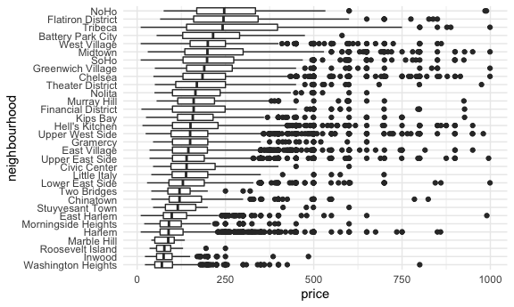
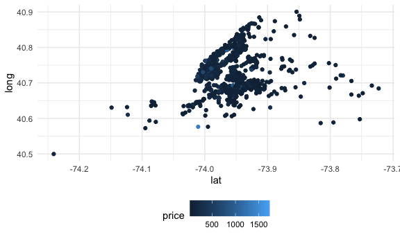

Case study
================

## Load the airbnb data

``` r
data("nyc_airbnb")
```

## Brainstorm some questions

  - what is the best Airbnb in staten island for \<$100
  - what price range is popular in each borough? most rented?
  - what apartment features are related to price
  - cheapest room type in each neighborhood?
  - hosts have higher ratings?

## Answer some questions

data cleaning

``` r
nyc_airbnb =
  nyc_airbnb %>% 
  mutate(stars = review_scores_location / 2)
```

``` r
nyc_airbnb %>% 
  count(neighbourhood_group, room_type) %>% 
  pivot_wider(names_from = room_type, values_from = n)
```

    ## # A tibble: 5 x 4
    ##   neighbourhood_group `Entire home/apt` `Private room` `Shared room`
    ##   <chr>                           <int>          <int>         <int>
    ## 1 Bronx                             192            429            28
    ## 2 Brooklyn                         7427           9000           383
    ## 3 Manhattan                       10814           7812           586
    ## 4 Queens                           1388           2241           192
    ## 5 Staten Island                     116            144             1

``` r
nyc_airbnb %>% 
  group_by(neighbourhood_group, room_type) %>% 
  summarize(mean_price = mean(price))
```

    ## `summarise()` regrouping output by 'neighbourhood_group' (override with `.groups` argument)

    ## # A tibble: 15 x 3
    ## # Groups:   neighbourhood_group [5]
    ##    neighbourhood_group room_type       mean_price
    ##    <chr>               <chr>                <dbl>
    ##  1 Bronx               Entire home/apt      125. 
    ##  2 Bronx               Private room          65.5
    ##  3 Bronx               Shared room           57.5
    ##  4 Brooklyn            Entire home/apt      175. 
    ##  5 Brooklyn            Private room          76.7
    ##  6 Brooklyn            Shared room           59.6
    ##  7 Manhattan           Entire home/apt      238. 
    ##  8 Manhattan           Private room         107. 
    ##  9 Manhattan           Shared room           84.7
    ## 10 Queens              Entire home/apt      140. 
    ## 11 Queens              Private room          70.6
    ## 12 Queens              Shared room           49.1
    ## 13 Staten Island       Entire home/apt      207. 
    ## 14 Staten Island       Private room          65.4
    ## 15 Staten Island       Shared room           25

``` r
nyc_airbnb %>% 
  filter(neighbourhood_group == "Manhattan") %>% 
  count(neighbourhood)
```

    ## # A tibble: 32 x 2
    ##    neighbourhood          n
    ##    <chr>              <int>
    ##  1 Battery Park City     65
    ##  2 Chelsea             1072
    ##  3 Chinatown            360
    ##  4 Civic Center          42
    ##  5 East Harlem         1048
    ##  6 East Village        1858
    ##  7 Financial District   391
    ##  8 Flatiron District     90
    ##  9 Gramercy             307
    ## 10 Greenwich Village    383
    ## # … with 22 more rows

``` r
nyc_airbnb %>% 
  filter(
    price < 1000,
    neighbourhood_group == "Manhattan") %>% 
  mutate(neighbourhood = fct_reorder(neighbourhood, price)) %>% 
  ggplot(aes(x = neighbourhood, y = price)) +
  geom_boxplot() +
  coord_flip()
```



``` r
nyc_airbnb %>% 
  sample_n(1000) %>% 
  ggplot(aes(x = lat, y = long, color = price)) +
  geom_point()
```



## Create a leaflet map

``` r
pal <- colorNumeric("magma", nyc_airbnb %>% pull(stars))

nyc_airbnb %>% 
  drop_na(stars) %>% 
  sample_n(5000) %>% 
  leaflet() %>% 
  addProviderTiles(providers$CartoDB.Positron) %>% 
  addCircleMarkers(~lat, ~long, radius = 1, color = ~pal(stars))
```

<!--html_preserve-->

<div id="htmlwidget-e34d9e78caf0fbb99997" class="leaflet html-widget" style="width:90%;height:345.6px;">

</div>

<script type="application/json" data-for="htmlwidget-e34d9e78caf0fbb99997">{"x":{"options":{"crs":{"crsClass":"L.CRS.EPSG3857","code":null,"proj4def":null,"projectedBounds":null,"options":{}}},"calls":[{"method":"addProviderTiles","args":["CartoDB.Positron",null,null,{"errorTileUrl":"","noWrap":false,"detectRetina":false}]},{"method":"addCircleMarkers","args":[[40.6911186944069,40.7293385465095,40.8434634621875,40.7083613964927,40.7432832155947,40.7305708265125,40.7653681008047,40.6938450968993,40.6973455836115,40.7677581364447,40.7128275588104,40.6642069385053,40.7038225216815,40.7070114725478,40.7705770573121,40.7199658123202,40.7332197210362,40.7164839167728,40.7084779615754,40.7699147671474,40.7248081716113,40.8192469949124,40.7451577075596,40.7663268414562,40.7076164779688,40.8292308291891,40.7630275619688,40.7199179572407,40.6952216378286,40.7247827953128,40.6883141663823,40.6727932732928,40.6542179313207,40.8204202910891,40.7286722150495,40.6291275159841,40.7397072775295,40.7266542016267,40.6938835967123,40.7192118485215,40.8150323652692,40.743357697385,40.8875703489323,40.6848587344558,40.6737809256722,40.7482653636353,40.6231738812298,40.7814829290454,40.8627132839052,40.6923086135752,40.6882544852701,40.6993809571042,40.7706636645119,40.7067355725709,40.6793541774703,40.7276404901774,40.7082854601272,40.6919638628717,40.7681194809714,40.783286790987,40.6353762627756,40.7311413027754,40.734127355688,40.6815835942117,40.6776642959706,40.722436794661,40.750088496469,40.7699537475606,40.8406387520319,40.760447323831,40.7230944804821,40.6659617678746,40.7533756163819,40.8376068384433,40.7650255768283,40.713734459886,40.7685961854351,40.7456098277731,40.8000865116767,40.5860191899109,40.6787749727389,40.6959991161405,40.6682849126954,40.7213591006646,40.7850981838928,40.6679781452595,40.742426286485,40.7321896016554,40.7114993919724,40.6075370892824,40.7245021360652,40.72804029544,40.7282378327508,40.6752086817877,40.6995179559757,40.8355070236373,40.7936962291011,40.6525592876285,40.7268948099296,40.7746910023023,40.764228578165,40.7138700470611,40.7217923739226,40.7959082103863,40.6845031349514,40.7468806485778,40.6561565314693,40.8683620906396,40.7205315508827,40.6801813591974,40.8021371879012,40.7554106864423,40.6983907857575,40.7108591838948,40.7277376431916,40.6806296095812,40.6924636183604,40.7331654967513,40.7198628748591,40.7671609853893,40.838388968001,40.8064927098826,40.6851083122359,40.8096003410181,40.7427142573067,40.7132442892559,40.6844553734239,40.7588813265605,40.7179560448703,40.7125690379906,40.708112775606,40.7016492377832,40.6816435233606,40.6854694470072,40.7009651174281,40.7103567662229,40.8462816411403,40.7122734062514,40.7333420710952,40.8010188640052,40.7028906394579,40.8000867904797,40.6835810422068,40.6936030156555,40.6833310437235,40.6649877741786,40.7483948889251,40.7264878947282,40.7247826798689,40.6736552161688,40.739816340276,40.8531086708672,40.7598355126938,40.6578319615009,40.7552903694223,40.7259764605245,40.6611688212827,40.6895526339809,40.7624251992987,40.6864952371519,40.7060873419343,40.7355624713205,40.6474825155174,40.646035943018,40.6925816871419,40.7362050942891,40.6561060483287,40.7581542927502,40.6929541349752,40.7124372685532,40.7996512218571,40.6968554345508,40.7547885099638,40.7438069687142,40.6405688616125,40.7167044786805,40.7681991070764,40.639805170103,40.7151294499764,40.7128783917853,40.7631100363334,40.7860169030719,40.6644999018316,40.708438600466,40.6430523480973,40.7410081509275,40.7419846421235,40.8000677822329,40.7680857928728,40.7054013257741,40.7641705290512,40.6880903554695,40.7196820527293,40.695744246877,40.8293938812883,40.7864994963886,40.6693930738542,40.6608020198593,40.6883625627594,40.7353574284055,40.7052209831771,40.6771074342692,40.7304607904376,40.8350290660337,40.8249734832097,40.6817158457944,40.7123378652641,40.7039502886699,40.696247697226,40.7433860153495,40.7706268870702,40.7348982366938,40.8066852797957,40.7030644178086,40.7187561800652,40.6703933556135,40.7451415273127,40.7065156443225,40.6850109054504,40.7891756692986,40.7476654950236,40.7122130715507,40.6469255107824,40.7529264176565,40.6628867102517,40.6759439156508,40.6944853020891,40.8095810294025,40.674803967704,40.8254465662908,40.7258773708943,40.646015615493,40.6752867403789,40.6176104500743,40.6468009401125,40.80226857183,40.8075464031739,40.6536623484167,40.8760492307273,40.6635611605651,40.730504684136,40.7020419806098,40.7104277445688,40.6648576186654,40.7217421225487,40.6824164199833,40.7026674636019,40.6797381833048,40.7375119055177,40.7148887544285,40.6887253181095,40.7156279504102,40.7389704217628,40.7492348758282,40.8189142647123,40.7350560374245,40.7265821955984,40.6798003178812,40.6843782748137,40.6966244688562,40.8230341846557,40.6681151770326,40.6065484908641,40.6999265453609,40.8061724370156,40.7142212794353,40.710321993807,40.7138662006977,40.7187458016445,40.7191256565482,40.7157861499394,40.7361006573977,40.7949452370193,40.6475151643061,40.6874786673928,40.730113245005,40.700013340845,40.7129568086719,40.7573750581044,40.798936698398,40.6547333176523,40.7167090455877,40.725221849147,40.7570125886077,40.7802474822442,40.6487128596115,40.5785650451324,40.7214104612789,40.7651042035016,40.7751974411174,40.811498258933,40.8179047412959,40.7267569775032,40.7215791584573,40.7327536131108,40.7098895514579,40.7436270699797,40.7951247583393,40.7149293512046,40.7289910440522,40.7588673032038,40.7784209165599,40.7217110538731,40.7660684229797,40.7457923220739,40.8588780618725,40.786470396188,40.6409295922912,40.6867479737083,40.727951985102,40.7677372657552,40.608846564751,40.5873005476757,40.6893458323498,40.7122349747442,40.7855403732148,40.7254183880514,40.7137518214066,40.7404469044011,40.6865464296635,40.6931009596073,40.7021933373061,40.8039451349974,40.6867478896731,40.7632130495392,40.7263050760413,40.6757410501272,40.6568263166654,40.6764117597745,40.6722644700086,40.8624408906441,40.6997681521046,40.6760363967361,40.7123026321516,40.6453961499454,40.7087768538535,40.7321417887324,40.6395304258615,40.7469204080333,40.7071490763837,40.7311104998993,40.6998491149316,40.729194288873,40.7286909410013,40.6749496134927,40.7661204422541,40.7060969903335,40.8188988865815,40.732454377138,40.7170273679248,40.7884388746618,40.7081679185855,40.6961706833871,40.802794142514,40.6932975160966,40.6471811184543,40.7221505016177,40.6614048722841,40.7321500972996,40.8439014127624,40.802283379136,40.7002052380671,40.6880026814982,40.7317544475801,40.7471095561098,40.6789393617314,40.6851150695155,40.713566593874,40.7256309109509,40.743482340087,40.6613524229472,40.7248201696537,40.7378841557204,40.8671341098932,40.8070551825407,40.7421080338109,40.6907130387862,40.7145409689845,40.5937768534518,40.7120712930156,40.7451228353909,40.7986465214077,40.6722618373829,40.7651623579346,40.7369758044763,40.7652826313945,40.7440565090391,40.739485387589,40.685178709459,40.6400222602987,40.8104134738386,40.691598092601,40.7325385778127,40.7020238409981,40.7878517115803,40.7204646422691,40.6715056784948,40.6790921690449,40.7217297363082,40.721083043801,40.6894684828881,40.7221459088377,40.7614815101857,40.7190243928506,40.6809093267512,40.7084385134685,40.6927790825563,40.7251782203575,40.7222022575933,40.8238082290639,40.6872664277634,40.727095063159,40.7125445306805,40.7434670245547,40.7879870165328,40.7650202824304,40.7318150275774,40.7172841569837,40.7083031643381,40.7634619718684,40.8416078596279,40.6548460095368,40.6887549640549,40.7211435233896,40.6939213738703,40.8109493862744,40.7931280743077,40.6950573128028,40.7457046447563,40.7210357791307,40.6624207362717,40.7288253126582,40.8261170719764,40.8236033789417,40.800607049853,40.7371928297771,40.740084641465,40.7630131269774,40.6743385386741,40.7175527544461,40.7771599136257,40.7611838683848,40.6714140649035,40.6613344460295,40.7471742441648,40.6712758750029,40.7626513858745,40.6852108792026,40.7182729288582,40.7214548210252,40.7138736578212,40.7646618814422,40.7095745694084,40.686296568128,40.6684196309259,40.7811557368447,40.8027129931014,40.7045810332624,40.73168892437,40.8094416243367,40.7380614971765,40.7591186011681,40.7500567687512,40.7469656411625,40.7114963042996,40.718008934433,40.7500538175359,40.7499716966466,40.7064160638333,40.7128178908657,40.698503203271,40.7183180874329,40.8615804053291,40.7217499704116,40.6932372214429,40.7339802567832,40.7082826328435,40.7311697301295,40.8277982035327,40.8253488832361,40.7201812555015,40.8120518565071,40.8045199063431,40.7504507797001,40.763983869352,40.879248564259,40.7172226895068,40.6950565725288,40.7180216627161,40.7530995185015,40.7077217686288,40.8088711479822,40.6798074893497,40.78826916007,40.8146327195869,40.6776393094953,40.7186051474974,40.6659974788094,40.6762834129877,40.7642848938621,40.7687067232177,40.789414474707,40.6975369981771,40.644625203314,40.7305061694212,40.6776418237541,40.7809301506729,40.6854520083445,40.7299678501571,40.7125898172281,40.6662254403695,40.7708774117155,40.8425874686173,40.6778724271764,40.7315594180809,40.7248955438311,40.6824686998911,40.7387747332726,40.7425910456558,40.7472793392496,40.7049751932132,40.8040633018705,40.8075545128646,40.6855740835511,40.8228719752367,40.7393826971033,40.8102433430774,40.7314606073345,40.8118598183208,40.6944980275785,40.7318698104552,40.7281369144008,40.8595906928352,40.7325213372998,40.7712053915695,40.7429597335396,40.7410577047715,40.6427720589351,40.6891382111894,40.6363284796766,40.7418131817929,40.7975800170096,40.7346176404068,40.7787531316303,40.8567650954524,40.7189644542447,40.7614488490544,40.692876708198,40.7363772619123,40.7779715183338,40.7180633198224,40.7632162032339,40.767728213364,40.7223321682923,40.7353156180063,40.8668887200942,40.7082696298332,40.7502294959426,40.7021071941178,40.8231128903133,40.7376817348396,40.8585920224129,40.7436397813352,40.7622664215401,40.8032083092775,40.7194297912962,40.6562682429413,40.7718330427149,40.7814478650721,40.7416004106068,40.7056059243036,40.6301696181641,40.8424267647956,40.7858918151293,40.7467227623751,40.7159930840035,40.7679079621794,40.7833382876564,40.7709681713701,40.7432082542148,40.7053593380502,40.654090046721,40.761917136451,40.6671303264311,40.7158662790645,40.8284033645864,40.6887178337404,40.6542341042183,40.6955456236404,40.7758754696786,40.6703105402459,40.7834225551198,40.7184364917862,40.7058653963953,40.8062199997728,40.7088417989823,40.7021873608718,40.7546149733416,40.7145915790197,40.7631574314976,40.7340481325133,40.7110357351266,40.8033999214056,40.7341828204295,40.7734409099799,40.6982779720159,40.7252142456655,40.786888481899,40.6603619641444,40.7145744904234,40.7281831721804,40.7664625961134,40.801010718293,40.7205118547062,40.7775030151604,40.7422713961885,40.7390500357069,40.7842837501274,40.716005338976,40.7068567931176,40.8112965078853,40.6705325202568,40.8626920909871,40.7929084057569,40.6722070783012,40.6828397461692,40.7499998602805,40.7242716978069,40.6849778057386,40.8578193618833,40.684207317708,40.7559024070329,40.6956275809709,40.7448677979945,40.7388412091835,40.6884454589785,40.5811498544274,40.7680078236384,40.7221033766713,40.7311612826368,40.691343704082,40.7665623021621,40.8163288598127,40.7822761658611,40.7851016259416,40.7204818756795,40.7674512576231,40.7640413903767,40.6850493038545,40.6837107489976,40.7339489357397,40.6873235476369,40.7341795087625,40.7422504391612,40.6432968047607,40.6789026853906,40.6851062547349,40.7268330920983,40.6289731562312,40.6703820863421,40.716948516228,40.7241817925523,40.7952245005224,40.7259479343531,40.6203918432487,40.7257532594153,40.6749883232387,40.8030020945741,40.7238686301783,40.6369186883692,40.8001899083635,40.7611657751089,40.7076556046483,40.831817713174,40.7133641098952,40.7960599687684,40.6877698070448,40.7186254675754,40.8128885416751,40.7212985896076,40.6855381064392,40.7526336204541,40.7228453295045,40.6855816212352,40.5897086489331,40.7293245232134,40.7306539366951,40.7615998860216,40.7170090035008,40.6525258110332,40.7553958019474,40.7212298507818,40.7133385216472,40.6077512661497,40.6579850461089,40.8626601463269,40.715855682241,40.7272633305993,40.6804847786592,40.7182691743204,40.732246576192,40.7362325081447,40.7222823286566,40.7821709167392,40.7750022547158,40.7426716584392,40.7439848335219,40.743674679126,40.6784004411599,40.6633634415026,40.7768733167092,40.6822156886876,40.7861843135374,40.6768049435503,40.7467462022388,40.7649315924439,40.7786698261057,40.6630742070702,40.6679512407037,40.6334952790826,40.668383632045,40.7444202386323,40.7507132093387,40.7420484869215,40.7658036307787,40.6212230502829,40.7256328240694,40.6786442851291,40.7339855973365,40.7132192715343,40.6902855243477,40.7136487959907,40.7783986378745,40.6962573707823,40.6505213344247,40.6837365747987,40.6916142544358,40.7696594870901,40.6881116792045,40.7830461669714,40.7742236207217,40.6855760590512,40.7372037006764,40.6691607904575,40.6862844494215,40.7896241337201,40.7631030395183,40.7585566916275,40.6199407621711,40.7640295858853,40.6916448206129,40.8017866823488,40.6823626797581,40.8168755140798,40.7181871729321,40.7654183203175,40.6800353582313,40.6943569703819,40.8046837825287,40.7009394177361,40.6605276859279,40.6915905987185,40.7325243502305,40.7293747852433,40.6729650792838,40.7612868155673,40.6737049552146,40.708349786964,40.712165235433,40.6764949643859,40.7056048969297,40.7134145657232,40.8021943180793,40.710593303649,40.7123095814182,40.698114113309,40.6838095581049,40.7977851101955,40.6847523446523,40.807591914404,40.7770378077792,40.6002605184884,40.7409340691398,40.807275847577,40.739029905914,40.6584487065564,40.6550275281772,40.6461517334239,40.7111857164833,40.6840321760727,40.7606216275292,40.6757453703519,40.6602558564529,40.7162597204912,40.775892902891,40.7144460911089,40.6884963009147,40.6876775977688,40.7621872607725,40.7224548643156,40.7069429811957,40.7446692653783,40.6723818455204,40.7242515269098,40.7341172746505,40.7281832779363,40.8773081255858,40.6812084722549,40.6765408283395,40.6809907646345,40.7225239631215,40.8119183969642,40.7514594195217,40.6903953383546,40.7535268854182,40.6958690126205,40.8016057467739,40.6895818939022,40.6880552531485,40.6860889529073,40.7066187119772,40.6761730150863,40.7794922099919,40.751341852194,40.8208525042155,40.7082547979155,40.7192612995683,40.7355261065567,40.6918431222966,40.6761489309886,40.8166548473094,40.7508268807084,40.5113297816487,40.7268454151164,40.815234981388,40.7281100988413,40.7197634320386,40.6736772198188,40.7154961713505,40.699098038944,40.7295776513946,40.7147429580724,40.771406774303,40.7164001943174,40.6256166790105,40.6658447023391,40.8331534426502,40.7282906115921,40.7056876915204,40.7615492325281,40.7617849696983,40.6838538897691,40.7384493027286,40.7780140378797,40.827878851411,40.7725820778637,40.8209436338288,40.7043136781542,40.6955382158091,40.6843681443854,40.6877328353816,40.6984907070564,40.7240922460399,40.8619868283788,40.762212594639,40.775197799073,40.6690737126513,40.798103485569,40.7534912992634,40.7422639242279,40.6587736902621,40.7037274696985,40.7295391388505,40.8388517372725,40.7060818129259,40.6850731831737,40.6878510635357,40.7196637353864,40.676476385979,40.7121192672292,40.7659580680423,40.7115635263808,40.7451072949716,40.7269476919347,40.7994136753156,40.7401027796552,40.6605092859839,40.6756586604299,40.6415498098626,40.7950077173625,40.7151564908082,40.7778960343799,40.7193887055908,40.6795452164177,40.6803923218289,40.7493193453736,40.6798895194314,40.726178989488,40.6801307785473,40.7568261103979,40.7393789037877,40.6890806561374,40.6985688019967,40.7262905165067,40.6458021196852,40.6782528383324,40.7636636270232,40.8263884322048,40.7103661614282,40.7163795496133,40.741177626874,40.6761733005157,40.7333210171424,40.7714969360257,40.6735619490243,40.7664621410323,40.6815563076596,40.7023395251875,40.6659231210807,40.6842017918746,40.6685759798088,40.7893146294788,40.7402462389641,40.7231804529777,40.7146758612394,40.7405664142107,40.7261726312223,40.7167108059022,40.7447599351406,40.769360217347,40.7205559511559,40.6879119155612,40.7682884530463,40.6961006542871,40.7176313136285,40.7569670262382,40.6623940621043,40.7024838245781,40.7212602925938,40.6934416444475,40.7991205804183,40.6432442573574,40.7673167961925,40.8209471817606,40.6781057613772,40.7659961712339,40.7196440126867,40.6951206532265,40.6911363829132,40.7643600655457,40.7323504548091,40.7700307443949,40.6665114079348,40.8268562360269,40.6909228439801,40.6844910650177,40.7816509859772,40.6917522010094,40.7138040646521,40.8313397844855,40.6927582323221,40.7370750748858,40.6929258743159,40.7466979337667,40.7409639340841,40.7636690717651,40.7802781034361,40.7156917016661,40.7623325563551,40.7195852820949,40.7225616115275,40.6085173626227,40.6712394385525,40.7829403816899,40.7685877570967,40.7617641806421,40.6862033903809,40.7077006849211,40.7650335748047,40.7888631621493,40.7696230618465,40.72229218928,40.6874752256719,40.7368267434047,40.7009014349032,40.7436089359419,40.7058603696272,40.686267681381,40.7256384485625,40.6488525583556,40.6974738338615,40.6893365320034,40.7849846491179,40.6786981657795,40.7260902343829,40.7661606131763,40.7562205818868,40.7261607519757,40.82959389488,40.7516428888691,40.6669329545521,40.697106512115,40.6321278333805,40.849660182195,40.7201169711506,40.6890188627512,40.7210785528427,40.7945765022483,40.8255959688286,40.7711290513822,40.6749401196355,40.6880029939222,40.7675658997997,40.7578466593349,40.6708470636258,40.7283282860572,40.7770691485399,40.7952179648148,40.705812182247,40.7247792742248,40.7069210367319,40.700975961584,40.6849130713746,40.7928436786592,40.7640706962422,40.8033818627193,40.6607130074998,40.6708296403895,40.7144925007323,40.7624868835688,40.740811972193,40.8065058269114,40.6844578664013,40.6974230995775,40.7639863186521,40.6825241404927,40.7275830826084,40.7370396888092,40.8157197537802,40.7395275568399,40.7425710631741,40.7308139244694,40.7116953657991,40.6908514504656,40.7238618003478,40.8183126738535,40.8286243879225,40.7171439547853,40.7067047131551,40.7213458312412,40.7296264608245,40.8218633385244,40.8342562576891,40.7542873865615,40.7142706993332,40.7073797349494,40.7002450375366,40.6542089767275,40.7629112582404,40.7193741907904,40.794172945012,40.695117939681,40.824034132177,40.7638838793778,40.7266546110458,40.6868482443685,40.7529937100208,40.777430791843,40.7190753793914,40.7187773036343,40.7208271854267,40.8002275094455,40.6429359456522,40.8118123727766,40.776505986375,40.7233813456636,40.717439000976,40.7619119154154,40.8478660131801,40.6845716228512,40.7688907083585,40.8293127271588,40.7692412416339,40.7430771388546,40.7302593113487,40.8282306618479,40.6976247803326,40.7195060835912,40.7444684233774,40.7122965627636,40.7161178706909,40.7293448405319,40.7387703555851,40.8086785953728,40.7160171635457,40.7186991485236,40.8105304067413,40.7663258560539,40.7394069841702,40.7091052641159,40.7315747459284,40.841206907541,40.6809020835239,40.7168399631647,40.754238082868,40.6603823425607,40.7184869610159,40.7253203583894,40.7136056851098,40.7209831212915,40.7114015828607,40.6562806925695,40.7131784783545,40.7257736102663,40.7626882881228,40.7295966825445,40.7454161607964,40.7843376968513,40.6761573172106,40.7635238717425,40.8047907513656,40.7392256380425,40.7235647140221,40.6077621232738,40.7207537929608,40.8077032624215,40.6698950206066,40.6902109966457,40.7461753929723,40.6936593697035,40.747218360088,40.7153187198765,40.7287610739852,40.6094792740436,40.6893756368076,40.846642635244,40.6914120772371,40.7424652823166,40.7073941774469,40.6998638723364,40.8353735315858,40.8063503975826,40.6936327530187,40.6395647152074,40.6970619374494,40.6964908952515,40.7300229683965,40.7899189688565,40.7791461048706,40.7161007878063,40.6438883400248,40.6754532528717,40.6721533828055,40.7487038240729,40.7380371491976,40.7796900895501,40.8221038288314,40.7168215195577,40.8105610413522,40.7452222960641,40.68254407203,40.6730903574247,40.6970177534294,40.7219406727284,40.6976405927129,40.6590025997504,40.6616432297135,40.6361247366194,40.6590237851452,40.8488333288189,40.7041976461457,40.784806883623,40.7754560574699,40.7192742723273,40.8240704846569,40.6653942264968,40.6830072350846,40.7830184580213,40.7310149975806,40.8085584624179,40.8305783183293,40.7529677405681,40.6621380921735,40.679330850664,40.6774201402196,40.708281281394,40.68203123828,40.5834078958057,40.7185180248707,40.6877034962765,40.6871730989672,40.6835442953584,40.6868819648897,40.7619400840058,40.6869753968997,40.8360026317637,40.7592977126757,40.686553386116,40.7965027109968,40.8283384166308,40.7366899451453,40.76885210656,40.69451675153,40.7726635163203,40.7169855447505,40.8528694561638,40.7198655212217,40.6732273521443,40.7649387019362,40.7722089951209,40.7886689701875,40.6470017310424,40.7997028709955,40.6722799731672,40.7219582214975,40.8040911192252,40.8046461995296,40.727794748726,40.7072614376271,40.8229190670036,40.7468294556443,40.6941717755757,40.7303247585779,40.6645492945672,40.8535653357176,40.7864756150291,40.7048625701658,40.8011764106185,40.8172381586035,40.7488244425038,40.7839036320429,40.7117113067067,40.8213720175278,40.7445858175379,40.7856754805882,40.6775297798283,40.7223477881835,40.8394192863069,40.7134830228418,40.6838602004879,40.6703626331605,40.7131366963135,40.7243385508108,40.6755382114605,40.7438716568185,40.7113516938457,40.7106746097775,40.710586197253,40.7362139731979,40.6814724175345,40.803504589652,40.7196853681935,40.7744190325573,40.6941830683149,40.758620112992,40.6945901278172,40.6779273126449,40.7026844019393,40.7439810543143,40.6427712852503,40.7398845929453,40.7539539934359,40.6628195486078,40.7876071324725,40.7898079019046,40.7535063526897,40.7975676593869,40.7669635852256,40.7184210404879,40.8506007717862,40.6876945007402,40.595454255012,40.7425959751393,40.6632272838024,40.7320370553698,40.7723070023561,40.7573729472525,40.8449741923628,40.7110610867475,40.6894924062482,40.7439852686856,40.7433868259757,40.6910022384553,40.6513072884469,40.6502511900383,40.6921823062669,40.7250588005841,40.7103471301388,40.715124107496,40.6873948472204,40.6646327627209,40.837295641432,40.7203446280652,40.7959543699414,40.7155896784643,40.7068787557585,40.8013994731497,40.7175602266802,40.7263894779214,40.7437088001228,40.7234510538922,40.8407408428402,40.7866449756106,40.7667940626823,40.6918320688296,40.870996127476,40.6771314975067,40.6908996966911,40.7446740199387,40.742813175678,40.7967729669557,40.8241106919881,40.7968730620318,40.7315945250249,40.6443126991849,40.727806527923,40.7070975032707,40.6422683119201,40.7248010320843,40.7714820024228,40.6438661008475,40.7448477482341,40.7099378132593,40.6878548768847,40.7130033942495,40.7342017447777,40.7649195053266,40.7945587569979,40.6834416109542,40.7252064833727,40.7893255585944,40.7218571618775,40.7782536229874,40.7192170286422,40.7278916408721,40.6446184940261,40.7242930501214,40.6949640140253,40.8514084101614,40.6934782817556,40.7691962945355,40.7619570063813,40.7312381867844,40.6210895220763,40.7229046658133,40.6793448952908,40.6761520143446,40.6271889952297,40.7140062291063,40.7128806803531,40.7139647872437,40.7990758320205,40.723755418829,40.6820684060964,40.6893063256739,40.7852102676094,40.6521023142492,40.7137322100193,40.6343980052675,40.7285619477031,40.7633478945636,40.6653897313464,40.6958479257286,40.5829429745901,40.757124427611,40.7444410286163,40.7168216572512,40.7339742322739,40.7446514733475,40.6892088939497,40.7068919946092,40.6781879943675,40.6876343451222,40.7039963535754,40.6836217444565,40.7666613397064,40.7171591975658,40.7287473811894,40.7672645597908,40.7229001275339,40.7058183523348,40.7011910944946,40.6741734992739,40.7671374551386,40.7054860399607,40.7426538778694,40.7119847355774,40.6710421897779,40.7734391549821,40.7072114057862,40.6883963554918,40.6822088406449,40.875127657255,40.7789948157416,40.7153210572796,40.7936921570417,40.6432236603058,40.7440408958586,40.6653542269328,40.7752839554443,40.8081040246689,40.7289881030358,40.6509412944944,40.7668699392289,40.7911539966972,40.6623269985025,40.7559602645014,40.8297417392386,40.6838362999626,40.7139895245119,40.7124984952096,40.7150514441234,40.7132894522394,40.6562345691641,40.6883666655756,40.6842346425561,40.7190362716293,40.7942746807804,40.8019333041322,40.6396442676279,40.6872439650732,40.7461710813168,40.7197497985924,40.7161224647663,40.707662076901,40.7407097494873,40.7096053162859,40.8308865480295,40.6677590013149,40.7161071036368,40.8313589698716,40.7536686610517,40.6866593793024,40.7171474067972,40.6910993725698,40.8543218965871,40.7466374406936,40.8250126022845,40.7137318142221,40.7542936710275,40.705592213742,40.8075234258318,40.7974017587407,40.7205907825697,40.8498989312626,40.7347744153019,40.7244394918421,40.7507908717726,40.7808016310475,40.7987258366109,40.8223773148916,40.7187170772131,40.7767153800229,40.7612653952328,40.7977632047877,40.7132509506729,40.7325774072374,40.6881434829161,40.7099546043669,40.7089523667448,40.7042245110257,40.7529256756248,40.6903477980174,40.7701108895382,40.7065306010709,40.777945221981,40.7230938978859,40.7646380690553,40.737037088675,40.6950997640063,40.731258741117,40.7163164492455,40.8151569352977,40.6825211465662,40.729146019892,40.7458749654184,40.7150067750968,40.6850963123597,40.7385441472205,40.8308772933826,40.7528378254378,40.6958120280188,40.6850279565735,40.717357769197,40.7335782415729,40.7859800450665,40.6612687978753,40.659614817675,40.8071509067958,40.6603592198825,40.7001995598183,40.7069563265184,40.7238003049694,40.6979562450358,40.6878330629392,40.736921567483,40.7384471985584,40.8138911153546,40.7415671949007,40.7833465696094,40.7492878898541,40.803449945233,40.6761096310894,40.7098645636415,40.7655953136886,40.7949396632871,40.6648451196877,40.7216101440526,40.7298284113665,40.7648545327056,40.7452663959531,40.7967385457579,40.7635818925764,40.7658967459659,40.7128663340812,40.7152096332025,40.7881147551332,40.672649008812,40.8167501680819,40.671480895474,40.7683419943138,40.7720531786476,40.7470837507594,40.6755321317549,40.7176435638111,40.7452479552096,40.7571570864103,40.6953375390512,40.794321388024,40.7881336658479,40.68629400672,40.7784499845018,40.7117155287827,40.6988495031639,40.7166629321467,40.6735012473879,40.719556419732,40.7244632803976,40.6890097280034,40.6854732318879,40.7189781996386,40.7782270223269,40.8162528402958,40.7276177514619,40.7113439182987,40.6588571778031,40.7075148995037,40.7903745082471,40.6813180588024,40.7080046979142,40.815739276858,40.7874666311712,40.6111164087495,40.7101877582321,40.6606633495205,40.6879237108223,40.6422505813516,40.686449315309,40.6102113343662,40.7436884667835,40.6861175813576,40.7005130385724,40.7080479018925,40.7625045884603,40.7041882313536,40.710921286616,40.7476675215853,40.8010650526867,40.7248503690589,40.8722086458544,40.7392947463341,40.7280449229657,40.8206530994353,40.8456270559192,40.7302184081773,40.6870268127981,40.7653458464277,40.7168597979008,40.7605828536762,40.6722768991517,40.7414482497476,40.7171390217909,40.7285764511084,40.7075214667534,40.6677378620371,40.7132340719062,40.8013269386061,40.7497669994868,40.744500836329,40.7652123579342,40.8174888817911,40.7923371152981,40.7267859432371,40.6894465760207,40.7721812631844,40.7106588480741,40.7171415410095,40.7637944538186,40.6863167639332,40.7215776489925,40.717584359352,40.692343781127,40.6861971776241,40.6866030734235,40.775303593308,40.7933114086816,40.728544498314,40.804920724673,40.7181269892632,40.7350745339913,40.773613383468,40.81573885819,40.7173367428685,40.8070534182693,40.6423197972668,40.6462094826332,40.7008559816705,40.7212294553674,40.667949814962,40.7104007577269,40.6916696022758,40.7233807669421,40.6410825210812,40.8090284186564,40.6842672046814,40.6608373109988,40.6085566745445,40.8355096349386,40.6760738454422,40.8913100811195,40.7643690478332,40.6824854948473,40.6785918918235,40.7245672083069,40.7249906653946,40.6892679807774,40.7810003071368,40.662053739881,40.7908581591487,40.7302958232605,40.6767892544116,40.6946701390583,40.6460328925889,40.6864774313431,40.6757511156523,40.7612314020641,40.7275852791011,40.7181182224245,40.7080523777801,40.7093519657978,40.6735392260137,40.7810143736899,40.6692260186709,40.7298265385369,40.8258969440565,40.7681586414511,40.7886200982076,40.7264457371675,40.6914225167398,40.7643228315985,40.7689307406747,40.7729064025981,40.8177296079975,40.7029294432292,40.8001176145423,40.7789054218183,40.6855652990688,40.6986757126156,40.6747516631666,40.77641019643,40.7254409315831,40.7429588935953,40.7157054977453,40.6679036473915,40.6965523033976,40.7156058304092,40.7850833018885,40.7123235493243,40.7206812027146,40.7364534231718,40.6867752905756,40.737003696652,40.6793031833004,40.731386911063,40.7911548277338,40.7186892608859,40.7746184818054,40.7080703101522,40.7232766169368,40.7631081508676,40.5962182478003,40.7866189994139,40.7146015271507,40.5760842619753,40.6817923394888,40.6725533085335,40.802684899952,40.7548770275873,40.7679238092005,40.8281444068181,40.765197091073,40.6947827669158,40.768544974424,40.8247542017076,40.6955984953392,40.6864868378943,40.7919488971307,40.6866627431459,40.7167077348005,40.7603698636497,40.7279331813305,40.6688983610437,40.7236246061557,40.669679002281,40.7107436334513,40.6819386165134,40.7262002180963,40.8030804077006,40.708169537657,40.7227682864294,40.8151077893867,40.7437942810255,40.7886572310663,40.7303195798608,40.7202050891327,40.679598846405,40.6997604178793,40.8688809260204,40.7744015509074,40.8227806019021,40.6729378721442,40.7097458906504,40.8005502729041,40.776419558652,40.7117541833045,40.5454996065808,40.7129977001474,40.6345665621951,40.7044505842827,40.6603529695508,40.7143850294283,40.8133057947406,40.7638967598241,40.7948994879119,40.7604243321542,40.7336790655739,40.7906794623633,40.7582574483168,40.6983352263366,40.835489893089,40.761641504205,40.734114958136,40.7189328340711,40.7192990402719,40.6937705379128,40.7093861205421,40.7270491462141,40.7777220998187,40.837053845555,40.7684331018759,40.7221931733561,40.7206071521376,40.6882462251198,40.690971839521,40.6784338596333,40.6789495971043,40.7711601408734,40.6907480298613,40.6847653564072,40.7780460717985,40.6937892959192,40.7630024714152,40.7000398081691,40.7516729926911,40.6480075021904,40.6994996758792,40.6851873224816,40.7536868179345,40.7384396634812,40.7697731468335,40.7315856235633,40.7032229501141,40.7596426727191,40.6924620282106,40.6727189692823,40.7557833780839,40.72683675491,40.6808410570017,40.6849608174949,40.6755169056908,40.8688148307964,40.7550802808608,40.6829690516869,40.850980395746,40.7793994477187,40.5893606080828,40.725823556321,40.6496591169894,40.6974360299533,40.7845205325996,40.701461223613,40.6932157279547,40.7358839911461,40.6905599792859,40.6676884802566,40.822857181441,40.7648726301729,40.7238452383285,40.6382093103564,40.7258999666706,40.6346477454109,40.7079443631127,40.8074766160567,40.6658839669098,40.739485941562,40.755248788254,40.7591907499227,40.6798172102927,40.7524063212802,40.6660930999645,40.6828650255831,40.7253888828087,40.7598711324765,40.7414066813447,40.8059851354027,40.789620226184,40.6969011790807,40.7389407771027,40.6915962943238,40.6990129553286,40.7471546001183,40.7418029729962,40.6920572758596,40.7114300620793,40.7633938912713,40.7638506159762,40.6811827537993,40.7346063244447,40.7539367148898,40.6512335145492,40.7280848014809,40.7697220149314,40.7078060701087,40.7353737779377,40.7502476202506,40.6737350298953,40.809089354585,40.6811122413949,40.6596628412711,40.6676160263117,40.8071746352185,40.6336840585096,40.6936113133198,40.6829997651494,40.728781122121,40.7756253464445,40.7222253220813,40.7349014120811,40.7604292782649,40.6797760423,40.8201279854114,40.7023033376514,40.6851078407272,40.7228411798284,40.8291938720955,40.7440608017639,40.6439618477139,40.7404125640816,40.7500360092678,40.6945111593213,40.7644585615492,40.7761350126385,40.6322878017322,40.6891420782067,40.6896027045358,40.6579051532325,40.7202881706301,40.7343059378424,40.7636171898351,40.7298487886019,40.6827881206485,40.7235800337414,40.7947856773785,40.6992304500512,40.6864714592558,40.6702194575224,40.7161873145103,40.7258307978648,40.7147679867381,40.6982389792371,40.6739248371713,40.7259417832058,40.8216523916637,40.6866674619368,40.7117124560753,40.6800746759034,40.7651800042613,40.7045121467375,40.6950267311916,40.6821458522444,40.7620610720347,40.7429778604144,40.7316954403128,40.681500037691,40.6992367610001,40.7367250196962,40.7387526326124,40.7293614073739,40.6855384667341,40.7722061583941,40.6847103480924,40.7171238629649,40.7963529176998,40.6470123055336,40.7153486970498,40.7264618718138,40.6856580313719,40.7141295700696,40.8304808655811,40.6363894027414,40.6906345744333,40.7215927147572,40.8119419896065,40.764213578667,40.7299037174412,40.8003419544399,40.6716261154799,40.7953386992068,40.7622359183492,40.6881660163673,40.7002069382592,40.7231829731595,40.6841592471218,40.7241819078013,40.6253552841811,40.662203907674,40.6905687191078,40.8299301030029,40.7890014128827,40.8254501120177,40.7620222161845,40.6399189087505,40.737961228011,40.6359305637506,40.7410450117892,40.7862707026531,40.7596816057492,40.696937240563,40.7631834210562,40.77441644858,40.717752658349,40.6582476370276,40.6960907093374,40.6626975541735,40.6777127193973,40.7977918837689,40.7719605352582,40.7324605533405,40.6866956055147,40.6992920763406,40.6372534259825,40.6644772168573,40.6407431543732,40.7002896335402,40.7279645136067,40.8096506278969,40.6901091499579,40.6950855655911,40.7064461599459,40.6872770219215,40.7619526825257,40.7307595425775,40.7147477026134,40.6705654418542,40.6779231048948,40.7209853770219,40.8508305201866,40.7247858405871,40.6953367718219,40.7204362380418,40.7668357247,40.761077624034,40.7729689527965,40.7128032989574,40.6832847408948,40.7615663956444,40.7384948072471,40.6839925541479,40.688797574608,40.7999292979134,40.7194814944692,40.7146545461961,40.8057117513799,40.7325051597107,40.7636690977598,40.7176210283039,40.6744795872202,40.7975708095767,40.734407279631,40.696270995291,40.7335302379912,40.7119860199658,40.6700272825269,40.79714675159,40.7653959233026,40.6781441810704,40.6941996705431,40.730546526603,40.7828895787599,40.8682105936269,40.7758635560481,40.7628358072571,40.5502933163419,40.6941898296954,40.7270218415348,40.7384457595301,40.7750332298972,40.713046082524,40.7633279782554,40.6851679976595,40.743431432929,40.6788994682826,40.8530072120203,40.7573103735165,40.7188578629382,40.8093026263685,40.7113845291854,40.688542840219,40.7222747202307,40.7267273402039,40.8004851610291,40.6846497373305,40.7079433369546,40.7743271014471,40.6659302000961,40.7248488427902,40.8062637219282,40.723518562512,40.7150385367289,40.6214488516807,40.8387237596179,40.7827439039675,40.6547733790633,40.6584518026316,40.6763935187556,40.7115315985619,40.7272079292513,40.8036017522853,40.7300867767698,40.57872471671,40.7200381464352,40.6767976558023,40.7121371925772,40.7762465083865,40.7493647046426,40.6830591783837,40.7289215020862,40.7565734434417,40.6747966713387,40.7194664085324,40.7372109082029,40.8130907516515,40.7333948841584,40.713726582705,40.7150783550107,40.7409953304385,40.7016520817805,40.8487509265184,40.6157551573482,40.7106517811307,40.6762887585834,40.7475955221659,40.6782260821665,40.7971224447746,40.6582655282219,40.7341908344937,40.7262075141361,40.6195659445769,40.7394324284322,40.7552461681571,40.763631254107,40.7013765095671,40.6957051001039,40.774374081258,40.715789876401,40.6887359092607,40.7256561881574,40.7143312804331,40.6454735446125,40.6519254203286,40.715729525816,40.6923961049043,40.821397802265,40.7356797770351,40.7827266530454,40.7953839568775,40.7229321012224,40.7703157788466,40.7875470432946,40.6573888616248,40.726082125008,40.7616753907673,40.7543874885388,40.7093302776714,40.7715056434318,40.6826727314635,40.6523440301534,40.8763231283629,40.7463458373197,40.8128558545659,40.7202443009585,40.7974801270025,40.7321736081045,40.8177480822496,40.763849951447,40.7858580592933,40.8228700303623,40.7295900196421,40.6904278469577,40.7283389697533,40.7077217158372,40.7591181930122,40.7147988936823,40.6856784543016,40.7438763321035,40.7436919901859,40.6831176854392,40.7412293588734,40.7114468530971,40.6568391958644,40.8577733741801,40.6689218306567,40.7105481662114,40.7962853825135,40.722210016756,40.6956155671388,40.6838631108272,40.7106469410547,40.6483840845937,40.7255895221794,40.6866149264724,40.7775275529773,40.7104847114365,40.6844990183894,40.7266995946983,40.7912619097419,40.7413187542426,40.6956065895429,40.7464836441882,40.713306759457,40.691703094864,40.7455555737312,40.7726767548066,40.7122321214195,40.7085268796156,40.8517275454689,40.7745885947651,40.7169436487302,40.8177096166926,40.7538567060686,40.7207616175751,40.7345820600022,40.6919365564788,40.7065251794972,40.6838348198572,40.8689482449116,40.7047963238003,40.742065420128,40.6444837466667,40.8172436879658,40.7532878818178,40.8000868094945,40.77008722172,40.7216152985571,40.759565683612,40.6756542112706,40.7198651698582,40.7424961583412,40.763168365019,40.6613887504518,40.7323449665113,40.6951566148741,40.7181847400926,40.6746381070356,40.7857085496636,40.6129491538778,40.7727011135045,40.7097776712378,40.71915376088,40.6142616978112,40.6981486909386,40.6686335137303,40.783682263706,40.7383527841075,40.731958372338,40.7123433891987,40.8368594373759,40.6613138717351,40.6570627065977,40.8260529808716,40.8177382519425,40.7096685792062,40.631460999733,40.7007528985198,40.748685051109,40.7464765322081,40.7648753037454,40.7397599887003,40.868175200218,40.7577182731608,40.7625449102068,40.7231341343921,40.6200768155227,40.6652533472616,40.73426835388,40.7629312691448,40.6985569153681,40.7426585802025,40.8150235061161,40.795859768416,40.7195180457002,40.6735129861149,40.6628619577348,40.7661257948669,40.7692667747272,40.6992138981475,40.7423878034605,40.7260806527779,40.731000768251,40.8275306407675,40.7359316222524,40.7120206844921,40.7340163618932,40.6732740289101,40.7875823097574,40.6849426724426,40.8031955169598,40.6949588223617,40.7529857827521,40.8646079566757,40.7144597191531,40.6737359615465,40.6732174144907,40.7840470252921,40.8254169523257,40.802568282161,40.7377211642683,40.8221962439106,40.6920758313123,40.6827016836261,40.7000918424158,40.6766706066845,40.8145514362042,40.5776529903455,40.8160932102159,40.8170810509407,40.7162243184589,40.7326161570886,40.7241597919813,40.7683174887169,40.6806217587123,40.7078099076527,40.813202404418,40.7536957329417,40.7150840427888,40.8037261105115,40.6974765938994,40.6453112668118,40.830752860119,40.6774870267953,40.7211828922205,40.6854492966458,40.6615023095944,40.8075149099401,40.6688169075361,40.7187537336073,40.7005013361672,40.6704233038165,40.737144899056,40.6921973227858,40.6457662981893,40.8877685180745,40.6434152848125,40.6869794605353,40.8335408289596,40.7646788411848,40.8150579484482,40.7331787379942,40.6605233511755,40.6346369836674,40.7200380123817,40.8046223848023,40.7474078627535,40.6223808721939,40.8307009424836,40.6915065813858,40.683104677296,40.7721560277482,40.7904497795347,40.7201142017568,40.7035505250548,40.8119405657472,40.7158454490143,40.6795371965344,40.6859330279567,40.6769522683445,40.7117988320597,40.8355373851197,40.7368103674103,40.6814800866427,40.6990253341116,40.6374686668066,40.7213953222553,40.748240183037,40.7242808198535,40.7476670675132,40.7222141589664,40.747255787216,40.7922863247117,40.7623548979926,40.7613162768702,40.7232828284395,40.7731560587508,40.7195789153716,40.6735585423624,40.717609404703,40.7453277420992,40.7072684236321,40.6903307988503,40.7415482655709,40.7214711107165,40.8067921636099,40.7627774208643,40.8254553825351,40.7494755771883,40.6896606920928,40.6986945053798,40.6445528836445,40.7049764616613,40.7437477151631,40.5772819023002,40.6840030201805,40.68940516248,40.7360702081743,40.7300008045498,40.71304650338,40.7399681553805,40.7144751569395,40.7958183209462,40.6853715977052,40.6907839313617,40.7161685399034,40.8009390518129,40.7311334290668,40.7411904201305,40.6558968368495,40.7238512028735,40.6774268995835,40.7501579890028,40.7061864992349,40.6443887041214,40.6145981045169,40.8287226730334,40.8248610406534,40.6854547360409,40.678310509157,40.6530146743224,40.744435876943,40.762773166075,40.7274627385288,40.7192259286587,40.6738267649475,40.6792707247326,40.786337340968,40.651098119289,40.6700266359719,40.7478019770602,40.6970462438907,40.7008295605967,40.7509391923017,40.7377276274527,40.7086344107052,40.8013082471914,40.6790276794113,40.7816253537415,40.7295115887931,40.7487604068593,40.7176223068461,40.8268466801816,40.7163830809567,40.7959416452425,40.7045745448565,40.6893911188592,40.7307337422771,40.8242726094213,40.8327019343079,40.7229469052777,40.777225471388,40.8086650908023,40.5883250006887,40.7290397624523,40.6776615051103,40.7077774143245,40.7620458065248,40.6735161365091,40.7628222723484,40.710021541278,40.6693458807433,40.6826596536375,40.8549152218,40.8438309718103,40.5963126795303,40.7673883621747,40.7120841444229,40.8047934090103,40.7162750428315,40.7869351729031,40.7081590360878,40.7028430422873,40.6442444287635,40.8297560641196,40.7074307449427,40.798751563612,40.6897890656282,40.8114304544485,40.7424639620176,40.7200160797322,40.7074936543293,40.7644624681683,40.7854932886214,40.7929544388798,40.7373155229895,40.6981293326269,40.8555120196404,40.7203158103255,40.7259227790698,40.6724036854037,40.7115906469943,40.6849343200379,40.7122221638517,40.7408890617478,40.6855225754781,40.7961377496138,40.6885487770323,40.8199847901253,40.7815219432852,40.7009629886253,40.7181942014931,40.6813942519217,40.7747697623893,40.7880443999721,40.6803433129144,40.7461467627999,40.8128368464672,40.7831993216913,40.7448171851248,40.685240388611,40.6938880342371,40.7725386717898,40.8119865014158,40.683277354093,40.704302032372,40.6869060276152,40.6867957157227,40.7481948956169,40.762808682493,40.6621779957966,40.6937100032287,40.6959396501795,40.7120790838876,40.6963410357917,40.8134323183443,40.6891593172306,40.728399161739,40.7653903155389,40.7212770166957,40.6159092264291,40.7002304228386,40.8045168829023,40.8047002979922,40.695872134311,40.7129546210371,40.7492324798112,40.7029894643292,40.8179011309275,40.8024329670384,40.6669318500064,40.699806134806,40.7606909905822,40.7210917106392,40.6965987699111,40.7918250635191,40.7852269155908,40.7790940840794,40.743151015037,40.7058526680679,40.7280438764049,40.7840097052891,40.7053539424792,40.7866071115612,40.7567064971433,40.7310400063395,40.7604804347306,40.6830609479462,40.6923880957221,40.7633430834756,40.7283936413436,40.7189241305957,40.8013231618937,40.705802099683,40.7597832500666,40.6828572558048,40.7088740177054,40.7387433049684,40.6838869751026,40.7234802558901,40.8092969949438,40.649170447016,40.68968066726,40.7261017274184,40.8197612534783,40.7592013756372,40.7561112962462,40.8238975034983,40.7909823413797,40.8695477236462,40.7718908552744,40.763283471061,40.7181418803024,40.7351570333199,40.7284344590734,40.6423914904837,40.7120209419449,40.8253061682402,40.7078867945536,40.7136702892423,40.7213859560777,40.6974970285357,40.7249988275268,40.7814192468918,40.7056170904021,40.6734065867745,40.5964193942113,40.7260590335715,40.733260706127,40.6831514861821,40.6962339817292,40.6682679488877,40.7641672746099,40.8007707661423,40.6691410668406,40.758982929773,40.6888205672093,40.8265723804505,40.7219788443386,40.7466391796851,40.7229645996293,40.7631648983301,40.7731597853604,40.744477448847,40.6872684368248,40.7187242384956,40.6798003421835,40.7915537880813,40.6589458430341,40.7115096989171,40.6782392593619,40.7301744065776,40.7770735815218,40.6827597298814,40.7135150212668,40.7443640621194,40.7561621755159,40.7730592317355,40.7252011571444,40.7079832836267,40.7515267808109,40.7090995204944,40.7295022363333,40.6875734483079,40.8462264290448,40.6394873105084,40.7257825105654,40.7707092142851,40.7641658514133,40.7257696944052,40.7047614237427,40.8023854433478,40.7203821679444,40.7214667524972,40.6931100033386,40.5925318010356,40.8206640162761,40.7300295277529,40.7724049939971,40.8135843382549,40.6837346938349,40.7601419432772,40.7820643196891,40.7236735148558,40.6889132485867,40.7585826675753,40.6723013567223,40.7084782653344,40.7540076836242,40.6562777598639,40.7222523174933,40.6727456453574,40.8069180752596,40.7745996488956,40.8000671780943,40.6458022954798,40.8079852934021,40.7201875343348,40.8104147538963,40.7133396208243,40.6711556040718,40.6849917182686,40.7128441891276,40.7480162427415,40.7608431765611,40.7239916572,40.6884135707706,40.7694975620074,40.6879723774173,40.7131050688238,40.7330003684017,40.8507283261036,40.7079823117402,40.7317983608144,40.7223016192695,40.8420451014815,40.7897952500394,40.8202898128684,40.7121440851123,40.8526241015236,40.8418447578282,40.7965013097579,40.6865657611585,40.7425976215513,40.6857177734278,40.7388963841806,40.791153736427,40.8046352534433,40.7163649094148,40.7126381543916,40.7814260217573,40.7580169801589,40.7070693967269,40.6892748827032,40.7348808735677,40.7348702275548,40.7132944209347,40.8225584662894,40.8194334126549,40.8045358670485,40.6776275958838,40.6528769125758,40.6903913996884,40.7356220707154,40.6905316413251,40.7960407716071,40.7171513877243,40.7066599102614,40.5785236971092,40.6844277072113,40.7106215488041,40.7202999229472,40.7219595153935,40.7126271264488,40.7751120175946,40.7429540739142,40.5770632036815,40.6881959684125,40.6829356907155,40.7952787364109,40.7176487837558,40.711869395878,40.7211552006285,40.7343413108084,40.7998895441485,40.7352820556693,40.6981272853147,40.8566666717092,40.7483467824969,40.7598685870243,40.7600425288969,40.7691686175208,40.7604599480817,40.7159446387972,40.739001673833,40.7316388278132,40.6921891651127,40.6837002075244,40.6267642980766,40.7943253529698,40.7075977462984,40.64841051779,40.7428506620476,40.7650509401264,40.6821117614386,40.7103294744633,40.6766175248096,40.7208309000214,40.7538346107557,40.7085624572762,40.6801501945655,40.712958646548,40.6373269233769,40.8075226678841,40.6897461770456,40.8006027635785,40.7179515743393,40.7455160250865,40.721030963814,40.6604520865657,40.7085575665751,40.82935480457,40.7318188101745,40.719745110061,40.7025823650769,40.6904934386601,40.6937401982919,40.7247220016497,40.7462891850057,40.7006137711283,40.7055114876002,40.7167076223473,40.7580712644777,40.7064541889147,40.7721334804577,40.7615215136193,40.7087766490743,40.7655050673604,40.6776466020239,40.6452776551392,40.6826834751107,40.797668823248,40.710117610805,40.7828763105424,40.7979061608799,40.740997071973,40.712601492936,40.7218452320417,40.7177405081912,40.6672119107095,40.685133632745,40.6879863699588,40.7551078218526,40.7879324836171,40.6583078104809,40.6508345388508,40.8911795112274,40.7089376978827,40.8282884312702,40.6958515373507,40.6943467662021,40.7028560921722,40.6845375366773,40.6929263583307,40.6701984539872,40.7269915566145,40.6825267599647,40.6944886137323,40.7081585888487,40.7743502242338,40.7183957539774,40.6825559684246,40.7102604904744,40.7149865984089,40.7435830359202,40.7677506576045,40.6754984115745,40.7019590735855,40.7287029191399,40.7283727015054,40.7441389074442,40.7358989355469,40.6609036604903,40.6558892503343,40.6716330212058,40.7644779146443,40.7487997642875,40.6673284731847,40.7219269840785,40.6909673399534,40.7820640464916,40.6341552408742,40.6947100045622,40.6838976826013,40.7131545119565,40.7848273796247,40.760174168829,40.7232777410404,40.6877888683074,40.6928513381167,40.8128967545394,40.6932748157055,40.7964370802167,40.6828227952366,40.7629230077035,40.8037147789208,40.7773226486518,40.7728632542453,40.712424834418,40.7664972223909,40.801536875778,40.7950635336019,40.7635443553448,40.743273194278,40.7316679920421,40.809674423894,40.7202487254177,40.8244217214544,40.7192804299067,40.7140159481326,40.7649514984403,40.7191953991966,40.7910304018791,40.6347251078648,40.745829162127,40.7115575514105,40.7224484114047,40.6832111487041,40.7075943766894,40.7782796000393,40.7879181699532,40.6882988676693,40.7361805013825,40.6591812084806,40.796675233387,40.6520287657647,40.6806498399519,40.7273942761964,40.6991413139176,40.7264743937323,40.6826009818781,40.6884300398015,40.7621098916138,40.7152828694565,40.7672948779122,40.8313499967236,40.5828901272684,40.6459062635581,40.6573447540646,40.7218530703525,40.6831322652054,40.6800887803741,40.7566878447506,40.7882479743268,40.7887989520165,40.7063766402774,40.6833785549526,40.7042451025375,40.746422196092,40.7088610233798,40.8328793540832,40.7281968569246,40.674055965295,40.6844196407176,40.7538190649993,40.6948964525946,40.8090422758388,40.7382155061237,40.7950776010961,40.7725912851944,40.7155150369015,40.7073813581895,40.763125871884,40.6515724426401,40.7556462495862,40.7355563754278,40.7313766940139,40.6917217449633,40.7138912124457,40.7535293113235,40.6710682754387,40.7565916921338,40.7356569536754,40.8277498760064,40.6342302029025,40.7854964321444,40.7104158399786,40.6941140446022,40.6588895708574,40.6234508539236,40.6545931260958,40.6536405600931,40.671953344438,40.7403859570639,40.7334767176316,40.7174492153122,40.752781437589,40.726991995007,40.7554761536729,40.7860475084108,40.6930118585355,40.8610993491551,40.7370029778098,40.7238286244785,40.7613208895642,40.7438154645748,40.703492230375,40.7154132626034,40.7135070707841,40.7260749549977,40.787873456157,40.7076884809319,40.7002166549814,40.6823658373725,40.7432703997561,40.7885739860286,40.8026518586916,40.6354811544385,40.7518810907543,40.7679100180641,40.7354763413746,40.720131573444,40.7384345180728,40.7314697391384,40.6795217399175,40.8044485922394,40.6909012561751,40.7323817508863,40.5999719357467,40.7711606709338,40.6846869386092,40.6977797129071,40.7271985708467,40.6913139462204,40.8068447384218,40.7177650839465,40.7473795831216,40.7654150474774,40.7294366927072,40.7089241865149,40.6367157926952,40.6580125057559,40.6970445470473,40.7446874642602,40.793302390573,40.763574573435,40.7264407553669,40.5924984029697,40.7062765883215,40.8255040816114,40.8340074483991,40.7654424544976,40.7461631509399,40.7931285847332,40.7229003270386,40.6790099238757,40.7157682296686,40.6758028244599,40.8104503301302,40.7643535797095,40.8253357667564,40.8210645704724,40.7666472800109,40.7345619402472,40.7154194072116,40.6799185356274,40.7617464958289,40.7221692737952,40.6614069716094,40.7483461629274,40.8040224431635,40.7675353451793,40.6541381396253,40.724968424647,40.7083403621546,40.6673000509919,40.7478406848619,40.6863398446075,40.7802355952786,40.7881549669693,40.7659909114073,40.7140674863893,40.7592100150526,40.709235192569,40.7586245508879,40.7172192370677,40.7737764383676,40.7141299723466,40.7140071059551,40.7241145741501,40.8636712806633,40.7370488152673,40.7298540690388,40.7617956080304,40.7623508971104,40.6883382658685,40.6276360787388,40.7056835383847,40.7166582425509,40.6845590333969,40.7790090643296,40.803392651666,40.6593200371113,40.5909755988816,40.6969165789372,40.7330590812709,40.7134183940558,40.6910625233294,40.6919721694103,40.6936416545647,40.7357745652938,40.7331417594731,40.7041564135779,40.7082813440234,40.654096041165,40.7498611826901,40.7201436881462,40.8221490921555,40.7056945672082,40.6825201374912,40.7944855229886,40.7086816905417,40.6889977324142,40.7167929744129,40.6796328366085,40.6852579312823,40.7703038127543,40.7223152011194,40.7424032714995,40.6849212772728,40.7124223019661,40.6911938244575,40.682023481068,40.6760998637315,40.7566997545591,40.7036509722664,40.8083312087567,40.7552524621846,40.7648320931771,40.8016001103186,40.8114279370209,40.8192214379399,40.8038965426983,40.8053463996412,40.6628326097373,40.8488963335407,40.7784915611604,40.7054432891408,40.6709738283906,40.6816312617112,40.6769474783181,40.7125650064458,40.7587320741469,40.6969537958071,40.745816847223,40.7363736096176,40.6857871288541,40.6990935244483,40.6676703410039,40.7266757608893,40.6921856360511,40.7166271407326,40.6476885102737,40.7735555245995,40.6806781765045,40.706229260427,40.714357049969,40.7151249918166,40.7668873613084,40.7527218005263,40.6925963046414,40.7618219893285,40.6918479841257,40.757880250319,40.7321593954769,40.6723534116978,40.7392509380175,40.7107733688079,40.6617069061996,40.7449516156416,40.7159965952745,40.738668916453,40.6927774664113,40.7215288194559,40.6167640256355,40.6522151132836,40.6990634481835,40.7615323683118,40.7361843365962,40.7239630736246,40.8309765697585,40.684245791878,40.743442029655,40.7169286782837,40.6970703961427,40.6909557909213,40.7925574017398,40.8044129185553,40.7553144150115,40.6876792835863,40.7980400309131,40.7323290515077,40.7268088459636,40.6801825647046,40.7311701808629,40.65864474391,40.588641385216,40.7440705716266,40.6734909800616,40.744957680218,40.7961340969664,40.6998664233198,40.7657705411644,40.7308137261371,40.6946666833878,40.7934574576052,40.7327175522867,40.6039895308116,40.7740021391945,40.7136843379311,40.7624578493174,40.7827096979912,40.6866858057865,40.7369324766985,40.6955467209741,40.7352881932602,40.6902321753863,40.782858124147,40.6870813040908,40.6602048818988,40.6955431116549,40.7183879294666,40.8223227443466,40.6971705675554,40.7164464792915,40.6991841066183,40.7220581389536,40.6868301028092,40.8150097017299,40.6620093954758,40.7595850980612,40.7244092228538,40.6836569163724,40.7261272486046,40.8115569930885,40.716796955631,40.7135800889253,40.7145058365116,40.7110144443316,40.6869065168566,40.7615227404532,40.6839467181212,40.7219382464784,40.7439268684202,40.6859915538448,40.7268153576218,40.6840115951516,40.7925104588388,40.7308327337055,40.8428904772346,40.758746116258,40.7764033414774,40.6585399034581,40.6452777647312,40.8216858806481,40.6937815470693,40.7288577046465,40.6863470860579,40.7207796058929,40.7705811298081,40.7668733794516,40.7867068622228,40.6416965045338,40.7442532567473,40.6709190031808,40.6508666336887,40.6767263442586,40.8010364908898,40.6584107696387,40.7554077329983,40.78934662725,40.7202212487653,40.8068380886506,40.7136183039183,40.8182998977299,40.7767252990486,40.7073654411408,40.705323932326,40.8001088501831,40.6863140376022,40.6843902591631,40.6996361602845,40.8196107644114,40.6842428949452,40.721388168923,40.7622605824431,40.7300471243781,40.8451260459982,40.6926459557286,40.6887911621085,40.7977420816321,40.728788816626,40.6845313939626,40.7246393110513,40.7502574559931,40.7340365900715,40.6816547981263,40.7219425218141,40.7331021647508,40.7182632146953,40.6562673155784,40.6996712093056,40.7490370136886,40.8265205921258,40.7095468050664,40.6995638723348,40.6659868650705,40.703348954593,40.7184857583371,40.8225563735467,40.7404895517795,40.7638396987664,40.7349039887229,40.7184395595863,40.6820175312648,40.7260149476803,40.7271551197343,40.7644323336235,40.7243496474548,40.7620513192599,40.6912038707891,40.7343294430537,40.756267988827,40.8071905153591,40.7638135463389,40.7159609453261,40.8189390468254,40.6963728830516,40.7189304557416,40.7274689186695,40.7434756223343,40.858875080583,40.677479683138,40.7176482379403,40.762661472382,40.8513346550277,40.7823284420792,40.7713153246458,40.7431131306835,40.7081918965869,40.7571002537833,40.7423395017517,40.6954923913779,40.6772514385256,40.8081885821132,40.66441697039,40.7130411183872,40.6967855020738,40.7630893874459,40.7404325013458,40.6464402587108,40.649845337711,40.6811962496274,40.6555430018887,40.695403141755,40.6881575375537,40.6986706237922,40.7440884452638,40.7415329905551,40.7102629268006,40.7385019635573,40.7016277003971,40.6895497639689,40.7536968614627,40.8071690074795,40.683885117893,40.7381181452553,40.7981452272315,40.6770542135479,40.6845376936338,40.7590341709141,40.7123189539662,40.7147127648302,40.7286308079881,40.7774212161888,40.7179042842065,40.8090323543759,40.6851492928386,40.729794343297,40.655079414722,40.8113549766949,40.7654273151008,40.6926004390072,40.7086217428895,40.6851667867144,40.6581547102359,40.8485564085663,40.7327237985884,40.6694754155853,40.7532182440232,40.7612225945673,40.7233661575497,40.7060989603732,40.7797269468546,40.7101269864251,40.7334334200725,40.7295408145647,40.7205860843047,40.7048190029069,40.7003210460585,40.7109223883856,40.7221881754817,40.6702970724358,40.7223425735304,40.6985259011358,40.6671889995895,40.8645031668826,40.7054977291143,40.712864436254,40.6475886163613,40.6812129501297,40.7274239091445,40.8145279881478,40.7228649864687,40.7121764681165,40.671104066795,40.7762686214196,40.7356370302572,40.6452225846939,40.7116296666432,40.7878912579086,40.6797352218664,40.7351209450817,40.6443428024777,40.7448013258808,40.6987216153839,40.8530961278951,40.7751050623787,40.6848170299726,40.7985859885229,40.727725400797,40.7625663097943,40.6734965803091,40.828682985829,40.7203953268744,40.6762831678016,40.6941803216157,40.6051368103771,40.7606290447945,40.7097214832872,40.6765122175728,40.7261540752129,40.7726708568259,40.6930877908757,40.7077619349821,40.6875412265346,40.6902304132162,40.8092108163053,40.7592884534614,40.7783573000604,40.808438687413,40.7610274706925,40.7104265305195,40.6874701382186,40.799532117315,40.730605898392,40.7270783089329,40.6989274050221,40.7228710942042,40.7094392429016,40.7665972603915,40.7559214711737,40.6802060938765,40.7639220979692,40.6436367929222,40.7231570213067,40.8088386562566,40.7174151351996,40.7277688616897,40.719728920653,40.7291478057503,40.6762563874464,40.7987926573249,40.7269804001634,40.7254995509244,40.7368073937255,40.7095578145483,40.774799927532,40.7495468867208,40.811696122201,40.7184079539478,40.712506197749,40.6863141628326,40.7192250361909,40.6812250125227,40.8001500965736,40.8411874030008,40.689076930447,40.6835384080537,40.6842559795569,40.6792795882458,40.76162482259,40.7557125018358,40.760462699172,40.71463342416,40.6880522778221,40.7285177764583,40.6958474381848,40.7860246206192,40.7827346078912,40.7810149268141,40.8011824958458,40.7631321319613,40.6982969670019,40.8056907697978,40.749478703794,40.6855813428196,40.5849298568249,40.6826628874606,40.8042744142945,40.8340279388452,40.6632561505635,40.7335637313085,40.678317006423,40.7794368546887,40.7205836706748,40.6761623018495,40.8199998555934,40.7628112548603,40.721128833846,40.7719360335119,40.7623003430832,40.8220985868906,40.6827080910803,40.7927935072735,40.7790194435709,40.8221753839843,40.6833245763447,40.78714664862,40.8687583671854,40.7677884354887,40.8224058233219,40.6558451351073,40.7882197902597,40.7237459110208,40.7081229468371,40.6674813147603,40.674984896627,40.7924146854487,40.5902911209247,40.7264879482536,40.8658863259715,40.7096964326265,40.6943530494608,40.7942011241575,40.7408633069041,40.7329127968666,40.6502268711389,40.634642367346,40.6463985245962,40.6901186487715,40.7750802963978,40.7426595855342,40.7419217946281,40.7055389863916,40.7140383446077,40.7120010503883,40.7956393069468,40.8254161277709,40.6852953609503,40.7183063929405,40.8166924163395,40.8103488094696,40.7138857821664,40.736545658445,40.6960067615799,40.6725497651108,40.7062885894132,40.6673237674396,40.7607598740233,40.8113618016946,40.779193714048,40.8636316909011,40.7636308145345,40.6841137928365,40.7027788265242,40.7635985167408,40.8400481369823,40.7428214954728,40.7248887045858,40.7101942658165,40.7618182837806,40.7328240121313,40.7418410015173,40.6887339158608,40.7132101649397,40.8523760609579,40.7779032236478,40.8619422729056,40.7457492264788,40.7141191679008,40.7761310027605,40.7344582085994,40.7624757214012,40.6431550319357,40.6573714301409,40.7391446166307,40.6987320595879,40.6496074588235,40.8015009197201,40.6018067579049,40.6904486264358,40.6957106909765,40.8297738705211,40.7506830079676,40.7011758716051,40.6848603064446,40.7557481741058,40.6903782745307,40.7559165702078,40.719809133726,40.7213615158393,40.6909130175231,40.6827369770793,40.8141913880293,40.7434722512019,40.683281981053,40.7992128369348,40.7257053918387,40.6833764897234,40.7117741824159,40.7082970408636,40.728004745125,40.719859803089,40.6209699175544,40.6816930033893,40.677077012082,40.7139180032938,40.7997443350896,40.706559184396,40.7633319902096,40.7762403814013,40.8672915110362,40.7151109786017,40.7781876343158,40.7262705270131,40.6869012657925,40.6667139587805,40.6655720821236,40.738455766805,40.8074497935081,40.7562573869497,40.7374972829117,40.7688085567295,40.7263448306771,40.7119232034118,40.7645982734735,40.7448405362004,40.7680861459572,40.7947414129079,40.8010196312265,40.7254210046843,40.7748676998137,40.7157118151253,40.6878891935325,40.7199607590937,40.7304856872146,40.7034469301208,40.7118786402333,40.8000090963682,40.7229831969321,40.6823370983039,40.7962191328867,40.6588085143455,40.7020767539876,40.7051417501975,40.8846651734238,40.7862671218648,40.7100978324656,40.7158548268767,40.7288398601833,40.6934351406384,40.7128301591333,40.7061591231501,40.7677657126903,40.7004962194119,40.7349084529578,40.6985451308955,40.7655658786263,40.7586822387694,40.7218325746591,40.7627545200511,40.8235504494322,40.6879826816096,40.8148822092217,40.7339967682385,40.7862595679811,40.7037313079173,40.6985887094874,40.8231239983756,40.7099099556139,40.7978810262907,40.7167225143173,40.7208314574146,40.7545550853757,40.764586911904,40.6881066269511,40.8007222656826,40.7701001439797,40.8047733904591,40.6366819144165,40.7235026083996,40.6474352532284,40.6980799306517,40.7959671937526,40.7593147819347,40.6903368753224,40.7467457253378,40.685379608345,40.7631062373506,40.714980708504,40.8059246428242,40.6846613483988,40.6882229056206,40.808498993376,40.6891859299625,40.7722146914184,40.6915841982022,40.7157907187586,40.8538369584466,40.7467087619036,40.7415596772203,40.6608902318235,40.7770893866578,40.8218284889867,40.7618049444873,40.7462438661176,40.6444041338251,40.6830301988441,40.7346405777592,40.7318622840175,40.7288916550245,40.7629191526845,40.6972428768537,40.695588342023,40.650197827019,40.6645375275466,40.751385511109,40.6823106376003,40.6362445317038,40.8282718138624,40.6789698479245,40.7484447789485,40.712194167544,40.7665197800347,40.7269155797731,40.7568537316773,40.756885743453,40.7542134135727,40.6708419810886,40.703383359917,40.6711249965205,40.803660461823,40.7208585576986,40.7461961588966,40.8248766651448,40.675924001905,40.8009443617674,40.6885137752763,40.7117864646475,40.7130626699608,40.7179649653809,40.700924309552,40.6669407554355,40.8163253801385,40.7419314929841,40.7140442477454,40.7071617665674,40.8343086524952,40.7759825256978,40.7179957176816,40.6484556916547,40.770912147297,40.6786257712889,40.6762876090244,40.7062467099703,40.7154440842943,40.8205564163421,40.7735374042833,40.715411365397,40.7042019433409,40.6746973640366,40.6788336356267,40.7493173427506,40.7095627548335,40.6692149159369,40.7172750512343,40.7699853151772,40.842616441882,40.8507557567899,40.7379383631134,40.7277197108972,40.6983623302697,40.7885480279549,40.729676180751,40.7261617612483,40.7079286414035,40.6867961599114,40.7781268660297,40.7644573698573,40.8075754115089,40.816797429247,40.7358597610042,40.6423048229145,40.6355311155622,40.7979614418199,40.8153264573638,40.653892935552,40.7470194721733,40.6725747133251,40.6894897959486,40.6772618585011,40.7063261383573,40.8471443906307,40.7190946076055,40.724531465116,40.6824853009712,40.7201791054381,40.7385783905384,40.8171668014544,40.7270038515592,40.8110159978088,40.7598855036607,40.7293653636538,40.7076348009537,40.7097117893717,40.655396161726,40.7457316355807,40.7371789529694,40.7841790146844,40.7288884097182,40.6901754093386,40.7618843683738,40.6840943547911,40.6784690434597,40.8002735810053,40.7340526851677,40.7185963238977,40.8029216253675,40.7385217028089,40.6784516623745,40.6730238098624,40.6803953524197,40.6864630471829,40.7712315722108,40.6915786944007,40.7771380235292,40.7453185002068,40.7071346005899,40.6832092290973,40.6840466605536,40.7217504288609,40.6854833544819,40.8316016951147,40.6974529066408,40.7738801565987,40.8023841821548,40.744316507977,40.6575994167631,40.7291211877459,40.7262642233112,40.672840110122,40.691472587775,40.7302068053034,40.7302025705924,40.7596701654332,40.7236052139613,40.6984418189853,40.7655909212759,40.6852033370445,40.7069245416529,40.6221310294919,40.7579309623235,40.7711558577925,40.7308611132356,40.7619186622639,40.7178312003381,40.6853762109961,40.7053231825603,40.8267492635786,40.7052644496386,40.8427772572893,40.6866360300399,40.6866600281949,40.8155745835292,40.6444715962817,40.6744530599656,40.8545026081986,40.8014554989223,40.5887950141932,40.7555512294651,40.8161407997791,40.8448176773476,40.5960561630947,40.548637194236,40.7078445340545,40.6927811513287,40.8028114222047,40.7070083284109,40.6605783920802,40.8038267479433,40.6533893753643,40.7541016710741,40.6727555199019,40.7186919450521,40.7475064353406,40.7711667757481,40.8019282056898,40.732575824763,40.7255562527955,40.716182443253,40.6912347767746,40.7384231402975,40.7975087574315,40.688428839119,40.7002297296415,40.6782847304844,40.7112168390664,40.862822921824,40.7692845028609,40.6959454449221,40.6927218106398,40.7227590876209,40.6192185927708,40.8121682589086,40.7043244849086,40.7419828602124,40.6957514946639,40.7043422569615,40.7536228809936,40.6911152839558,40.7781159344343,40.6946630318933,40.6505712987715,40.7683168291267,40.7122649564686,40.7175554579607,40.7122259157333,40.7085822421899,40.7249645036272,40.7286455877667,40.677493402723,40.7416975778593,40.6959347333859,40.7497622778413,40.71933701442,40.7630737013158,40.6674742853014,40.7123290391604,40.7032266185261,40.8695708465008,40.6983383439866,40.6405338593962,40.7262108302526,40.8160152093544,40.7251659411691,40.7002197163445,40.7328056402584,40.6839848278732,40.7546437359946,40.6765634844064,40.7109624036391,40.7243844201904,40.7198844416347,40.7740198655856,40.6840938902353,40.7113323998749,40.8217865391286,40.817087377207,40.7679603698471,40.8099071560729,40.7593851478396,40.7120879613447,40.6887606696639,40.8179229130968,40.7645899014674,40.7496157515906,40.7596514183196,40.7133671027475,40.6772154979523,40.7641317326528,40.7611187979016,40.7160665362601,40.7200628104591,40.7130504889526,40.6881288988195,40.7490610541007,40.7608938074002,40.7278493397339,40.7122907343962,40.6899982460519,40.7439172004533,40.7435369603309,40.7624542413414,40.6717969009456,40.8114681335529,40.6606058304393,40.7433882191614,40.645241679037,40.7081186199309,40.6848207218516,40.8273030825878,40.7440890439762,40.7268514127159,40.6955621042698,40.676214147211,40.6352720663501,40.6487615929921,40.8419753405481,40.7354457108149,40.7641865378337,40.7645402702715,40.6724630347967,40.6785465371295,40.7060458649376,40.7147240027484,40.6954084672686,40.855137157685,40.7921129318408,40.7287234400559,40.8073302844373,40.7286849011705,40.7300669578789,40.8104159504265,40.8518219454446,40.6795663813978,40.6833632964296,40.7256057621992,40.7337385095103,40.7072284468281,40.7485085578383,40.7339060756881,40.7828432272715,40.7296247568242,40.7392637531412,40.7289585385296,40.7915664120956,40.7826842727757,40.7450278787533,40.665369942577,40.8179015674243,40.6788610501223,40.691580101478,40.7957272005533,40.7901430659781,40.6890188896751,40.8148388508698,40.6312982181521,40.7177901602256,40.7599365450678,40.7666427340719,40.7272365478496,40.7549267865825,40.744224413037,40.7205525116909,40.677956471923,40.6525495469819,40.8092743872158,40.7913430400241,40.7963852955248,40.7334577051264,40.6473010126001,40.8565797075552,40.7432234969998,40.7601893590243,40.6306584442774,40.7406203743029,40.729388085205,40.6712291904162,40.8362098008442,40.7189083753906,40.673650015424,40.7530334278962,40.6730817649091,40.7538813132596,40.6642290634256,40.7655320318636,40.6707840107782,40.7604644189678,40.7861573827412,40.8217267125725,40.6383389970893,40.7527708643165,40.654091362878,40.6990974512806,40.7039524183154,40.7785474941169,40.7353141301284,40.8141633919266,40.7371319821216,40.7509709304001,40.7654646760672,40.6864496141103,40.6845549286669,40.7098909381063,40.6430231413125,40.7533358249216,40.7591513626457,40.6891038619247,40.7413449791985,40.7335093257589,40.5882776389338,40.7946638982635,40.728079646809,40.6792163802906,40.7300104881611,40.5992920156864,40.7944163067144,40.817254387508,40.7819868369386,40.6917232845382,40.8551554709272,40.7127518293455,40.7779094970906,40.6913458508027,40.7517529638418,40.7473161966552,40.7638325861536,40.6932431182344,40.6581336162836,40.7681951606558,40.7226121718037,40.7854248085104,40.7998951214857,40.7131917158973,40.8411087860286,40.7599491976529,40.7580348436823,40.7089121058976,40.6366635295808,40.8260547473106,40.6611024010429,40.7144747253095,40.6817487657687,40.7603883195908,40.7990935416321,40.8233190395665,40.8135970887625,40.7136262082177,40.7615980626334,40.6794119708741,40.7262530965035,40.7862939892897,40.7166870840249,40.7984494293466,40.683121852571,40.7215818241652,40.7661535334969,40.7663709844282,40.6845049036825,40.7231733864812,40.7031466805384,40.6473635341187,40.7303759097095,40.7459019483971,40.7269231737301,40.7278957733389,40.8633499432298,40.7349917495843,40.7411299791486,40.6941369445207,40.7077423600998,40.6695179459468,40.7256418555497,40.7000909707554,40.7802038205032,40.7460897414152,40.7578209934345,40.7392071044844,40.6811607996821,40.6837036369633,40.7273074189955,40.7607267370166,40.7703982099612,40.659132097542,40.5835413382836,40.7162131990485,40.6903351024566,40.6593673342925,40.7016235299906,40.703338429532,40.7215217034672,40.7120898835911,40.6710235416398,40.7035237732711,40.7589331516464,40.8099670072873,40.6654270479779,40.6786680085248,40.6870107447828,40.7599229659605,40.707128529364,40.7488333594692,40.6617786027174,40.6541263289662,40.7415272935896,40.7084027388156,40.6950537500758,40.6972077495996,40.7155213296134,40.6584999488441,40.7536859995224,40.7136794328858,40.8069935573575,40.7738102186708,40.8228429999415,40.7080906771515,40.8245753908501,40.6845909553316,40.7203959309369,40.8027248863445,40.8167179989056,40.7746895999533,40.8320702442958,40.7661127747097,40.6745654844197,40.8162524732494,40.6641351238985,40.7627179417526,40.7135997364674,40.6959293028096,40.7876778043401,40.6774901688668,40.8279477533285,40.650456151483,40.7458166583537,40.7491976392731,40.6791608528829,40.6783187019941,40.8291417795612,40.7055825032804,40.6938652395289,40.7180613196284,40.8577764335248,40.6772987186903,40.721493078054,40.7315750363823,40.6448735188204,40.6122337769282,40.6754579086413,40.6807606225854,40.7257020802578,40.741015704681,40.791305760681,40.740994712844,40.7575803522512,40.8223146171498,40.7049924298229,40.7155177139541,40.6826618335,40.7076485719229,40.7130302682688,40.7119177081712,40.7442720351828,40.7576256928076,40.7197818684006,40.6819701739259,40.7457443472934,40.7895755856614,40.6912085995219,40.812803672154,40.7286974465297,40.7169629751645,40.7441763071447,40.7328294169922,40.7697901010364,40.6859058252519,40.7536923284218,40.6685462635741,40.7223378104792,40.6506164440775,40.7669706409909,40.6743584210321,40.7294412355308,40.6883449460712,40.7205477869405,40.6876653996929,40.8236129969865,40.6768930893227,40.7200435789391,40.8448987576316,40.7246280771766,40.6869477269761,40.797732657143,40.7558773005792,40.6924026808054,40.6999686004334,40.8768307057148,40.7597526244053,40.6891987694822,40.691625637509,40.7296135180391,40.6826142924922,40.7298595391137,40.6582278474489,40.8164332129951,40.8028466505866,40.6818316591146,40.7165613657023,40.7309533325713,40.736230713086,40.7060588952121,40.7647502472227,40.6815505492674,40.651767743939,40.636942398205,40.824461126709,40.678869256119,40.6852079063616,40.6882317730399,40.6742394220692,40.6898394021711,40.6958734478154,40.7469074413565,40.814437915285,40.7726236822259,40.689148326258,40.7969907553878,40.5834098919419,40.8341440785172,40.7169801998868,40.7374368872246,40.7444016038822,40.6970125722105,40.6924264365323,40.6869335594972,40.6813400634229,40.7807567764955,40.8103714664842,40.7705441235797,40.6616451149748,40.7223940929478,40.7173322074112,40.6828387548486,40.7948962247206,40.7031946876145,40.7210121357301,40.667128600469,40.8250244525666,40.6574001904157,40.6732157509947,40.716955583392,40.8634467615543,40.7238483613315,40.7599415929112,40.7175633264872,40.6480355604877,40.8300958041451,40.7245263116096,40.6786078072993,40.7155808118588,40.729921662241,40.7510704123378,40.6367313165185,40.6857829569027,40.6609550995635,40.7398683964195,40.762762989102,40.7248441866313,40.7061703052214,40.7934500047144,40.6936029768387,40.7946315756559,40.6429311010142,40.5860598334302,40.7666059178709,40.6716257813034,40.7711152759202,40.6654762856031,40.8294301015678,40.7165251964167,40.7765862262471,40.717688717974,40.80554538612,40.806790150899,40.6911045027311,40.6945076945885,40.7616787784355,40.8537966051686,40.689790946533,40.7394304849368,40.7659072813203,40.8316567109586,40.8205636660092,40.6706776893788,40.7166232474462,40.7487481649281,40.7524876361403,40.6453218824437,40.7063283489422,40.6863663449645,40.74977196174,40.7421765491158,40.7218326337038,40.6796045143153,40.8035810200429,40.697842697669,40.7944885937153,40.6839870141006,40.7174268137836,40.7108491141962,40.7972853780569,40.6402757179515,40.6626469623349,40.8015718364955,40.681974900743,40.6863378075897,40.7479309689623,40.6767783236379,40.5853006402282,40.7436454004926,40.6770133598967,40.6869002240059,40.700214920446,40.7632498580621,40.7668997784023,40.664781929159,40.7444132891695,40.7211549084485,40.6583780144646,40.7158723316933,40.6452325692905,40.7945874137716,40.5876337537987,40.7208695861578,40.7642865186327,40.6813943675369,40.7383415746452,40.6838878403654,40.6868462204079,40.7141667117357,40.6590997342269,40.754895048321,40.7384007109917,40.795010308555,40.6900256698543,40.6706079502118,40.6771653164134,40.7259307031735,40.7638505918022,40.7004611465002,40.8498352389775,40.6902208296581,40.6878306934257,40.8127719642631,40.8346314629817,40.6869651886317,40.8010995580302,40.6762235535649,40.8145080347851,40.8057306844977,40.7635717115562,40.8241177908862,40.7132993061991,40.8166794591532,40.7384210493725,40.7237384957158,40.8203220186047,40.8005083617329,40.6850013502564,40.7392533933938,40.8084151365943,40.7623070024987,40.798527890812,40.7145186475414,40.7644102840687,40.7446357641547,40.7854897630178,40.6771296565917,40.7207877811961,40.7493978242878,40.7664423941597,40.7880150260866,40.7823561964328,40.7460867429479,40.76649611007,40.7725206434884,40.6693867501821,40.8364170895126,40.8229945325374,40.787077574434,40.6700015507285,40.7023907012462,40.7587936934346,40.7416516530506,40.7284675215007,40.6828780955365,40.7236401861157,40.7406259231993,40.7199223955293,40.8305712665867,40.7123401794332,40.6694562030482,40.7633665799789,40.71701871756,40.6758734316001,40.7601756364515,40.812197143682,40.6441681223331,40.6424993149971,40.7804176256049,40.7780899794519,40.8013874083058,40.7694162902344,40.7864457758962,40.7418207431667,40.7034168009008,40.7071694548476,40.7273892514618,40.7415074129238,40.6966191659675,40.6820372258405,40.789551969296,40.7292139327713,40.7683310991004,40.741598483146,40.718636010843,40.6993156508278,40.7390063420727,40.7671538482692,40.7789152575729,40.7502744186683,40.7357142080023,40.7420806562024,40.7568884411707,40.7264469661181,40.8135422065469,40.6843477612924,40.715151821596,40.762990416534,40.7222798848258,40.8151868170021,40.6860361817791,40.6710535988351,40.7962359491977,40.7630642834434,40.7541685438356,40.7858548527265,40.6984231076061,40.7220497060493,40.706840045966,40.824412809766,40.7629934328751,40.6867856473338,40.7674919197933,40.713120980251,40.6813654397821,40.7681641522275,40.6934981314623,40.7261562974399,40.6902102028756,40.7998963692336,40.7443571544894,40.7405842332608,40.7307665498647,40.7120279697721,40.6652360588748,40.7750724348894,40.7772018416365,40.7628912715147,40.7159699715687,40.7440396200955,40.7876488112599,40.7230141342849,40.8264499312816,40.728355231612,40.7008313972056,40.7671205401196,40.7936681557311,40.7480549798522,40.671789137624,40.7506934531097,40.7254749915689,40.652106608146,40.8569210019478,40.7464229816697,40.7190563835866,40.7130691666993,40.6686925351421,40.6537944324155,40.7908797927892,40.7204147734614,40.8007722975655,40.7202845022704,40.7131200985317,40.761139828685,40.6443078166893,40.7613239235069,40.8205474500658,40.6936955904268,40.796092610276,40.721768174254,40.6822127742398,40.8044993901754,40.7093999725799,40.8033809381638,40.665267470469,40.6813913014152,40.6423696895394,40.7909121382756,40.8034745374496,40.729407484575,40.8162773203636,40.6844472607682,40.7638687397157,40.7714273079346,40.7247446566328,40.7325275764017,40.771435068368,40.6759801740337,40.6930094286001,40.7402535051172,40.6452331493045,40.7244544853194,40.6915512782272,40.799019390392,40.8241987248413,40.8207138997236,40.7574844125191,40.7615765561215,40.7231805689128,40.8127148065098,40.6808385992294,40.6805060338748,40.8031085404511,40.7494711344402,40.7637384913317,40.6810627694909,40.7934178083487,40.7709015480103,40.6926652589929,40.6911938131928,40.7237468063932,40.6841729435899,40.6741195750187,40.7115242475865,40.7519805360612,40.6946814295747,40.823069250108,40.6400807856141,40.738559485746,40.6841210855029,40.7471605225729,40.8415936781957,40.7136619314868,40.6935373907089,40.7081249770229,40.8313562270068,40.6573863961403,40.7172445242456,40.7223159420395,40.7208817590466,40.7108085281492,40.7936628611152,40.6839849679042,40.702061229285,40.81053567996,40.6658189084257,40.7888257410517,40.8547366751748,40.6745910104784,40.742864993422,40.7197342117583,40.7953324181868,40.764124143349,40.7280278249055,40.7628678208948,40.7118173137185,40.7204353354724,40.6855587193858,40.7569129217498,40.6773807874505,40.6449223206741,40.7211259847905,40.6626034905649,40.7234388427033,40.7478736628491,40.8120800572,40.7199034798615,40.764140424139,40.6895340147816,40.7133535689424,40.8330704456543,40.6945362262978,40.74019596434,40.7135385561307,40.6379861384856,40.6829842062207,40.7438656260399,40.7284425624432,40.7255921139471,40.7341916148821,40.7994286360479,40.7230468586635,40.7279084952802,40.7790964061023,40.7325401628826,40.7029044913991,40.6933371133214,40.7635196516799,40.6977697177215,40.7209970560789,40.7616619185653,40.7568670984222,40.7432511081656,40.795124548077,40.6773224901198,40.6171645605936,40.7674670431331,40.7121058911168,40.7286827774317,40.6897574005657,40.6378170230304,40.7074268786595,40.6926524054044,40.7057847705521,40.7275502286726,40.7050815933554,40.6748002782896,40.6255076918376,40.7199668285123,40.7233482973354,40.8592850260458,40.841828983731,40.849958211629,40.8024542620744,40.7475185388548,40.789601896649,40.7073240132833,40.6882989903042,40.70664055514,40.7431773885016,40.6576715789574,40.678932636622,40.7102724421538,40.6987317270695,40.7308579647035,40.7185464197128,40.7085866106607,40.68985716173,40.773202355844,40.7144909815331,40.6914100524281,40.6711033993208,40.8015616345232,40.6629319408809,40.7774340842885,40.7259102231789,40.6752902733323,40.7220473799831,40.7447074058005,40.6955082965117,40.6163114658596,40.7554607242205,40.7841836346265,40.747239842586,40.7587775827544,40.7838525989432,40.7111048246723,40.688308262284,40.8089114074797,40.6623046204323,40.6867931576219,40.7698108824838,40.6801541751114,40.7967664144023,40.712036110235,40.8074275112031,40.7396935420028,40.7144758607832,40.7431943294631,40.7743059631064,40.8271173678716,40.7678094493416,40.7118759932047,40.8192388465868,40.7811485021915,40.7129723864372,40.7328959597299,40.6926133441913,40.7205000163693,40.8244774942634,40.7934486319866,40.6637820967016,40.6565091848099,40.7126434803594,40.8034763585679,40.7138472334568,40.8163470923699,40.7155170375729,40.8109493503373,40.7958816152904,40.7764114588501,40.6937045175142,40.8435940710397,40.7822969230073,40.7074026948714,40.7444963956703,40.6994966469201,40.6903907412885,40.7185995812658,40.7373758563818,40.6773031972556,40.7607108646996,40.7302641461551,40.7879798119496,40.7112695176584,40.7238547751022,40.6696565336775,40.771106364631,40.6916764691419,40.7895657541031,40.7598422605887,40.7053552084565,40.7171021025082,40.7569128954808,40.6837459937756,40.649344432807,40.6856650872023,40.8149751957136,40.6736096328914,40.8029776401668,40.7345911198722,40.8037270884899,40.7103026596619,40.710263692345,40.7279563480709,40.6798983946854,40.6663869299927,40.6748861276971,40.7207247349943,40.7680577534837,40.7562702145524,40.679623199636,40.8057198263956,40.6924075663479,40.718100705627,40.7846992437108,40.6860392544227,40.8242392419509,40.7861394546069,40.6914249656175,40.6426564292318,40.7762412994989,40.8200400373929,40.766184570171,40.8374105526961,40.7183273183954,40.6576066078768,40.7447735717664,40.7201063842371,40.7244129040714,40.7704896618431,40.7288220341199,40.6612926662167,40.7391574216884,40.8495706881034,40.7540767551022,40.6828146254347,40.7701843292108,40.6324528281995,40.6816682299182,40.7055712991768,40.7281139296568,40.6622322235034,40.8000613337054,40.7082915361261,40.7304043958977,40.7278271316326,40.6519600804734,40.6871522078449,40.6801479454831,40.6421314814573,40.7170026687204,40.8216401576894,40.730574327087,40.7219776249885,40.7613447544089,40.6863447567837,40.768212703937,40.7753564721261,40.7169748003709,40.6666056559172,40.7217120756299,40.7592451216688,40.7623951671838,40.6783408323387,40.7616904389131,40.8196950059007,40.5857203542541,40.7292767956448,40.7141254010582,40.6850971728279,40.644225609797,40.6775708490262,40.8136974512538,40.7082801702333,40.7784306630776,40.812375452133,40.7637988022092,40.7150666762214,40.7299922484653,40.7690960895565,40.7121254038592,40.7739694375709,40.7442953954164,40.776789165547,40.8060360951625,40.6924342934754,40.7453540885641,40.7604875273939,40.7784985406092,40.6941039631207,40.8235554605975,40.7189489980478,40.8272505590573,40.7883423429296,40.6847266794719,40.7319634834742,40.7910136687659,40.692966074237,40.6479130137787,40.5777024048893,40.728252349439,40.708237258832,40.6473711980875,40.7067488462674,40.7018303812325,40.663352430712,40.7188853618884,40.6538161194317,40.7105289283241,40.6956919457859,40.7219061955962,40.6867519490224,40.708039052481,40.676309448411,40.8423938376346,40.7557560616922,40.7869745223542,40.728094586874,40.7023448674019,40.7252210680332,40.7195530948637,40.7683467251769,40.7348235315608,40.7661205529968,40.7175964348701,40.749108116806,40.7169536796656,40.7041815539169,40.7259077045783,40.763258677498,40.6951854837778,40.7635774256689,40.7281919750798,40.7458248342869,40.8062479273355,40.6798052355994,40.7979637296763,40.7993016662062,40.6859322396763,40.7804691678466,40.6356007639912,40.7328649142207,40.7131907423359,40.7322842428686,40.725687452717,40.7133660207142,40.6782753244498,40.6429458510223,40.7160581043341,40.7245440184084,40.6402350496789,40.7104984214149,40.8262428267781,40.7449372449387,40.6713168960601,40.7419715465584,40.6842095638156,40.7272232650903,40.7473270675341,40.8649586647261,40.6833357870989,40.7309030641942,40.7802068728328,40.8194884046057,40.6209510899699,40.7841741297166,40.7659342052908,40.6917492568847,40.786077973024,40.7070452910595,40.6913254861592,40.7215049904308,40.745729502791,40.7664451383205,40.6883825795657,40.7584973161858,40.6845803002234,40.7134719022923,40.7437895310828,40.7311465463903,40.7077433262842,40.7259553233679,40.6612795416072,40.6908417873026,40.7277397368511,40.7405290435971,40.7369594560739,40.7063426935765,40.7129183503015,40.6557621675286,40.7771858740885,40.72916535357,40.7280637333412,40.6860208204228,40.7252157959381,40.7813654451117,40.741223492648,40.700777667183,40.7658734288475,40.7133238845418,40.6831617134317,40.7986931579133,40.6961731031245,40.736401722429,40.6803505490096,40.6822687230605,40.6909331499467,40.8102216730855,40.741222389303,40.7876566948636,40.6975667895024,40.740775860924,40.740119750688,40.7221029460874,40.7632247892354,40.5909436343221,40.6743777539146,40.8076092902586,40.8206323333377,40.7790649065869,40.772291370525,40.7863339527438,40.6997893061779,40.7337510358327,40.7115031082676,40.7208237100134,40.7335384531933,40.7337645985397,40.8315509540798,40.7407540944184,40.652422375098,40.6609822733935,40.7185445680403,40.6987668407699,40.6917615730184,40.7900372283312,40.8348045032671,40.6882828565566,40.8219831974951,40.7215283561845,40.6838597008432,40.7095260714183,40.6930607555982,40.6654989940242,40.7329199627602,40.7783554938843,40.7504529127154,40.719471063987,40.756444364829,40.7150011767266,40.7799549134829,40.6928523190039,40.7585819689243,40.7388577468034,40.8277300804726,40.8058855560012,40.7119321841631,40.5922528715328,40.7522711684661,40.7269465320203,40.7191989014014,40.7768575147866,40.700504915566,40.7094275453682,40.7477542575995,40.714769705731,40.7651346408573,40.7968841459407,40.680253553997,40.7268949150426,40.7186712959296],[-73.9707263244961,-73.9860305678786,-73.9447073121093,-74.0070320223926,-73.9332646681341,-73.9859956861233,-73.9943795077461,-73.9324483411555,-73.9319202422908,-73.9311979283528,-73.9578466485898,-73.8912085946168,-73.7395497920804,-73.9368709301024,-73.9593441044346,-73.9996993202243,-74.0085345868627,-73.9974834793351,-73.9496054671799,-73.9518904697455,-73.9805652508546,-73.9407253811104,-73.9958991630962,-73.9872803181206,-73.9436811512504,-73.9413216684126,-73.9815411996793,-73.9553604770051,-73.9838783682646,-73.9754997537129,-73.9128226974823,-73.9783553054206,-73.9378400678024,-73.9579815169159,-74.000093621879,-74.0859502015536,-74.0003796471465,-73.9871679833471,-73.9809866893014,-73.9911591807242,-73.9605417452134,-73.9164187554222,-73.9052169063977,-73.9439480275011,-73.8884612981476,-73.9886578210818,-74.0253473966191,-73.9488527507618,-73.9287220750882,-73.9414576215543,-73.9083400980736,-73.9354709903603,-73.9218135748452,-73.9442182157014,-73.9803004367866,-73.9851268975648,-73.9596537781181,-73.8202875964901,-73.983409332203,-73.9744732457767,-74.0069359202363,-74.0057691626421,-74.0046512871393,-73.9080385430509,-73.9393367151227,-73.9422149813142,-73.9787300514404,-73.9560408907554,-73.9372685880037,-73.9982115195261,-73.9842779763713,-73.9493577030145,-73.9061769005882,-73.9411689732986,-73.8303858598322,-73.9846492395983,-73.9201045645992,-73.8851410407747,-73.9700873338223,-73.9323820759396,-73.9091157540294,-73.9085398820484,-73.9271544461935,-73.988936651603,-73.9525392728154,-73.9382784547967,-73.9942921561929,-73.9577603823779,-73.9435832532222,-73.9532034455814,-73.9941888761237,-74.0008459614877,-73.9916512887533,-73.9516625644662,-73.9475130666126,-73.9150408709453,-73.9735501811405,-73.979804793165,-73.9867582350802,-73.9632682681719,-73.9206052935552,-73.9569701291306,-73.9457333253035,-73.9316187099027,-73.9385225313839,-73.9828214184165,-73.9237038855846,-73.9282728419037,-73.9890096472333,-73.9483934016901,-73.9532544851377,-73.9335096569169,-73.976655331454,-74.0068124110853,-73.979339570983,-73.9098273586339,-73.9681778623996,-73.9981257160276,-73.9620349418699,-73.9636644590012,-73.9381887678603,-73.9556456952336,-73.9856680646981,-73.94396433939,-73.9935515825167,-73.9427061731042,-73.9731942331298,-73.9846701556759,-73.9976539871044,-73.9629487236874,-74.0052182629725,-73.9225722080789,-73.9349743485758,-73.9688644647364,-73.928050562774,-73.954773005252,-73.9430575645877,-73.9677574459329,-73.9547766425482,-73.962827858184,-73.9531011746162,-73.9604026855002,-73.9357345866327,-73.9465323152735,-73.9936876969385,-73.9792489523024,-73.8872656263917,-73.9828381739662,-73.9426461400756,-73.9652963161888,-74.0052585547814,-73.9086083978552,-73.9873991184683,-73.9606841547033,-73.9994398282107,-74.0027766918052,-73.9608277329877,-73.9511683006958,-73.9892616461795,-73.9649803637325,-73.9533190099836,-73.9867941953779,-73.9980181703196,-73.9251062015007,-73.9436117574485,-74.0051339180305,-73.9514989981726,-73.9940561335858,-73.9234931907721,-73.965059680153,-73.9607846491746,-73.9304153844548,-73.8577615046713,-73.9922995912573,-74.0786013855272,-73.9632735398146,-73.9846733446109,-73.957119702533,-73.9893457248549,-73.944062025864,-73.9606276915745,-73.9772861895306,-73.9898658897963,-74.0124000601139,-73.9995934117902,-73.9955230151927,-73.8955762633521,-73.9528578923511,-73.8313551784299,-73.9529167889989,-73.8300827422598,-73.9602715659391,-73.9859559973292,-73.9285964419604,-73.9374597053122,-73.9548171732282,-73.7697517240714,-73.9623508025519,-73.9976273193204,-73.9839324801135,-73.9366162692158,-73.8053955264492,-73.9864251886422,-73.9416634009526,-73.9511873542284,-73.9323600539858,-73.8174633569245,-73.9336733685325,-73.9369599218452,-73.9969329916342,-73.9808272657765,-73.9955215426176,-73.9497022938208,-73.9242485292827,-73.9854188792645,-73.9844973767136,-73.9134516266038,-73.9227434076404,-73.9604388469512,-73.9792658476904,-73.9072112096663,-73.945501148896,-73.9030183415555,-73.9030385255029,-73.9817638675299,-73.9483881994434,-73.9187402320999,-73.9530800618228,-73.9594779832165,-73.9496944648581,-73.9905239911035,-73.9596432369386,-73.949882362307,-74.0117495743626,-73.9508033466371,-73.9552327718151,-73.9542067696532,-73.9553946532394,-73.8804709016151,-73.9566681330177,-73.9804318481197,-73.9210930619525,-74.0159222102936,-73.9937072624376,-73.9841828678776,-73.9360393238544,-73.9238295941552,-73.9666098280082,-73.994080132538,-73.9945864216422,-73.9255685378154,-73.9469547523782,-73.9810415792856,-73.9937555538633,-73.9391413479167,-73.9997677777759,-74.0023746795617,-73.9390758324187,-73.9518755876538,-73.9725176620573,-73.95434847343,-73.9830337388786,-73.9520028820017,-73.9137007157077,-73.9415022051728,-73.9573231354718,-73.9516954077959,-73.9529681680346,-73.9555558092044,-73.9826050912527,-73.9588571950431,-73.9894230379757,-73.9434145251834,-74.0059011377119,-73.9722632368159,-73.999023770879,-73.9069827247806,-73.961367301956,-73.995464607636,-73.9640894430849,-73.9554817471811,-74.0088767154717,-74.0023389918843,-73.8244257206062,-73.9480220499966,-74.0077380973868,-73.9803236372929,-73.9816047697227,-73.9917523101115,-73.9818750569723,-73.8560678909837,-73.9538983011568,-73.9552898727806,-73.9457208300538,-74.0025143141951,-73.9534660943698,-73.9897664972584,-73.9318170787742,-73.9903383044821,-73.9870075710077,-73.9947470125277,-73.9755596589972,-74.0027069524718,-73.9556860502349,-73.9985793008453,-73.9316829843084,-73.8216051094785,-74.0151586532479,-73.944968567901,-73.9895814497669,-73.9892008806828,-73.9533706859161,-73.932506044777,-73.9126956678711,-73.9568144198458,-73.9743055909226,-73.9829697281372,-73.9616893018789,-73.9817536621699,-73.9429891617054,-73.9820836339801,-73.7329613975491,-73.9653148645844,-73.9792330526818,-73.9929747381106,-73.9480657843367,-73.9777346166201,-73.9609020536517,-73.9677522779688,-73.7576503871587,-73.9240518820476,-73.92592810818,-73.9687491389255,-73.962330967317,-74.007821171284,-73.9407088364041,-73.9863713501913,-73.9721391343071,-74.003181728281,-73.9255751364586,-73.9852822214866,-73.9292502366509,-73.9820095682749,-73.9765304858471,-73.9570829530689,-73.9884131805393,-73.9274611287906,-73.9378742685317,-74.0027536510421,-73.9933847395678,-73.9465128132779,-73.9543495176264,-73.8520448339432,-73.9488012710529,-73.9494913499859,-73.9604512568582,-73.9797635637324,-73.915271387878,-73.9882122301952,-73.9374398482191,-73.9587529293336,-73.9405028327388,-73.9774540097405,-73.9951824557067,-73.8566699639127,-74.0128021975311,-73.9508614562112,-73.9420858080215,-73.9911768205554,-73.8289625747651,-73.9509502502986,-73.9524962129902,-74.0063711691008,-73.9281142423036,-73.9540287848793,-73.9845850917704,-73.9429788864694,-73.9507023333627,-73.7987401162669,-73.9558570247891,-73.9917891885825,-73.9382798559605,-73.9554572847507,-73.9876580582486,-73.8776261745912,-73.9259638704641,-73.9955104521242,-73.9282027110341,-73.9441935334436,-74.0182443883151,-73.9433729442045,-73.9471373440227,-73.993287906152,-73.932646335515,-73.9771687082347,-73.9375873593728,-73.9173346406683,-73.9731503907232,-73.9935065992027,-73.8445709706041,-73.9166569633328,-73.9811404290222,-73.9886955103493,-73.9487923295634,-73.9766018076105,-73.9610709158866,-73.9467781401581,-73.9803427235891,-73.9997307709052,-73.9272458684908,-73.9484524547749,-73.9870057140663,-73.9684912154788,-73.9502042145479,-73.9475005339336,-73.9893201606115,-73.9863826617415,-73.942976895102,-74.0140624174027,-73.9911941156871,-73.936787094275,-73.9561470413635,-73.9237716000766,-73.9530570854565,-73.9226231794261,-73.9529618423336,-73.9465108051023,-73.9501892194327,-73.9449746927816,-73.9949797950717,-73.9909016296977,-73.9786901913551,-73.9521640729585,-73.94743460867,-73.9590076678435,-73.9937914468891,-74.0027063798139,-73.9933442056051,-73.9572772062338,-73.964188471958,-73.9582215887456,-73.98994938489,-73.9319101003771,-73.9613636898399,-73.991789265736,-73.9420890505288,-73.997110498255,-73.9794478866363,-73.9549394629784,-73.9414501692599,-73.9852940577147,-73.9170629356513,-73.9574207514173,-73.9857235131741,-73.9072995693581,-73.9810395058912,-73.9588795998292,-73.9409504933387,-73.9888981583116,-73.9576387913095,-73.954622378723,-73.9945930445281,-73.9958272053607,-73.9886249174633,-73.9429013140721,-73.9863173277354,-73.9989787545564,-73.7881532179227,-74.0175636428361,-73.9397875262881,-73.9314380910871,-73.9419430347177,-73.9285866300543,-74.0035122030317,-73.9321736197394,-74.0036851053728,-73.9547718690865,-74.003103433782,-73.948907036108,-73.9495829944627,-73.97753952394,-73.915662246516,-73.9651624223157,-74.0031901804342,-73.9828557769023,-73.8825425807042,-73.9547663759961,-73.9081667042952,-73.9489373981775,-73.927088792487,-73.9375214290098,-73.9475586378785,-73.9621778816175,-73.9690139580957,-73.9510612493456,-73.9224103057804,-73.9865277510153,-73.7617343768862,-73.9511316633977,-73.8322514342715,-73.9547894342465,-73.9488130061301,-73.9474919283395,-73.9757825560155,-73.9549644332184,-73.9646970811633,-73.9789805804874,-73.9653379182404,-73.980086333316,-73.9989727430949,-73.9311299411384,-73.9806051951596,-73.9423170228896,-73.9415454206859,-73.9862677118746,-73.9514572395723,-73.9796071318794,-73.8865037011839,-73.9970778777031,-74.0022937544386,-73.9286816386402,-73.9473098198637,-73.9510423956125,-73.984535295799,-73.945223894267,-74.0003217419986,-73.9263174179436,-73.9890540490373,-73.9401858609362,-73.9311324096527,-73.9849068619804,-73.9801794357837,-73.8700668039514,-73.9869564580065,-73.9170990168172,-73.8783148409407,-73.9781849999537,-73.9729609193318,-73.9210434914953,-73.9721071088446,-73.9814378662939,-73.9451846926977,-73.9526061083239,-73.9875022889876,-73.9372686235374,-73.9592034123631,-73.9897787869566,-73.9475012777789,-73.927285767879,-73.9789028380834,-73.9863102836449,-73.9161204465338,-73.8284111044942,-73.9821383484909,-74.003095866334,-73.857756180011,-73.9569886210312,-73.9829315253616,-73.9841807056727,-73.953293230125,-73.9824811972805,-73.895714547561,-73.9467583105976,-73.9949483620349,-73.9520964622454,-73.9635877909375,-73.9593595709389,-73.9097340914537,-73.9529218995806,-73.8306511148922,-73.943276176743,-74.0063897117053,-73.8324018254116,-73.9759738386698,-74.0055540791417,-73.9473763605878,-73.9873504654999,-73.9745231860315,-73.9268300848098,-73.9583767332378,-73.9422869514486,-73.9602488056332,-73.9597048967978,-73.9815461612638,-73.9434813271113,-73.94461450865,-73.9427832657587,-73.9592089703583,-73.9306931079205,-73.9878500301653,-73.9408818397476,-73.9779136130603,-73.9884519124818,-73.9317638440483,-73.9462176242658,-74.0075382744638,-73.9226982931758,-73.9664569160078,-73.9451298756075,-73.9884007558719,-73.9972471965479,-73.9628693683794,-73.9500063232639,-73.9568316647351,-73.9886294648205,-73.9321801843657,-74.0021296277225,-73.9758780625713,-73.9821419542403,-73.9563637697709,-74.0078502586327,-73.9820463312798,-73.960762787168,-73.9850497112204,-73.9526154583548,-73.9821705489967,-73.9816130334082,-73.9487228693961,-73.9912340399553,-73.9536528765463,-73.9246464654621,-73.9827893457098,-73.9301735748289,-73.9401980781504,-73.9805640560513,-73.9354583713294,-73.997593969478,-73.9884923858031,-73.9319188657934,-73.9318334656838,-73.9598547482884,-73.9680793170663,-73.9641752095933,-74.0064257161048,-74.0063369450886,-73.9644984565381,-74.0918218656125,-73.9250085235043,-73.995209195356,-74.0021164151144,-73.9446803653855,-73.9277304433065,-73.9374114092278,-73.9774756332684,-73.9739696557559,-73.9470946550982,-73.9910779500533,-73.9808065335823,-73.9572274581918,-73.940277742429,-74.0101187722477,-73.9665375433958,-74.0046006335977,-73.994922263901,-73.9590205272346,-73.962423464824,-73.7688367346045,-73.9542506312072,-74.0264095425828,-73.9321407462859,-73.9917769054993,-73.9452760898565,-73.967608481057,-73.9915703440039,-74.0402149373419,-74.0009331865199,-73.9242671765212,-73.9527789600549,-73.989389027229,-73.9524724705876,-73.9696138603146,-73.988424481948,-73.9689407819136,-73.9477671934403,-73.9619227380976,-73.9488104531742,-73.9160128366123,-73.9870061704541,-73.9456008075062,-73.9855929244826,-73.9847118796243,-73.9857981576825,-73.9940942304101,-73.9814965733549,-73.7925738339154,-73.9544656491203,-73.9836459260465,-73.9890427597705,-73.9568469922804,-73.964040229998,-73.9921868957508,-73.9951287226282,-73.9865913576807,-74.0687305975224,-73.949236162667,-73.9254987786275,-73.9613398856572,-73.9895596556286,-73.9105115091663,-73.9625912852308,-73.9943996194574,-73.9541208039242,-73.9934553290022,-73.9742968807608,-73.9507104103299,-73.9760314824294,-73.9962442718367,-73.9973699635767,-73.8936198042019,-73.9265593810047,-73.9463195448403,-73.952840457834,-73.9733873315287,-73.9485127024569,-73.9813786646938,-73.9806579980382,-73.9825649383321,-73.9834030244675,-73.8923177603802,-73.9495694092184,-73.9313356925832,-73.9148574145702,-73.9965838788531,-73.9875052186684,-73.9879507116731,-73.9528997862403,-73.9404536460952,-73.9662496304213,-74.0054893379517,-73.9862186771139,-73.91898511895,-73.9458031200208,-73.9830474264744,-73.9838236375417,-73.9626446131004,-73.9098769956947,-73.9657165363986,-73.9531883151845,-73.9131613890501,-73.9538099821047,-73.9558071310305,-73.928099477252,-74.004933907222,-73.9512458679636,-73.92092342283,-73.9480201638548,-73.9639290150378,-73.991176308398,-74.0135237703015,-73.9216230121233,-73.9283449641394,-73.9649466194964,-74.0009072629908,-73.9419273786579,-73.9913563718396,-73.9547002863808,-73.9462802499586,-73.9299486134084,-73.9641691005483,-73.9271796096032,-73.9892940537548,-73.9549561780236,-73.9549584774288,-74.0012531844315,-73.9548902521829,-73.9895534329084,-73.9533547198002,-73.967843623938,-73.9636735607127,-73.966970605988,-73.9420230019726,-73.9454308082552,-73.9463625380651,-73.96002480582,-73.9531295259109,-73.9757355638305,-73.9684464632042,-73.9348639223897,-73.9798571094715,-73.9300212712206,-73.9823593564009,-73.9510948591314,-73.8735935364722,-73.9498737725755,-73.9797476020767,-73.9613054560727,-73.9610512259685,-73.9612336435937,-74.0060141197979,-73.9364091787874,-73.9174952493795,-73.9654605317061,-73.9399196769811,-73.9618263295814,-73.9818764784945,-73.9911752544251,-73.9952610771768,-73.9576201555766,-73.9923515526733,-73.9964822807068,-73.9324606386054,-73.8754863742023,-73.765832914865,-73.9870397999315,-73.9862852397049,-73.9794559436273,-73.8508075351725,-74.0018702499667,-73.9532657513999,-73.9634321654252,-73.9916367423568,-73.9523909133883,-73.9408030828374,-73.928245411171,-73.8812771983109,-73.9340730448459,-73.9427696856478,-73.9126163191213,-73.9549132373745,-73.9433189586752,-73.9130067793379,-73.9813574636201,-73.9497336148809,-73.9680701284279,-73.940246034721,-73.9493194494772,-73.9420563757565,-73.9540072671305,-73.9712823158122,-74.0000415072117,-73.9398732822566,-73.9728367431759,-74.238031317548,-73.9888724066561,-73.9550515041798,-73.9802954365146,-73.9423432910207,-73.9216529758573,-73.9409762033299,-73.9294661303587,-73.9867061281472,-73.9453854904983,-73.9333327837079,-73.946669735383,-73.9557931225165,-73.9446949595394,-73.9410846020381,-74.0043204458644,-73.9098714590229,-73.9913731325749,-73.9862322177671,-73.9522954752514,-73.9837263477144,-73.9838492298332,-73.9462112758579,-73.9504342233696,-73.9464694565607,-73.9452840658708,-73.92588158998,-73.9865376758704,-73.9484433685086,-73.922997488755,-74.0024061403938,-73.9243671772124,-73.9902808051471,-73.9527238144322,-73.9760879570631,-73.9390330836265,-73.9686569351891,-73.9499947531393,-73.8963144664894,-74.0082732286658,-73.9884247380667,-73.9383780046347,-73.9315350777323,-73.9388769039816,-73.9918116879013,-74.0029760686828,-73.9633951753611,-73.9588753989828,-73.9901677071407,-73.9634283995092,-73.9239786465472,-73.9872274470306,-73.9702566569833,-74.001600236991,-73.9849451508604,-73.9394419073437,-74.0193468872976,-73.9444806059413,-74.0070728165228,-73.954754284187,-73.9435584883837,-73.9466156367699,-73.9830867285568,-73.9872477651096,-73.9085654474893,-73.9855885628959,-73.9122138901975,-73.9901606445263,-73.9998499209193,-73.9145189743766,-73.7422469705087,-73.9933741977769,-73.9709721888016,-73.8941626530374,-73.9943808422693,-73.9418578309179,-74.0086460205152,-73.9667095461075,-74.0001199294032,-73.9702290020648,-74.0032057667951,-73.9799340782297,-73.9320986512317,-73.9934457097411,-73.9653652678723,-73.9243910798751,-73.9873133985093,-73.9589438733096,-73.9908275745977,-73.9751954452908,-73.9899656768747,-74.0022312653289,-73.9871346645679,-73.9988958648688,-73.9830500917695,-73.9553968090808,-73.9804000496965,-73.9199788733555,-73.9467847425017,-73.9583898828905,-73.9843003493574,-73.993291035985,-73.945634161628,-73.9184748511575,-73.9457594184665,-73.9258641915212,-73.9848169350353,-73.9091744182381,-73.9520393959604,-73.9632810993127,-73.9684866923197,-73.9400723512676,-73.9712589026182,-73.9894541478954,-73.955383426194,-73.984532815347,-73.9684284710978,-73.9647119539138,-73.9862653954238,-73.9527492545206,-73.9887620637246,-73.9378231137498,-73.9286606240311,-73.9399404381827,-73.9482546234769,-73.9856789776334,-73.967981652131,-73.9477757577155,-73.9706139200508,-73.9793027642492,-73.9911316222349,-73.9747058097173,-74.0012934646374,-73.8708804905813,-73.9147655021377,-73.9907578634096,-73.962021709234,-73.8581621509086,-73.9470341329648,-73.9691271471873,-73.9862540766674,-73.9847394297812,-73.9871990121725,-73.9913516632039,-73.9475445412808,-73.9221183524527,-73.9865490676017,-73.9476093207812,-73.9871386695745,-73.9870464643391,-73.9739664239884,-73.9542962093754,-73.9405510377703,-73.9493035232244,-74.008076929046,-73.9313065913395,-73.9779366342243,-73.9468102900618,-73.9495298184352,-73.9578967967857,-73.9728410392642,-73.9985650545921,-73.9879548856665,-73.989163139955,-73.9728031945838,-73.984076470028,-73.9471855117883,-73.8764393857001,-73.9276701453595,-73.9252337670188,-73.9459833146559,-73.9394453002742,-73.9567514109733,-73.9678414478517,-73.9849641236441,-73.9707686206279,-73.9524281302445,-73.9259219656485,-73.9713526189693,-73.9170964630213,-73.9873502489867,-73.82490960789,-73.9580788903487,-73.9478135750708,-73.9565183161432,-73.9324972509323,-73.9011212840412,-73.8557885265087,-73.9432397501886,-73.9395907549114,-73.7589543899188,-73.9767541380109,-73.9857868543002,-73.9635970287657,-73.9558013225214,-73.9480813458681,-73.9874020400437,-73.9080532578671,-74.0011117519609,-73.937762261583,-73.9395584421556,-73.9477519700077,-73.9856367488103,-73.9961937890471,-73.9861809421798,-74.0060651463132,-73.9483154608563,-74.0005422747987,-73.9820702737653,-73.9555148493884,-73.9632094910587,-73.9557827110932,-73.9810473617497,-73.938326873234,-73.9460934210529,-73.9605064506899,-73.9684810558424,-73.9965038891371,-73.9541727185294,-73.9567206335813,-73.9475755291616,-73.9979135187833,-73.9506751616071,-73.9423586806132,-73.9217549874747,-73.9594504357135,-73.9859106940096,-73.9579032296544,-73.943761395505,-73.926239623646,-73.9537899018,-73.9887369334973,-73.9840725068277,-73.9552609011185,-73.9691675380502,-73.9761641043837,-73.9944585288768,-73.9568867252471,-73.8566467207058,-73.9667855698761,-73.9468200044301,-73.9213858185136,-73.9785761170733,-73.9932103339354,-73.9549011942507,-73.9879407227666,-73.9330647846373,-73.9261956664752,-73.9501364919282,-73.9435821865383,-73.9906961905255,-73.9770914832253,-73.9559580768522,-73.9469147904589,-73.9014225642242,-73.9844919304756,-73.9968359590647,-73.95401278278,-73.9313686500891,-74.000749969783,-73.9818873141567,-73.9462908373143,-73.9477508323011,-73.9570439121465,-73.9441672428624,-73.9909839572954,-74.0006724290658,-73.9528678639619,-73.9581455816891,-73.9388056850537,-73.7819553241363,-73.9440959796918,-73.8582437875918,-73.9497228606406,-73.9902665151497,-73.9841243787852,-74.0110889367515,-73.9978355509681,-73.9879353634066,-73.9613799774015,-73.962364564007,-73.9874485744254,-73.990893399761,-74.0018632024591,-73.9504601543071,-73.9786683265884,-74.0040067797287,-73.9776974472304,-73.964901720991,-73.9858878730813,-73.9457716555212,-73.9554466144966,-73.9834784543724,-73.9540807261354,-73.9883712061928,-73.9220689432904,-73.9912889909535,-73.947365612933,-74.004657645213,-73.9556303139464,-73.9991173395919,-73.9580310665404,-73.9694765588867,-73.9367186957655,-73.958856092346,-73.9820187031283,-73.9149768171297,-73.9298045000388,-73.9397383609715,-73.9568018516575,-73.9480548166249,-73.9323525839487,-73.9742233917107,-73.9766165064602,-73.9998654609242,-73.9488787639345,-73.9779429143624,-73.9426410554463,-74.018702065958,-73.9652396166432,-73.9428085613813,-73.9453955210997,-73.9851989145711,-73.9773776103114,-73.9446721590906,-73.9957426788141,-73.94293922028,-73.9750480575657,-73.9291282569438,-73.9635382256041,-73.9727264316385,-73.9942343413457,-73.9492868182246,-73.9922709676568,-73.959803964097,-73.9459997420741,-73.9823101826485,-73.9321935525563,-73.9419329046435,-73.9780428318407,-73.9067544438846,-74.0045348868674,-73.9544399096114,-73.9291922498437,-73.9637499651833,-73.9727874515447,-73.9893552795241,-73.9457288083505,-73.9494952742483,-73.8735468060949,-73.988756355722,-73.9956169391558,-74.0079063430166,-73.9565319985007,-73.9318376883937,-73.8164959360258,-73.8837291241726,-73.9077810667739,-73.9601508202235,-73.9261236575966,-73.9559570861927,-73.9496645294832,-73.9186077932974,-73.9416588450366,-73.9922411825865,-73.9435955681378,-73.9681274041809,-73.9495985202034,-73.874260033062,-73.98712214751,-73.9232200691975,-73.9026779910605,-73.9546925492389,-73.9379443066369,-73.989182692243,-73.9618984970695,-73.9275162059496,-73.9898850413915,-73.942754594114,-74.0822349006784,-73.9332786220915,-73.9270665440677,-73.9906292287136,-73.9459167018236,-73.9536535036682,-73.9881654649223,-73.9221615488836,-73.9396556207339,-73.9737608870521,-73.8307162433097,-73.9997591995271,-73.8928675033468,-73.929687840101,-73.9691989086304,-73.925824429504,-73.9545099943383,-73.9417981072636,-73.9778779647287,-73.9006573793764,-73.9457490386452,-73.9476893192805,-73.9814728169353,-73.9769849588114,-74.0096982552946,-73.9954304779775,-73.9385535443546,-73.9374803721337,-73.9992442707851,-73.984748626157,-73.9671891545797,-74.0004284327447,-73.9818656279786,-74.0013442750126,-73.9532869987107,-73.9541869529789,-73.9478282617488,-74.0061225239777,-73.9581396341578,-73.9476413881763,-74.0087616701849,-73.9146514137742,-73.96770333773,-73.9684065872751,-73.9491972170319,-73.9953090090752,-73.9354323208166,-73.9734825567522,-73.9794658283612,-73.9829270083562,-73.8824142443735,-73.9871412152916,-73.948634215678,-73.9751849430904,-73.9719636160327,-73.9380011707601,-73.9829863100185,-73.9446684341148,-73.9402281773588,-73.9533332237704,-73.755258611489,-73.9929344018189,-73.9811655757445,-73.9836425137973,-73.9569547140682,-73.9691559679233,-73.9393427597223,-73.9491804615165,-73.9556979258552,-73.979418261174,-73.9941436819457,-73.9253487870754,-73.9786572164137,-73.9613579332887,-73.9357446075947,-73.9977249844037,-73.9645793807412,-73.940371867266,-73.9069736883018,-73.9835855267378,-73.940944066063,-73.9623018640572,-73.9364620918489,-73.9032254873997,-73.9449324451983,-73.9579292817815,-73.9545700487245,-73.9887463914688,-73.9820523857668,-74.0010198492104,-73.9354373092101,-73.9532946300075,-73.9859812144272,-73.9959214842207,-73.9203168707854,-73.9576544509889,-73.9533323193308,-74.006109147384,-73.9798083930281,-73.9344378221811,-73.9440441319819,-73.9715113537935,-74.0021840048677,-73.9580601948676,-73.9808011936311,-73.9509069260375,-73.9622369170943,-73.9821559584076,-73.9822649670337,-73.9685455550825,-74.0018624083552,-73.9512957022906,-73.9778561288524,-73.9575613168532,-74.0085355207359,-73.9912797950028,-73.9434497839927,-73.9933009277902,-73.9787860475139,-73.9493240405563,-73.9961174524238,-73.9502371158497,-73.9425916904589,-73.9762935529941,-73.9444141116904,-74.0007209572748,-73.9277160408972,-73.9297555869375,-73.9592740893355,-73.9543120825406,-73.9192821575473,-74.0064831997671,-73.9892433121622,-73.9569084720451,-73.9640262143743,-73.9492560356692,-73.9997333666386,-73.9633288491731,-73.9582170576348,-74.0065047287694,-73.9516194920343,-73.9858487649404,-73.9339748759542,-73.955477984313,-73.9735121642234,-73.9500985567491,-73.9398650296994,-73.8948001221636,-73.9802417469811,-73.8700745360245,-73.9565098890056,-73.9819925482255,-73.9589677108362,-73.9914627191289,-73.9926765613663,-73.9659992450581,-73.9818311732218,-73.9955036122377,-73.9803760715072,-73.9413641490433,-73.9625547515197,-73.9177342535088,-73.9408323556284,-74.0036603547685,-73.9803615259218,-73.9558043536108,-73.984344104743,-73.9828502171587,-73.9841400340729,-73.8317646735061,-73.9278003831855,-73.965176381461,-73.9592182905263,-73.9244376322756,-73.8978143824372,-73.9651055968837,-73.7300581140512,-73.948526710276,-73.9534069624195,-73.9752692441562,-73.9461773018395,-73.87930674226,-73.9545938440728,-73.939506215336,-73.9653934058363,-74.0762691795186,-73.979394686367,-73.9901115646638,-73.9575372112371,-73.9564708783666,-73.9997422634591,-74.0066588777678,-73.9587688909408,-73.9683023674804,-73.9614973983435,-73.9991052765879,-73.9419336390605,-73.9981277600333,-73.9970718012685,-73.9468088158403,-73.939361507357,-73.9658584442183,-73.8765534967209,-73.9055310874547,-73.9624183978603,-73.9896194649463,-73.9680815976561,-73.9703770005991,-73.9562888474611,-73.9636144899154,-73.9837403922171,-73.9596431214201,-73.9508467536686,-73.945396290484,-73.8218363289173,-73.9635201577279,-73.9412451083225,-73.9570032316929,-73.9982795987716,-73.9484297281714,-73.9863569023943,-73.9944882996593,-73.9562055286874,-73.9149572785409,-73.931984154135,-73.9767171269065,-73.9512509042541,-73.964149104024,-73.9919822924396,-73.9079997841987,-73.9671348755885,-73.9353994210789,-73.9566983989123,-73.9329472648384,-73.9910202780526,-74.0032983070129,-74.0020935008271,-73.9102462884073,-73.9678209154555,-73.9553367474564,-73.9603012667882,-73.9469708251876,-73.9918147468401,-73.9382886029893,-73.9953297062893,-73.9986919079828,-73.9919499753646,-73.9553646616249,-73.9220369641724,-73.876496325137,-73.971732240703,-73.9298102879651,-73.8309928187666,-73.9386353481603,-73.9778733450238,-73.941400463985,-73.9940339373427,-74.010487851698,-73.9814980580732,-74.0050199008726,-73.882974120957,-73.9482931066108,-73.9643621430555,-74.001060805958,-73.991487468456,-73.9631578733166,-73.9474511581557,-73.8740690769871,-73.945000384354,-74.001380737203,-73.9957693455459,-73.9380872037694,-73.9420625166622,-73.9880173340495,-73.9751966414456,-73.945155998863,-73.9617670182764,-73.9524403939841,-73.9490336752817,-73.7594835647742,-73.9434894147354,-74.0049764952659,-73.9826824608899,-73.9606514113456,-73.9921925396957,-74.0055076561425,-73.9520486033237,-73.8560758631856,-73.9519958542969,-73.9965770280918,-73.9516349271735,-73.9410606897817,-73.9592695486826,-73.9229337936719,-73.9455684819473,-73.9854254750837,-73.980127171347,-73.9818974339857,-73.9779909377711,-73.946285561004,-73.9444870711014,-73.9885902115032,-73.9661135636998,-73.9957277138682,-73.996055836223,-73.9780799447972,-73.9484997894317,-73.9454692985623,-73.9778624451514,-73.9533368126394,-73.9821854518838,-73.9757973870451,-73.9637631413597,-73.9568865545649,-73.9920017707227,-73.9177539496568,-73.9203851841047,-73.9642052312434,-73.9449465578155,-73.9636738335032,-73.9798516586079,-73.9425369549828,-73.9360573456541,-73.9982399495049,-73.9385597283465,-73.9981751732564,-73.9523473150936,-73.935849339685,-73.9320860936909,-73.9444946346098,-73.9763677443368,-73.9435351811816,-73.9821777586109,-73.9605281104917,-73.9191883871433,-73.9544058827257,-73.9445046308772,-73.7540256838822,-73.9579212395409,-73.9487694636391,-73.9527557607969,-74.0002773896436,-74.0170494842055,-73.9596535455527,-73.9899857106222,-73.9533255934679,-73.9399442013055,-73.9619587989362,-73.9248549501566,-73.9438353606207,-73.9201033052989,-73.9544199262119,-73.939187284311,-73.885576377825,-73.9675544849772,-73.9446776102505,-73.9606454960692,-73.9834892799742,-73.8657664699296,-73.9961884447551,-73.9886724721496,-73.9420287269628,-73.8627598912632,-74.0042101192999,-73.9143475939916,-73.988487021922,-73.9516064459113,-73.9160477869837,-73.9724757841141,-73.9244479574001,-73.95446696168,-73.981323217234,-73.9536686192114,-73.9343336609735,-73.9878032625377,-73.9657394542251,-73.9964713952553,-73.9833921880538,-73.9877565230142,-73.9431489920057,-73.9407087259759,-73.9779334877999,-73.9459490691865,-73.9816507201204,-73.9572569658898,-73.9913891810324,-73.9071752584665,-73.9179259779358,-73.9939480548694,-73.9552083357553,-73.9374474927066,-73.9718376276853,-73.9741566354761,-73.9027320034029,-73.9753662657651,-73.9796553173556,-73.9448637994754,-73.9966521264493,-74.0004793010941,-73.979078393023,-73.9487093028,-73.9935229038547,-73.9433682798908,-73.9571992766905,-73.9816333212516,-73.9268549270349,-73.9499861278954,-73.9805326260503,-73.9650704712064,-73.9216904599268,-73.987937554251,-74.0993896326373,-73.9214310743544,-73.9092835455543,-73.94905624726,-73.9961334160059,-73.9423176624044,-73.9641295964578,-73.8557072344682,-73.9195034471913,-73.9952015641306,-73.9077866833731,-73.9471744994553,-73.974668846865,-73.9442883651546,-73.9769749749081,-73.9630055727006,-73.966829107913,-74.0048592741996,-73.9666103944022,-73.9333345628103,-73.9958977033655,-73.9964194685184,-74.0118304967312,-73.9866341848335,-73.9886157759773,-73.9852301858293,-73.9693942467283,-73.956467842593,-73.9908473266714,-73.9853347221709,-73.9238789313714,-73.9887738407258,-73.9496236964288,-73.9152988639852,-73.9548179306053,-73.980345514244,-73.9138678474613,-73.9859892852927,-73.9011038582876,-73.9517616627132,-73.8616374201026,-73.9334992403241,-73.9408726592543,-73.9453303789591,-73.970734207367,-73.9351807064848,-73.9464951169966,-73.9514997204647,-73.9846929017664,-73.9908198644745,-74.010222411969,-73.9870300513838,-73.9900779007549,-74.0064217679388,-73.9506650442517,-73.9658659409176,-73.9816170121638,-74.0075758763219,-73.9446723927737,-73.8744432066801,-73.9196809530466,-73.9877876904674,-73.9466252460597,-73.9914063383824,-73.9539053209961,-73.9687368343168,-73.9495026841396,-73.9938753712434,-73.7964990310468,-73.9424094307884,-73.963205620327,-73.9613980034596,-73.9525212528076,-73.9769278487906,-73.9689966603383,-73.7985213640056,-73.9117543237471,-73.8681057475626,-73.9879426976372,-73.9828562302344,-73.9553234373161,-73.9484186089133,-73.9027364465814,-73.9728547985211,-73.9743433278345,-73.9852906511149,-73.9572191237795,-73.9901641882701,-73.9816483620166,-73.8726205623407,-73.94708009455,-73.9234442392695,-73.9542927826483,-73.928955535838,-73.9891084464168,-73.9557210238631,-73.9509428797268,-73.993994046921,-73.9431536277688,-73.9879537110624,-73.9494107077479,-73.9846938602908,-73.9859285393341,-73.969476103293,-73.9296845934202,-73.9218335019112,-73.9557811468462,-73.9547080170953,-73.8699202380015,-73.951773603,-73.9630508276436,-73.9559434288245,-74.0083953393641,-74.148290298962,-73.963063315156,-74.0781670684196,-73.9062973185371,-73.9515600943632,-73.9637580595525,-73.9432783923662,-73.9890853670713,-73.9710221621124,-73.920733017659,-73.8568461984975,-73.9494442848015,-73.8259747302,-73.9275548103342,-73.9472885330932,-73.9871576545576,-73.9978733213838,-73.9875701596387,-73.997807550664,-73.7636485150033,-74.0012081917808,-74.003140427339,-73.9817416498336,-73.9399013092543,-73.9293910142592,-73.9376194204234,-73.9957298234139,-73.9803791884814,-73.9554575222512,-73.9638539404038,-73.9719976564107,-73.9879589005876,-73.9901898609052,-73.9982493737727,-73.9152055728654,-73.9453881658909,-73.9260128841384,-73.9309106182157,-73.8917084618509,-73.9756209987451,-73.9333431360838,-73.9417597612909,-73.9667945498225,-73.9545608145966,-73.9863805124934,-73.9573686565222,-73.9291337500804,-73.9649896818895,-73.9316100193012,-73.9241537274587,-73.965397404433,-73.9893758384983,-73.9307501982606,-73.9611105336831,-73.9305423963191,-73.9148496529411,-73.9167305323103,-73.8917778184731,-73.9391465381809,-73.9164584821136,-73.7937445544981,-73.99401869237,-73.9645906984461,-73.9704609903161,-73.9762429008875,-73.9818789283337,-73.9459413183398,-73.958758713101,-73.9563688048579,-73.9888590262147,-73.9459561778291,-73.9216722286754,-74.0039451960843,-74.0272997232092,-73.9938951031461,-74.023660917917,-74.0137496012684,-73.9558935838034,-73.9783257524648,-73.8986161415213,-73.994119481912,-73.9183634278646,-73.945367586849,-73.8909477178162,-73.9503816526485,-73.8598077477991,-73.979633882086,-73.98725679325,-74.0018452675665,-73.9637639586557,-73.9771763396373,-73.934353005638,-73.9804922856552,-73.9045004752641,-73.939666530712,-73.9110448766018,-73.9806911529157,-73.7454637535906,-73.9415903417691,-73.9583211401276,-73.986689558665,-73.9110672121282,-73.9965731070457,-73.8053828836951,-73.9643644493913,-73.9876343940173,-73.9206033425219,-73.915488622359,-74.0020861431141,-73.9801124807041,-73.9797613717185,-73.9369882622539,-73.9559110368324,-73.9560123247741,-73.7555533375185,-73.9515977498087,-74.0227227852882,-73.9525912085028,-73.9655010924133,-73.9774669894597,-73.9441870617611,-73.8545169732533,-73.9854895982279,-73.9950030227156,-73.9745755190608,-73.9383692537272,-73.9293535312712,-73.954517346815,-73.9857590542839,-73.8761369732457,-73.9960695930824,-73.9632812494978,-73.981762513648,-73.9964657247624,-73.9431259755716,-73.9069828304971,-73.9503701696796,-73.9626844086448,-73.9776017825365,-73.9531250259539,-73.9500860314335,-73.9973115453998,-74.0106335244899,-73.9224621901847,-73.9832125790214,-74.0024233607892,-73.9932272559201,-73.9491859819163,-73.9246669934865,-73.9601428254421,-73.9472670034638,-73.9572943947491,-73.9801342622053,-73.9871579351961,-73.9243731875319,-73.9660979337084,-73.9847662112783,-73.9534770783323,-73.9389712500169,-73.9570446905358,-73.9633391872432,-73.9786034304251,-73.9258775189177,-73.9498617429801,-73.912491322386,-73.9490435929252,-73.9839186310949,-73.9544300212802,-73.9171876234234,-73.9126746320274,-73.9252616853073,-73.9868321554771,-73.9991092322843,-73.9949877851903,-73.9481947466079,-73.953251459279,-73.9467116837953,-73.938725884825,-74.0047161984701,-73.9570251080842,-73.9868520777226,-73.9077035956497,-73.9630232018291,-73.9500907853494,-73.9450008626981,-73.9572656622721,-73.9878194941591,-73.9529561314185,-73.921379346188,-73.9883490626899,-73.9663760260713,-73.9858416329116,-73.9452560431722,-73.96337783443,-73.9547877464249,-73.9446974496629,-73.9493058866222,-73.9393696964648,-74.0069334654536,-73.9290045295848,-73.9469326891555,-73.957090489033,-73.9435002321727,-73.9426752816094,-73.9500246803356,-73.9220729996719,-74.0075959727116,-73.9966532128706,-73.9607615435977,-73.9798146696812,-73.9429196433009,-73.9925053751618,-73.906898223029,-73.9872888924649,-73.9581711431312,-73.956033218117,-73.9595288718021,-73.9746476549368,-73.9471603358956,-73.9569795007441,-73.9364798038264,-73.9542078570591,-74.002261060956,-73.9620957729781,-73.9348205119578,-73.9734540355726,-73.986951305181,-74.0151217116937,-73.9176107611347,-73.9817804926062,-73.939118686908,-73.9697693147629,-73.8320285172777,-74.0078186548789,-73.9147555038042,-73.9851067832017,-73.9570581215811,-73.9555747417447,-73.9547050655383,-73.9435754879898,-73.9996272964384,-73.9409344565821,-73.9884877133301,-73.9132816379878,-73.9956814197109,-73.959440233633,-73.9886955524494,-73.916037916329,-73.9805294892698,-73.9378964286155,-73.9996865000976,-74.0058942727307,-73.9619180032062,-73.9354460381107,-73.9521432178438,-73.9972857891774,-73.9911764315697,-73.9542875439824,-73.988463771658,-73.9881791862968,-73.9435386489245,-73.9574677829787,-73.9408536012115,-74.005564981856,-73.9344970181282,-73.9866555845437,-73.9402166325842,-73.9526549338519,-73.9486410332806,-73.9919754454858,-73.977796030372,-73.9496334727221,-73.9582999784062,-73.9549038059927,-73.9225188602271,-73.9798436789833,-73.9790397449201,-74.1673465792386,-73.9836349413819,-74.0013127954173,-74.0009604858275,-73.9188163697179,-73.9656760183183,-73.8287932131458,-73.9775195596179,-73.8822699398591,-73.9400116583211,-73.934281544093,-73.993893250589,-73.962339591204,-73.939966225185,-73.9373624073558,-73.9778895862218,-73.8417263766617,-73.9893126373951,-73.9553312036924,-73.8684002404922,-73.9457416011783,-73.9485420072536,-73.987898972661,-73.9788627928097,-73.9400920393618,-73.9814568745359,-73.9866436424859,-74.018315949226,-73.8298206936213,-73.913179264763,-74.0009988809397,-73.9606415774788,-73.960027417396,-73.9421543966501,-73.9783420852712,-73.9573344025837,-73.9801761312168,-73.9525053098312,-73.9971011607336,-73.9988845890482,-73.9936228176398,-73.9810245041716,-73.8869843677295,-73.9314056623429,-73.9833472155752,-73.9941991076156,-73.9773574457484,-73.9525215317192,-73.9888743009514,-73.9461440236332,-74.0040291550017,-73.9495752437773,-73.9601148138931,-73.9995697116634,-73.9240586805381,-73.934128381895,-73.9916572274339,-73.9630198023588,-73.9680249842155,-73.8733494799052,-73.9700663959366,-73.9611736851667,-73.8920902085234,-73.9526444939121,-73.9511378657818,-73.9936031180134,-73.8747467591805,-73.9954356830501,-73.9576836591167,-73.9216782092511,-73.9206975368551,-73.9485054060866,-73.9915767908562,-73.9985453999201,-73.9529228983232,-73.9390931316382,-74.0119325226951,-73.9730057693342,-73.9617175912556,-73.9345210145484,-73.9567543846617,-73.9544424038288,-73.9731859374901,-73.9471642090581,-73.9944430270077,-73.952684580863,-73.9549313468891,-74.002980008582,-73.996712679825,-73.994904605422,-73.9253414782494,-73.9679176126601,-73.954590872692,-73.9127248579968,-73.7350871663327,-73.9139788923234,-73.9960353453484,-73.9361844974299,-73.9823914069198,-73.967294993136,-73.95652426428,-73.9452172058226,-73.9947488263113,-73.8479765093352,-73.9517995579075,-73.9824508010604,-73.9567710889579,-73.9804845381385,-73.9412563221121,-73.9898450471737,-73.9924827844463,-73.9624386859882,-73.9992311235274,-73.9957103649529,-73.9841172439863,-74.0026704259246,-73.9869870717142,-73.9571906186576,-73.9329149381313,-73.9913606733431,-73.9501741580335,-73.9476874046214,-73.94712235249,-73.9557483351815,-73.9352033008318,-73.8301465351442,-73.9593828973778,-73.991567372326,-73.9705412259765,-73.9095198224356,-73.9607214665917,-73.8770604300524,-73.9776983071252,-73.9470852479245,-73.9972082437412,-73.9487425590555,-73.9772554927886,-73.9881553644391,-73.9569311689879,-73.8235050049599,-73.9568319065916,-73.9520191531266,-73.953612180389,-73.9402074519264,-73.9514886177877,-73.9606260072436,-73.951999549671,-73.9332397398896,-73.9988687584368,-74.0009044209929,-73.9595193949315,-73.9381438581608,-73.9222645911755,-73.9234137157111,-73.922209820516,-73.9909406047086,-73.8922225383814,-73.9411799986624,-73.9888024673383,-73.961233751899,-73.8770786457428,-73.9945403298599,-73.9286334049635,-73.951209928913,-73.9615076942824,-73.8807632384207,-73.9905343453309,-73.9472838732551,-73.9871691924053,-73.9244028704206,-73.9582971466381,-73.9542752780529,-73.9714928782106,-73.9536636110293,-73.9467947245936,-73.9077377972093,-73.985462023434,-73.9774554176525,-73.9361609782632,-73.9583602251594,-73.9473449880092,-73.9263598876174,-73.9572652143674,-73.959774883405,-73.9439332087696,-73.9956304408985,-74.0018228367153,-73.9494047775945,-73.945953124379,-74.018072227631,-73.9648557501729,-73.9827559859569,-73.9740036072476,-73.9845861484064,-73.9656262449097,-73.901494578738,-73.927079400044,-73.9927122043632,-73.9871235613137,-73.9821390397887,-74.0393007577515,-73.9952403606749,-74.002650767784,-73.9191597797087,-73.9308660404891,-73.977431169587,-73.9368401999813,-73.943324600748,-73.98534558731,-73.9453097579184,-73.9579997565629,-73.9780806296452,-73.9527829574213,-73.9165445263548,-73.9221289823852,-73.9879814926905,-73.9596629612909,-73.94861557217,-73.9936882595797,-73.9660207745089,-73.9856854144181,-73.9522389654419,-73.9760735504662,-73.9376998373228,-73.9649503649803,-73.9394909821291,-73.9889915671381,-73.9236315371361,-73.9365805075202,-73.9481044338443,-73.9584682784891,-73.9476838121365,-73.948452881457,-73.9581073052348,-73.9993184425155,-73.9427302161722,-73.9652535707615,-73.9311947704897,-73.9182317142983,-73.9868891644518,-73.94471090612,-73.9833751290116,-73.9437597855546,-73.9398877535611,-73.9906309620304,-74.0018147789928,-73.94938202121,-73.9345974454655,-73.9970332896644,-74.0144030465396,-73.9358664812573,-73.931855163215,-73.9516698999277,-73.9678960202833,-73.9324896458733,-73.8929284968588,-73.9305847727361,-73.9438642600316,-73.9806551591559,-73.9504917885028,-73.9624949264303,-73.9409708699035,-73.9332053169196,-73.9552672199506,-73.9385817747778,-73.9507198527464,-73.9533309354122,-73.9239910011497,-74.0053233178941,-73.9058967484386,-73.9785120937159,-73.9717596766038,-73.9434972242252,-73.9936596652343,-73.9485094105833,-74.0074471455901,-73.9856300169418,-74.030937139401,-73.9435217057,-73.9607411765733,-73.9471187481753,-74.0076304743145,-73.9191811599595,-73.9676830653177,-73.9496246659874,-73.7888119856502,-73.9484666811751,-73.9972873565497,-73.9257531562027,-73.9411625657549,-74.0100335337325,-73.9993517990816,-73.9377019167071,-73.9156659686926,-73.9918684794787,-73.9384916251986,-74.0032008209223,-73.9205186286358,-73.9469354500504,-73.9502183075757,-73.9934893149303,-73.913609802272,-73.9500444552918,-73.993931944547,-73.9451160403733,-74.0021324894379,-73.9496199103328,-73.9600532015671,-73.9876198206719,-73.9950823150843,-73.9511803844282,-73.9571583229699,-73.9424950928593,-73.9915904595731,-73.9795556520489,-73.9246475651988,-73.9790250047506,-73.9765194285877,-73.9873273275633,-73.9440767642546,-73.9849803503343,-73.9529158205971,-73.9841991722996,-73.9408753117888,-73.9299696305521,-73.9782577821509,-73.9443015547345,-73.9067787341535,-73.9639679754044,-73.9094814572121,-73.9953526362844,-73.9520058056074,-74.0054370782316,-73.9505735653024,-73.9878936890092,-73.9915691348207,-73.9689068715563,-73.8774971218173,-73.9216730321987,-73.9543174794459,-73.9570088408923,-74.0031402639105,-74.0005957744721,-73.9620051306268,-73.9457992860028,-73.9552267911362,-73.8936307090283,-73.9191049137481,-74.0904852933897,-74.0362586854776,-73.9431579551518,-73.9499822655375,-73.9604813985471,-73.9835771538513,-73.9524078944012,-73.9717378984881,-73.9932880459369,-73.9761082688366,-73.9646786963588,-73.9609983263873,-73.9743381111899,-73.9783865987576,-73.9642550709443,-73.9740014055827,-73.8159255686196,-73.9838454497466,-73.9169487058,-73.9916980225566,-74.003136217551,-73.9511301323122,-73.9579045119655,-74.0065692704947,-73.9497968540577,-73.9823902488327,-73.9450724386079,-73.9932788008545,-73.9536811131516,-73.9635672238446,-73.9344210225367,-73.9186941530382,-73.9651575831848,-73.9865229805218,-73.9442840086161,-73.9448628178685,-73.9948105142323,-73.9487881928278,-73.9254836967677,-73.7995395203344,-74.0012883276939,-73.9682588090662,-74.0068535614,-73.9845000493641,-73.947024833975,-73.991702908778,-73.9623696368018,-73.9485003564298,-73.9386887491736,-73.9285305570037,-73.9408621572154,-73.9574319854768,-73.9912439363435,-73.962559991166,-73.9528959748055,-73.9575575697585,-73.9507225301581,-74.0139978508335,-74.0113611500841,-73.8991092611995,-73.9486682800195,-73.94816708362,-73.9712841643331,-73.9166121710921,-73.9243602115995,-73.9834828305356,-73.9839184174823,-73.9391623576651,-73.9560313233403,-73.9724576677586,-73.9380768540025,-73.9016809004679,-73.9263212219426,-73.8860595008419,-73.986374553018,-73.9902563176619,-73.8811793848047,-73.9988425779873,-73.9440278591887,-73.9610457661207,-74.0018090440261,-73.9608967034686,-73.9378731615535,-73.9229386531641,-73.9032482087406,-73.9724919672186,-73.9309223012768,-73.9541388166628,-73.9118542291508,-73.981202099849,-73.9490556384742,-73.9495635183456,-73.9170432241816,-73.9407158205242,-73.9767063182347,-73.9169897355951,-73.9606990285108,-73.9305808863097,-73.9619311345243,-73.9509332281186,-73.9515761880565,-73.986671922428,-73.9329425077103,-73.9736267463415,-73.9836722002927,-73.9878170603087,-73.9838537188946,-73.9121195250733,-73.9671451942627,-73.9509130042341,-73.9729623054875,-73.9589400608245,-73.9769953226547,-73.9981230013198,-73.9789683949158,-73.9784251963118,-74.0779600409498,-73.9408774163739,-73.9525567809059,-73.9602866254813,-73.9453007637102,-73.9623022669664,-73.8056766963691,-73.9358485446285,-73.943193876987,-73.9564291639708,-73.988006154042,-73.9411089736087,-73.9906782412442,-73.998013431015,-73.9307177340771,-73.9717206442495,-73.9753239004767,-73.9787190270483,-73.917333396197,-73.9184052117901,-73.9866544062267,-73.9513456305707,-73.8282519718686,-73.9521294653381,-73.9174935968168,-74.0087911056848,-73.9976666293543,-73.9465858019712,-73.91442978541,-73.9865087761211,-73.9861318796759,-74.0035068835093,-73.9556810053589,-73.9104111947718,-73.9924563394399,-73.9305538314599,-74.0133729663551,-74.0005523061652,-73.9212821078922,-73.9940642682379,-73.9431681055951,-73.9765276445898,-73.952126167246,-74.0028080205433,-73.9402891186161,-73.98901600002,-73.819572344327,-73.9539324116883,-73.9790979175439,-73.917842563007,-73.9465443959754,-73.9857678711574,-73.9841126139833,-73.8745988052663,-73.9887128058358,-73.8838265661875,-73.9666548878649,-73.9535629357953,-73.9690306127276,-73.9918571138487,-73.9906567315427,-73.8511499357663,-73.9412307171628,-73.9841792263432,-73.909902279357,-73.9623423935898,-73.7560636259263,-73.9789273262507,-73.9824480341852,-73.9090831867699,-73.9826083691923,-73.9250921310386,-73.9894127936171,-73.9681012477218,-73.9556966232073,-73.9888546175783,-73.959694173079,-73.9441763690495,-73.98784710994,-74.0016470796482,-73.983224741142,-73.9863823971246,-73.9532670570541,-73.9783812800356,-73.9719959177234,-73.960423246849,-73.9823146072905,-73.9474553999571,-73.9776797609711,-73.8156124834586,-73.9696646479013,-74.000857317441,-73.9071019240279,-73.9350257262574,-73.9957482499979,-73.9729243957082,-73.9934374197283,-73.9863742491486,-73.9833890784878,-73.9537351196388,-74.0025543373717,-74.0128557857818,-73.998034348616,-73.930318060611,-73.9392013644818,-73.9058545746876,-73.9767438979555,-73.9670765967755,-73.9281614323052,-74.0027853900233,-74.0155668694185,-73.9656937333585,-73.9903209900537,-73.9945497772362,-73.9289857739536,-73.7991949765936,-73.9525880423959,-73.9857550958569,-73.9047404820071,-73.9531463611165,-73.9486425760901,-73.9672675150634,-73.9494883707438,-73.995648984464,-73.9659842716189,-73.9907755721691,-73.9595073587598,-73.9458376195675,-73.9176410616122,-73.9226454606154,-73.9964117235783,-73.9629984754966,-73.9643367768155,-73.9495160361737,-73.9385897475165,-74.0115745547088,-73.9442427222052,-73.9879702576932,-73.9444980994487,-73.9902522007807,-73.9792135929593,-73.9889701278541,-73.9396464816227,-73.9746057722375,-73.9836721594877,-73.9837449259054,-73.953825029354,-73.9532008739309,-73.9469639786234,-73.9544840361737,-73.985488741607,-73.9385127348412,-73.9524853341291,-73.9832210312009,-73.9493796622204,-73.9418725507357,-73.9421323002172,-73.9386116231495,-73.9511137113529,-73.9382135135778,-73.9370835878533,-73.948247983287,-73.912961331504,-73.9070607301049,-73.9640991021703,-73.9811656839324,-73.9474327483512,-73.9494318508323,-73.9924793143234,-73.9989274812038,-73.9201032812453,-73.921378912504,-73.9527951265497,-73.9695688351984,-73.9958266578742,-73.9562726649018,-73.9622258145372,-73.9390113987614,-73.9528907541701,-73.951330600988,-73.9962758729046,-73.9647744858714,-73.9594711258854,-73.9222765565141,-73.9378861450329,-73.9423725550453,-73.9591094902761,-73.9652553672443,-73.9651806022356,-73.9633725940499,-73.9527408264278,-73.9869847113938,-73.9953615161295,-73.9524610704377,-73.9527618617447,-73.7896155996508,-73.9843850926645,-73.9453509109446,-73.9246637112951,-73.9321726643061,-73.9523945170967,-73.9634171429123,-73.960269849976,-74.0068772268753,-73.956113737992,-74.0068895243921,-73.9344325621047,-73.8654285280462,-73.982628307543,-73.9935454842633,-73.9923505386559,-73.9861492852232,-73.8327726877367,-73.9540034985808,-73.9983217522949,-73.9845364882139,-73.8375967232331,-73.9650531586128,-74.0203477921146,-73.9733333164026,-73.9407244220409,-73.9517768204534,-73.9746799342431,-73.9928073750558,-73.9212087439352,-73.9630173627823,-74.0139705001023,-73.9908534541374,-73.9953611953092,-73.9510956456885,-73.9355000916045,-73.9823905206666,-74.0908248152386,-73.9426483184484,-73.9311973506785,-73.9611126858176,-73.9427253093037,-74.0006010577842,-73.9909202455772,-73.8987315461191,-73.9546887932011,-73.9425481493866,-73.9845010955769,-73.9843569923076,-73.9206814688577,-73.9086374159886,-73.9462793875546,-73.9413473143135,-73.951993354235,-73.8177799912115,-74.0068130228796,-73.9559094971567,-73.9268193954293,-73.9057823353347,-73.948419738958,-73.9910925455018,-73.9172715202936,-73.9847113169878,-73.9637810355197,-73.9762149839266,-73.9282534248574,-73.9643833715832,-73.9171975747377,-73.946408604533,-73.9695102064665,-73.830874517727,-73.9497298415279,-73.9824636598119,-73.9857354663269,-73.9386193892196,-73.9528626271932,-73.9731432424207,-73.9916951523734,-73.9765689984944,-73.9607487413435,-73.9610111720239,-73.8498739162527,-74.0060847171915,-73.9479196891269,-73.9445987650119,-73.907239831558,-73.9270994212905,-73.9611390082747,-73.9312070118674,-73.9788497532876,-73.9514879527391,-73.9501034249711,-73.9918797549158,-73.9531216151773,-73.9121745790491,-73.9535909710085,-73.9610816421123,-73.8513475451734,-73.9556129848371,-74.0008701420777,-73.9115269479064,-73.9587841056841,-73.9215961375814,-73.9786263680256,-73.9798606652284,-73.9851630381086,-73.9232356654737,-73.9930613210915,-73.959476924934,-73.9771900918652,-73.9467381972094,-73.9467581881144,-73.8834750971412,-73.9937869179727,-73.9797184015957,-73.9779661002824,-73.9070542603384,-73.9331947208084,-73.9504184709798,-73.9940799360631,-73.9725100629434,-73.9888991034391,-73.9404054523005,-73.985170623112,-73.959698513786,-73.9439712412206,-73.9049100366141,-73.9435633209897,-73.9977449469941,-73.9911091323798,-73.9634122025832,-73.9513837047091,-73.948740955971,-73.9952041125332,-73.9888999746466,-73.9575209307211,-73.9413331467211,-73.9792341588972,-73.9062681323374,-73.8582954116131,-73.9516631367699,-73.9790054820223,-73.952027308055,-73.9838591462493,-73.9443202857707,-73.9915523276406,-73.9637284810769,-73.9727027584967,-74.0338394544292,-74.0040452069224,-73.9621780404302,-73.9788563533335,-73.9431496993664,-73.9267841593144,-73.9763995201995,-73.9485840020165,-73.9564396165074,-74.0025581069875,-73.892258638325,-73.9337886492868,-73.9627999934237,-73.9515433807858,-73.8632318172658,-73.9359063822764,-73.9906130297033,-74.0005599306422,-73.9623881147233,-73.9876652582548,-73.9401680815601,-73.7716214682352,-73.9444245057313,-73.9568280019798,-73.9477329695786,-73.9591852397007,-73.9902313696712,-73.9616484521951,-73.9467614603286,-73.9641121596524,-73.9486978300069,-73.9484392947613,-73.9662725747626,-73.9865673786536,-73.8332765750987,-73.9851643430968,-73.9677690870753,-73.9207545516076,-73.988933473601,-73.9646322833356,-73.9516552248221,-73.9196833572527,-73.9315182032745,-73.9580651352518,-74.0060589940021,-73.9325608257938,-73.9564674850528,-74.0074894927857,-73.9327650261313,-73.9897793991226,-73.9793962332653,-73.9359405162458,-73.986339905974,-73.988504851327,-73.7949528486656,-73.9648577204374,-73.9288990756857,-73.9425138987523,-73.9931308850431,-73.9854490993073,-73.943129420226,-74.0077717406377,-73.9485589510347,-74.0180514261077,-73.9615074499004,-73.960082740359,-73.9300133481245,-73.9747549572187,-73.952407797475,-73.9553499658817,-74.0066548869106,-73.9845241040701,-73.9568990891373,-73.9700454934326,-73.9789435094272,-73.9970578415859,-73.9735394775736,-73.948944874101,-73.9350252248048,-74.0029170037174,-73.9838963258016,-73.8321834140516,-73.971997706216,-73.9441777027835,-73.9405860900817,-73.9299851518794,-73.9497190759825,-73.9711590075231,-73.9454830411474,-73.9144094537217,-73.941496791107,-73.9720226436748,-73.9432804751003,-73.9522060278787,-74.1204399749254,-73.9830907516398,-73.9650862593824,-73.9889624747903,-73.9836733593493,-73.9866746548318,-73.9887091801041,-73.9638342017116,-73.964902025953,-73.9395402327731,-73.9980505533781,-74.1325390313609,-73.90570879555,-73.9407862519855,-73.9344483112125,-73.9867082129317,-73.9477869939359,-73.9630706135413,-74.0149335709789,-73.9886845382519,-73.980808507248,-74.0026645817928,-74.0132496188936,-73.8881354761319,-73.9608139351776,-73.9340806111938,-73.9766047052178,-73.9342392328468,-73.9864098068411,-73.9783649716671,-73.7988279815954,-74.0064863612699,-73.943501481171,-73.941878096717,-73.9235526761102,-73.9039206520328,-73.9349278723401,-73.9939245852744,-73.9112643246206,-73.9605258194954,-73.9625055686851,-73.9202002766979,-73.9200098444731,-73.9472287701145,-73.945473392996,-73.9327039664427,-73.8562426404135,-73.9851097650428,-73.9475018678904,-73.9501188920379,-73.9948092464562,-73.8470519676743,-73.9426260448885,-73.9666815036747,-73.9616587504224,-73.9337969723981,-73.9818340633634,-73.9220628006543,-73.7683116762253,-73.9772455686845,-73.966095964218,-73.9481346751015,-73.9495879203541,-73.984039795228,-73.7818771814477,-73.9889547023698,-73.9594770770109,-73.983608754888,-73.878562150948,-73.9568448412033,-73.9504439040115,-73.9566422758269,-73.9986482986194,-73.9289280458591,-74.0049152496322,-73.958300123723,-73.9836128043384,-73.9620266874261,-73.9759325486425,-73.9008628158516,-74.0089316099965,-73.9456178655005,-73.9198358793383,-73.9759623426506,-73.9516705359558,-73.9417911019396,-73.800806953091,-73.9083162810208,-74.0015696313612,-73.9992912812598,-73.965286718322,-73.9048616925366,-73.9453756140262,-74.0025659050825,-74.0007191663679,-73.9202210877224,-73.9548128449791,-73.9581355564172,-73.9862270879674,-73.9827717894323,-73.9560139243405,-73.9226807087971,-73.9386254523875,-73.9475346055719,-73.9431595467697,-73.9176770435596,-73.9565183769289,-74.005490681997,-73.9715408422365,-73.9330606755958,-73.9943291736502,-73.9764244640684,-73.9314098835243,-73.9582327801359,-73.9600998276134,-73.9815083211368,-73.9436598596512,-73.9927666033821,-74.0074178949603,-73.9430620341716,-73.8814069662486,-73.9919330484676,-73.9493868296749,-73.9541280139885,-73.9416081126251,-73.9448663844838,-73.950443675476,-73.9915447619582,-73.9292986652252,-73.9058093109361,-74.0161574840366,-73.9476213778656,-73.9670891094494,-74.0112086631369,-73.9589968269209,-73.7624398822788,-73.8165472689941,-73.92270116116,-73.9810651850377,-73.9553466325476,-73.9227944066164,-73.9800359607594,-73.9817912837101,-73.9417095561335,-73.9992138336647,-73.9743471186248,-73.9565230361945,-73.9287397727578,-73.9280781156688,-73.9544537760443,-73.9880121025411,-73.9861154959145,-73.9691984912045,-73.9733745176215,-73.9912678726778,-73.9587332076963,-73.992226849561,-74.0093542389089,-73.9487084788098,-74.0000003804577,-73.9625904204632,-73.898908902597,-73.9514581329466,-73.9415429371058,-73.9544791279234,-73.9570803506451,-73.9933071875116,-73.9255186510694,-73.9487387913485,-73.924308310433,-73.9928044923817,-73.9845143510641,-73.9894081555104,-73.9500823542803,-73.9904848394019,-73.9950558096553,-73.9914158057612,-73.9484360005044,-73.9721018483792,-73.9453977196903,-73.9640929446633,-73.9714680895051,-73.9206890984566,-73.9444378585695,-73.986947073438,-73.9995179800818,-73.9657171413505,-73.9877322686187,-73.9438353041511,-73.7948266969594,-73.9431632810832,-73.769513957313,-73.9742009976176,-73.9355941238146,-73.9255152583339,-73.7640876262524,-74.0032642336072,-73.9501029870845,-73.9457125671793,-74.0060742967778,-73.9709152182326,-73.9893269370674,-73.9637599167783,-73.9991300404522,-73.9528821551205,-73.9576419868023,-73.9531648688203,-73.9372930996016,-74.0032311205539,-73.9130102722558,-73.9833915135981,-73.9453359842583,-73.9504329161292,-73.9245813186051,-73.9599571437867,-73.9569592319292,-73.965886794205,-73.9623307062851,-73.9451326134612,-74.0047216617378,-73.9698081618452,-73.9591696821612,-73.9619315198442,-73.9243901813159,-74.003234459368,-73.946071858913,-73.9859990962389,-73.9418224424456,-73.9568995139253,-73.9542893305576,-73.9395911605264,-73.9404224622599,-73.9584744932663,-73.9501832092986,-73.9388379948964,-73.9113817287388,-73.978096946057,-73.9882638644036,-73.9873318170258,-73.9427594585277,-73.9451708116362,-73.9884369140325,-73.9392499592446,-73.9182825196105,-73.9586623362856,-73.9838449707208,-74.0069692988563,-73.9388189494228,-73.9505502196659,-73.9532616809548,-73.9553503932628,-73.9864214862165,-73.9535839510225,-73.9828583684719,-73.9782477428019,-73.9598284218866,-73.98208646658,-73.9875893332458,-73.9636335703207,-73.9531104802728,-73.9546870683919,-73.9501624918282,-73.9955853639336,-73.9478844001485,-73.9605526124959,-73.948435387899,-73.961184416019,-73.8673801469224,-73.9507755609184,-73.931809275641,-73.9220452532348,-73.9132993838753,-73.9496355446365,-73.9523087276389,-73.9210420520481,-73.9458282063248,-73.9726668130754,-73.9888092893182,-73.9913736018303,-73.958069608409,-73.9407009878957,-73.9036633498598,-73.9812702464825,-73.9324393794276,-73.9857456515057,-73.9337650417534,-73.9886111628159,-73.8287323826927,-73.9817255639611,-73.9326694644601,-73.982664997841,-73.9583733137136,-73.9919943381263,-73.9543682712487,-73.9215927754412,-73.9945386791937,-73.9530427593398,-73.9597970380648,-73.918875230432,-73.9868975117204,-73.9289089658885,-73.9833355118036,-73.9448440801628,-74.005266504589,-73.9403351869778,-74.0038774977625,-73.9488866858719,-73.8894315552411,-74.002957145933,-73.9497125339583,-73.9918437273056,-73.9846134080327,-73.963816401937,-73.9668588913247,-74.0058764287244,-73.9210996734555,-73.95302787108,-73.9871818411561,-73.9587601340954,-73.9387056683754,-73.9200498177695,-73.942803962572,-73.9883318528336,-73.9522841337437,-73.928862632659,-73.951012877563,-73.9577155925166,-73.9620453015396,-73.9290561579625,-73.9494023472253,-73.9054329270132,-73.9838376407648,-73.9499814115926,-73.9187653973268,-74.0003201681795,-73.9831863690564,-73.959939443645,-73.9431497932086,-73.9904671230631,-73.9649692146945,-73.928244636762,-73.9568725154307,-73.9814960928123,-73.9755972929462,-74.00206632813,-73.9773560778431,-73.9604617617995,-73.9292075517821,-73.9691581771415,-73.9113439178909,-73.9247105855108,-73.9923305833395,-73.9609465698233,-73.9878163766853,-73.9086716039668,-73.9888458646308,-73.8732132026622,-73.9427439907999,-73.954132810066,-73.8747643249426,-73.9397343548742,-73.9960694531951,-73.9317757835942,-73.9579343313038,-73.9636223568837,-73.9404490864356,-73.990789457238,-73.909650262339,-73.961072125856,-73.966127285596,-73.9571298668272,-73.9546183590669,-73.9568904867066,-73.953739355462,-73.9915360816521,-73.9655945099142,-73.9476189729315,-73.9369019456699,-73.9817186778652,-73.9324582108253,-74.0035571572393,-73.9897604320605,-73.9732102661398,-73.9632659420232,-73.9853071285539,-74.0157037281353,-73.9871469495271,-73.9651748320151,-73.9563811107733,-73.9833704578129,-73.9965890303843,-73.921683599599,-73.9382958348925,-74.0086894559527,-74.0014028047864,-73.9409784744764,-73.9958939745854,-73.925337726769,-73.9836148464998,-73.9275246136849,-73.8970122438455,-73.9404707326983,-74.0843633737495,-73.9631909352997,-73.9896760296567,-73.9433807726768,-73.9904413791977,-73.9515576725471,-73.9523103318022,-73.9836485767006,-74.0030307586975,-73.9829297847068,-73.9518601592593,-73.9742712972207,-73.8441345281039,-73.9994162602993,-73.9775664402657,-73.9175931434706,-73.7861376471786,-73.9409081356406,-73.9298347139732,-73.956660552,-73.9607762258903,-73.9763875387293,-73.926340906,-73.9912690545492,-73.9438073173674,-73.9917266980282,-73.9642507720555,-73.9579832810903,-74.0736656634894,-73.9955224016148,-73.9557636421048,-73.980071223802,-74.0022545157905,-73.9287142956062,-73.9057982162623,-73.9588641803054,-73.9252180968347,-73.9462769635059,-73.9400193183298,-73.9896728673911,-73.9824505054986,-73.9288949625174,-73.9900097009256,-73.9569588840237,-73.9727021523545,-73.9658585162862,-74.0037313996799,-74.0005542182454,-73.9154895754357,-73.9413512637104,-73.9483843054686,-73.9925609955958,-73.9699077388754,-73.9379883696074,-73.9876310504757,-73.9636024578399,-73.984395677769,-73.9434870601791,-73.9831273534888,-73.9900530732668,-73.9933825745738,-73.9856515651463,-73.9821072504585,-73.9672124846911,-73.9491114766038,-73.9779568638615,-73.980284127265,-74.0134132085243,-73.9777880515904,-73.9508086958356,-73.9554981298431,-73.9963985151395,-73.9516973215802,-73.9274127936993,-73.9896030361322,-73.9561939455105,-73.9376387020261,-73.9389951284189,-73.9554504417578,-73.9567757237226,-73.95053670896,-73.9662732382769,-73.9922565134863,-73.993994561425,-73.9512495385259,-73.9585481510126,-73.9963398068383,-73.9806368577642,-73.9422743354149,-73.949932688727,-73.975526236037,-73.9800797919348,-73.9451315987104,-73.9172391632544,-73.995253734712,-73.9605761331011,-73.9931228975641,-73.9493999342607,-73.8173638071957,-73.9181889523387,-73.9655963611128,-73.9455299174578,-73.86646753786,-74.0087842551982,-73.9728289668237,-73.9851766699213,-73.8749259100549,-73.9470504078129,-73.9454837074159,-73.9158030399619,-73.9946476747826,-73.9604169153055,-73.9500541815161,-73.9435863827298,-73.929905213175,-73.9713125252724,-73.9793563284148,-73.9552742738848,-73.9627065455059,-73.9762398239412,-73.9225214877732,-73.8278750976223,-73.9559287022326,-74.0021674858351,-73.9416713644411,-73.9399016787593,-74.0065552062211,-73.9255405128944,-74.0116945263988,-73.9726218542795,-73.7903220636334,-73.9790351540723,-73.9256599005816,-73.9541121620585,-73.9329424832155,-73.9413563017582,-73.7234879983877,-74.0005895284682,-73.9725134893042,-74.0784167550153,-74.0134377733785,-73.9725177278505,-73.9799027377642,-73.9759015518342,-73.9793522615335,-73.7663721804379,-73.9587698699782,-73.9666649791711,-73.943975040826,-73.8563643010116,-73.9110568775324,-73.9934157468675,-73.960291553313,-73.9459833997807,-73.947528214939,-74.0077753461911,-73.9144904560534,-73.9332785388431,-73.9496268043814,-73.982332052542,-73.9886665456933,-73.9408805439964,-73.9473297498968,-73.9300225237818,-73.8665829778181,-73.9297262422404,-73.9267293089352,-73.9901681402317,-73.9379964252581,-73.8891894165242,-73.9793641780354,-73.9596217000467,-73.966348002998,-74.0029671133636,-73.9826503467309,-73.9149527521206,-73.9646866003904,-73.9305879849034,-73.9786922639703,-73.9262519196575,-73.9783789722407,-73.9914966858165,-73.9815132539344,-74.0002111857162,-73.9127868282378,-73.9628483297862,-73.9460692055724,-73.9989268386631,-73.9393675539161,-73.9746497663166,-73.9648336118903,-73.9483105320439,-73.9248799391553,-73.971659179912,-73.9407104137555,-73.9949535798839,-73.9282626770535,-73.9932886536117,-73.9684198180283,-73.9146195320248,-73.9551509225295,-73.9412895146476,-73.9876742612955,-73.9543549999658,-73.963670146687,-73.9503285376098,-73.9506369937129,-73.9493338318223,-73.9365743531495,-73.9950646040833,-73.9989322186959,-73.9458167223193,-74.0144188774962,-73.9793441505915,-73.9592476949085,-74.0148510918962,-73.9952015529869,-73.9664935620455,-73.9621576646536,-73.9538958009794,-73.9199938368945,-73.9872504523303,-73.9468326103779,-73.9271564719707,-73.9579822720961,-73.9792380088832,-73.9891494690189,-73.9307411158404,-73.98171768133,-73.9789608811061,-73.9227343659622,-73.9418036236814,-73.9645129411557,-73.9806755055092,-73.8948016947115,-74.0006160593518,-73.9416052950258,-73.9863701613838,-73.9860784970309,-73.9845664746013,-73.9711363741212,-73.9540065721679,-73.985391514869,-73.9502914994604,-73.9907449219112,-73.9440976028099,-73.9576676357161,-73.9611523501122,-73.9121520330259,-73.9415485160494,-73.9675636587723,-73.9495675743443,-73.92648983611,-73.9705857837082,-73.933760977793,-73.8993349035855,-73.9192191627338,-73.916518874862,-73.9711228417632,-73.9473318044736,-73.9898158777228,-73.9864881582052,-73.961526073004,-73.9671370482058,-73.9423169922638,-73.9110896208956,-73.9290982179276,-74.0017081929433,-73.9759534316285,-73.9888810093951,-73.9261480381428,-73.9886864327505,-73.9847029673202,-73.9474572989,-73.9390258505199,-73.9422078204187,-73.9547406829898,-73.9442850034354,-73.9431795635044,-73.9262591007011,-73.9497137340415,-73.9639927598798,-73.9386661924512,-73.9966614022375,-73.9788380052076,-73.9662554270032,-73.9584088801947,-73.9982489912783,-73.9157607831942,-73.9321906979457,-73.9512014722632,-74.0286036969159,-73.984754350327,-73.9546472482195,-73.9347209970139,-73.9494894936835,-73.9880291306921,-73.8071199098845,-73.9776034669232,-74.0005617423887,-73.9292170264825,-73.9986617066644,-73.9365308808075,-73.9340031372401,-73.918838182921,-73.941130258785,-73.9542153120442,-73.9558556086099,-73.9669850048583,-73.9357943786335,-73.9376327502686,-73.9163627912748,-74.0003660773686,-73.9399267896532,-73.9463580115075,-73.9445870703035,-73.9909343850842,-73.8352834860691,-73.9490952783192,-73.9306207447192,-74.0008397797113,-74.0032871838095,-73.9844566030562,-73.965668187092,-73.9706595336186,-73.9375986830306,-73.9550948757875,-73.9847784571872,-73.9799019019092,-73.9416025203718,-73.9636510098878,-73.9493018271983,-73.9708995623546,-74.003664390201,-73.9562303612443,-73.9889914731376,-73.9994791901023,-73.9939326487147,-73.9682241795745,-73.864353543957,-73.8788452528788,-73.9137384148216,-73.9453615674917,-73.9582712651604,-73.9950467433777,-73.9770674199511,-73.9440734945962,-73.9810745235781,-73.9664804509539,-73.9574020667246,-73.96449160516,-73.9871454106442,-73.9913188063545,-73.929452373495,-73.9843101225446,-73.9381994230678,-73.7871325166199,-73.9984586524752,-73.9539071122712,-73.9402006723516,-73.951977710056,-73.9932705034712,-73.9618579287249,-73.9187527267846,-73.9389955393019,-73.9761896543427,-73.9295040972292,-73.9891766429761,-73.9528709019134,-73.9846243990014,-73.9635679761558,-73.9355968158263,-73.9824455876664,-73.9840679301738,-73.9927596614253,-73.9629381586195,-73.988134037977,-73.9985882658816,-73.9665083035624,-73.9360506394982,-73.9368451988628,-74.0048069362839,-73.9797828769081,-73.9352114738657,-73.9685192119841,-73.8963927224003,-73.9950074851652,-73.9198684192543,-73.9236881682454,-73.9757359776573,-73.9929438491354,-73.9370222699373,-73.9462392849989,-74.0072719412304,-74.0127494596025,-74.1221588963737,-73.9392100122862,-73.9426544569333,-73.9543092022384,-73.9756305947815,-73.8908241322783,-73.8402300623426,-73.9592750276387,-74.0097397497917,-73.9417242300503,-73.9847253108142,-73.9822010304735,-73.9323397779926,-73.9824306216721,-73.9888202872533,-73.9453139772879,-73.8897418997765,-73.9471182372021,-73.9883216397445,-73.9882870600494,-74.0145541409784,-73.9522886414354,-73.9523971156426,-74.0047122934398,-73.9753566533226,-73.9485096924433,-73.9885321044916,-73.9216605703464,-73.9653888140267,-73.9415381807347,-73.9666234767575,-73.9677514823729,-74.01001713998,-73.9628517440782,-73.9473065561258,-73.9960180724601,-73.9998267541208,-73.9389989614968,-73.9318319520881,-73.9131335643721,-73.9093172985001,-73.9570493676987,-73.9805594164362,-73.9148632305262,-73.9350731196161,-73.7835672515419,-73.9585108052837,-74.0058396472701,-73.9662528234253,-73.947202756533,-73.9465158072814,-73.9466160820155,-73.9650294033332,-73.9998528851677,-73.9460854906063,-73.9835490861304,-73.9782166630084,-73.9564771165178,-73.9411256934334,-73.9989529188802,-74.0016524141583,-73.9659547145599,-73.9840238365542,-73.933398299223,-73.9879056352077,-73.967426795602,-73.9550102430037,-73.9974502367678,-73.9677907771791,-73.9342717687645,-74.0050746778192,-73.9881725933922,-73.9839176478004,-73.9647903836344,-73.9445468942778,-73.9393201388939,-73.9854150381416,-73.9391622605334,-73.9580032096079,-73.9272383533159,-73.9529477889076,-73.9957400060541,-73.9576225412822,-73.9274344635282,-73.9544132238282,-73.9727755667139,-73.9941208683973,-73.9442922064095,-73.9423505722884,-73.7788172526922,-74.170486336346,-73.9588409427139,-73.95913859018,-73.9464377888212,-73.9323837116307,-73.958245359115,-73.9679256764208,-73.9620013505877,-73.9954281423259,-73.9272479120633,-73.9515798927929,-73.9953704973755,-73.946654893964,-73.9651074227765,-73.8730918025244,-73.9436791671311,-73.9630177978761,-73.9359898839766,-73.9531238032747,-73.9616766387151,-73.9367825333441,-73.9182479396235,-73.962280388944,-73.9629658629469,-73.9274675524678,-73.9616322362443,-73.9817268791015,-73.99338450791,-73.9829121667738,-73.9939945522269,-73.940563991552,-74.0079768335474,-73.9767969873161,-73.9213309356807,-73.9898859101502,-73.9715834724367,-73.9389998793596,-73.9806746755851,-73.9325727254893,-73.9785813666502,-73.9234571499475,-73.994160923897,-73.9528235234765,-73.9486449168503,-73.9530142596407,-73.9781671931408,-73.8972734303726,-73.9594798730423,-73.9978033399363,-73.9264243883268,-73.9969374365817,-73.9842417841651,-73.9646711530282,-73.9835308235115,-73.8484844369311,-73.9283597033942,-73.9236439217748,-73.9136929070002,-73.957849378717,-73.9882829094205,-73.9602204057234,-73.9874196025055,-73.9262415321016,-73.9817245955016,-73.9410096153286,-73.9860482355044,-73.9582470627073,-73.9517058984467,-73.9499982728606,-73.990615840766,-73.9907341359547,-73.9405622711311,-73.9876243658324,-73.9411651517929,-73.9534575275858,-73.9520516070768,-73.9459744875928,-73.9660069069862,-73.987944020674,-73.9057819047555,-73.9420498321462,-73.9903520213705,-73.8997113979521,-73.9954961935848,-73.9496397697571,-73.9530458456329,-73.9571380159083,-73.9263089879487,-73.9988282877665,-74.0104329308259,-73.9623461694481,-73.9125255907748,-73.943149879798,-73.9969463338932,-73.9941015468027,-73.9624501667258,-73.9378313081316,-73.9810997645802,-73.9855064657332,-73.9910945618355,-73.9426640310467,-73.9471031663899,-73.9449014011357,-73.997748588415,-74.0808796742831,-73.969658459227,-73.9320913508657,-73.949038784012,-73.9112190138975,-73.9863801726709,-73.9352310648646,-73.9699960971822,-74.0067707839102,-73.9627898167957,-73.9381616004784,-74.0009666036615,-73.9068971081435,-73.9137029307324,-73.9340110217852,-73.9494902828242,-73.9355769435669,-73.9398057160714,-73.9315645279765,-73.931043511824,-73.9685655165476,-73.9863931378183,-73.9392635024582,-73.9923089095846,-73.9863660055654,-73.9583026901004,-73.9294107159766,-73.9457723998607,-73.9494903401915,-73.9493996058421,-74.0012109297877,-73.9481121893456,-73.9124700075317,-73.9548154386758,-73.9482464565389,-73.9893169124997,-73.9204545343632,-73.983037707504,-73.9488625807937,-73.9183449835475,-73.9787925094526,-73.9855868962343,-73.9403337577577,-73.9680164301849,-73.9103862751336,-73.969518860571,-73.9403468940905,-73.9156031252758,-73.9405186618011,-74.0859454901927,-73.9864467096411,-73.9919903848355,-73.9521161805702,-73.9878132592208,-73.9342100328643,-73.9543225468237,-73.9932256991112,-73.9645842339433,-73.9622726577201,-73.9427045188852,-73.9448875952906,-73.9331934473714,-73.9851052849037,-74.0840849972253,-73.9265584837873,-74.0022679878796,-73.9886594480676,-73.9649555860212,-73.9982395646102,-73.9831914993521,-73.9240936653672,-73.9464572665906,-73.9909501954944,-73.9638437715879,-73.9384389174643,-73.9933300805752,-73.9730768243988,-73.931491882558,-73.9844060909976,-73.9881526341838,-73.9861596241099,-73.9734763163359,-73.955476266963,-74.0829066445912,-73.9668561962976,-73.9160982112025,-73.9142072455414,-73.9363230935355,-73.9491409951584,-73.9831535752115,-73.9620420224487,-74.0035843983591,-73.9956177358159,-73.9855323819722,-73.9242504545089,-73.9449599433293,-73.9574946452507,-73.9725456070474,-73.8169900828904,-73.9318760685924,-73.773304317113,-73.9805990415733,-74.0058355335241,-73.8152923107638,-73.9717335463286,-73.9991987961248,-73.9493730769583,-74.003690815567,-73.7969592034076,-73.934334260976,-73.9349851830733,-73.9772692413701,-73.9444599715608,-73.9377964769183,-73.9868171464759,-73.9471371320912,-73.9469430489496,-73.9721775339732,-73.9872280029274,-73.8733738543975,-73.7612031521313,-73.9577265180555,-73.990707104681,-73.984576029776,-73.9546297005698,-73.9538912141228,-73.9360588197145,-73.9369785731546,-73.9943694125131,-73.9890705248449,-74.0129169298368,-73.9596077600126,-73.9478341776659,-73.9471081943267,-73.9523658985411,-74.0001829758861,-73.9914466148428,-73.9602017577013,-73.9547056148721,-73.9499856709935,-73.9907020211163,-73.9967716433535,-73.9127174296645,-73.9817332355385,-73.9553278561321,-73.9542476345525,-73.9693229898259,-73.9723467638897,-73.8172973545395,-73.9241347124238,-73.9834204610826,-73.9501696572643,-73.992899427527,-73.9157957643813,-74.0079071973112,-73.9877119895202,-73.9553452036553,-73.9861644042441,-73.9829762593553,-73.928219784155,-73.9925414778189,-73.9233911618876,-73.9307453176193,-73.9481944633577,-73.9428739145789,-73.9823875428659,-73.9202163764804,-73.9091308113544,-73.9490308046193,-73.9212897263899,-73.9804490034707,-73.9655939615719,-73.9924863659728,-73.9864047192485,-73.9857145635781,-73.9502371655944,-73.9927356231103,-73.8147796370302,-73.9921456805745,-73.9532120195142,-73.9437138492067,-73.9453718885881,-73.9092469793197,-73.9430031198433,-73.9519630549725,-73.9807987814131,-73.937979815601,-73.9636617268237,-73.9399156474528,-73.9329879737528,-73.9615637634048,-73.9842195219231,-73.9659318977822,-73.9453744382282,-73.9960999928827,-73.9451662272485,-73.976843833457,-73.9796975353888,-73.9415317555979,-73.9316129257587,-73.9351213470049,-73.997314479081,-73.9590584718129,-73.9663158976425,-73.9536022425685,-73.9593741919958,-73.9887696277583,-73.9419925331019,-73.9508431623133,-73.9503835314936,-73.9172013808807,-73.9775323431724,-73.9663406290647,-73.9453178457916,-73.907278886907,-73.9469460717466,-73.9848177424926,-73.956775602537,-73.9431248000724,-73.9857350651782,-73.9626862707384,-73.9644796311146,-73.9205720392194,-73.9524501100085,-73.9509120054299,-73.9424847030015,-73.9354772786035,-74.0021571047939,-73.9984689537112,-74.0046694062273,-73.9512767244268,-73.9473636944212,-74.0153259028238,-73.9684062567801,-73.9577515679415,-73.928101869398,-74.0080562713323,-73.9981527030454,-73.9925438910022,-73.9491901889959,-73.9518291301173,-73.9147207066766,-73.9391182096469,-73.987943040262,-73.9817286567101,-73.9434449516844,-73.9813883605812,-73.9932688622827,-73.9562631194449,-74.0153270528301,-73.9386883362094,-73.9197061516507,-74.0076095472071,-73.959153597229,-73.95574413471,-73.979193175439,-73.8248068682612,-73.9849240622924,-73.9419028205973,-73.9963258273834,-73.9465423900025,-73.9547555440323,-73.9599989047362,-74.001807176673,-73.9934533149683,-73.998684710908,-73.9848312656622,-73.9675116923862,-73.9134438794134,-73.9924734660186,-73.9501817430869,-73.9893769647565,-73.9618863323449,-73.982091011651,-73.9480683332625,-73.9781322122403,-73.9787526327481,-73.9584256668496,-73.9126070905484,-73.9468630191923,-73.9396669588746,-73.9561487981079,-73.9403366233685,-73.9945152856477,-73.9294675572479,-73.9641654418856,-73.9311689328343,-73.9700724732988,-73.920835225045,-73.9095400552866,-73.9229009330437,-73.9747408108475,-73.97709075809,-73.9944370209387,-73.9639667750608,-73.9926085055079,-73.9805859367259,-73.9370393729125,-73.9583647739896,-73.9617508302748,-73.9549424246881,-73.987241956727,-73.8002752300794,-73.9380046593736,-73.9805709507078,-73.9401409835305,-73.9652503898367,-73.9748657669335,-73.952741383967,-74.000009298107,-73.9713107704051,-73.9336654536881,-73.9666504559237,-73.9941989894968,-73.9095995236141,-73.917632255633,-73.9251648751166,-73.9236390781436,-73.924672221206,-73.9724519772735,-73.933741070291,-73.9428829957217,-73.9962930661667,-73.9841316523621,-73.9993996929398,-73.9735295804593,-73.9708671416723,-73.9989237331955,-73.9315075762976,-73.9487656528417,-73.9575289814551,-73.9549664758438,-73.9253627394096,-73.9460486871326,-73.9530993036574,-73.9418342890498,-73.9720302279987,-73.9145463776998,-73.9596832200468,-73.9773268313044,-73.944041286027,-73.9617407892811,-73.9330770545177,-73.9538188420385,-73.9227044707649,-73.9848196286481,-73.9611370975564,-73.9406284499586,-74.0166804474576,-73.9394230368383,-73.9930860820564,-73.9215378454834,-73.9435510698697,-74.0023453224458,-73.8765375687802,-74.0349155852216,-73.9440872585101,-73.8477756986867,-73.9831659154062,-73.976522030434,-73.9430678339669,-73.9183202349108,-73.9395691118096,-73.9486404994157,-73.9706055565842,-73.9702694325036,-73.8184663355334,-73.9915532605098,-73.9426492281842,-73.9494412281368,-73.981958303729,-73.9407018704189,-73.955543177241,-73.9506825395907,-73.9846023890392,-73.9574565058912,-73.95152925683,-73.9212528919081,-73.9940355479995,-73.8612984814121,-73.9319672159881,-73.9704850158028,-73.9999496486209,-73.9866431927276,-73.8174669444763,-73.9566139551174,-73.9163325111988,-73.9599334488193,-73.8277466778037,-73.9686555536013,-74.0206278805213,-73.9223148481878,-73.96391853915,-73.9397917603762,-73.9941493995724,-73.9490845490732,-73.9631773079166,-73.9630543043453,-73.9369440367397,-73.9412552857114,-73.9755553222319,-73.9937247514067,-73.9506521223848,-73.9650809560771,-73.9609538435194,-73.9225014281235,-73.9540736374488,-73.9348456705665,-73.9251582962129,-73.8821058929513,-73.9669231184934,-73.966989827163,-73.9825836399709,-73.9624727160469,-73.9549557768198,-73.9224118471989,-73.9898063183916,-73.9863844117756,-73.9894408269986,-74.0009549128492,-73.9830795482893,-73.9604814306923,-73.9460348433108,-73.9764838661693,-73.9681805414756,-74.0951547325728,-73.9795170606664,-73.9957941087471,-73.890341916171,-73.9077394764084,-73.9555748076561,-73.9324478253078,-73.994203846704,-73.9594179510707,-73.9954164466312,-74.0015387040421,-73.9713232548051,-73.9413023052191,-73.9903952698023,-73.9864852242992,-74.0007961636808,-73.9949744333459,-73.9133749819571,-73.9418682764097,-73.9307690410542,-73.9413790547611,-73.9529148008692,-73.9400010040451,-73.945059989637,-73.9602984204628,-73.9795271876354,-73.9595323832944,-73.9499446876623,-73.8300046307011,-73.9387173593191,-73.9483827151998,-73.9451079351461,-74.0019447416217,-73.992188972845,-73.9409434215373,-73.9545750420272,-73.9388626482828,-74.005753532834,-73.9218652157356,-73.9882036795724,-73.9414286706384,-73.954857585429,-73.8894256951902,-73.9843644121294,-73.9741899968362,-73.9782947210735,-73.9892488807616,-73.9771926364005,-73.9563526400909,-73.9502628028783,-73.9755352216114,-73.8317466289856,-73.9175886675905,-73.9247218741336,-73.9483928129673,-73.9381964125594,-73.944858368895,-73.9410822294462,-73.9243884769698,-73.9189207215464,-73.911850402723,-73.9796682763605,-73.9531966860712,-73.9367788832379,-73.9992306295673,-73.9984274411984,-73.9877323292352,-73.899843813378,-73.9500005363331,-73.9500752622647,-73.9888527562614,-73.9409939578867,-73.9317501468877,-73.9887749842556,-73.9524613873478,-73.978223726843,-73.9429321823787,-73.9512832185565,-73.90888327799,-73.957976948576,-73.9564140353636,-73.8473515319363,-73.9789844338282,-73.9282859997379,-73.9436587324918,-73.97823886569,-73.9838479694837,-73.92203943166,-73.9924897792093,-73.8392126101069,-74.001012155242,-73.9235472326954,-73.9968085810662,-73.9975337146444,-73.9178092903152,-74.0027347264968,-73.9853290716479,-73.9823838911791,-73.9966614104464,-73.9537190653042,-73.9810283184417,-73.9931494003873,-73.9859112549149,-73.9444897352617,-73.9515874410469,-73.9902915028122,-73.9585734504517,-73.9837969611347,-73.9395629995136,-73.9128850102027,-73.9882056558976,-73.9475209014255,-73.9822356037239,-73.9223015402828,-73.9714476896761,-73.8972299398973,-73.9799369738959,-73.7462708775127,-73.9283719367518,-73.9497021442934,-73.9553992651898,-73.8735661677337,-73.9966863959271,-73.9564989813945,-73.9891265918903,-73.9062500271681,-73.982107112969,-73.9292519628555,-73.946352348435,-73.9969711518118,-73.9849863474453,-73.9585061743692,-73.959926083837,-73.8134791941737,-73.9489577503277,-73.9089746355676,-73.9941927492349,-73.9483657593455,-73.9068848708911,-73.9489276528986,-73.9940682877733,-73.9442576864494,-73.9816339812275,-73.9167944409458,-73.9827895798666,-73.9719865225713,-73.7121157231955,-73.9724785731482,-73.894759214129,-73.976889341958,-73.9787232096455,-73.8662078107739,-73.9734460344827,-73.9843276460276,-73.9881091324295,-73.987798311814,-73.9626567574294,-73.9459725209841,-73.9598806977415,-73.9660981283909,-73.9934922816594,-73.9645084340809,-73.9698031254246,-73.9546208788422,-73.9675943497872,-73.9523222532893,-73.9450126559609,-73.9734295788868,-73.9960987181922,-73.9393048824141,-73.9537660929423,-74.0027829246479,-73.9573359299142,-73.9886007864343,-73.9584869736173,-73.9804751023858,-73.9481408919353,-73.9660659648276,-73.9882927687995,-73.9447151389903,-73.9378504276849,-73.9239782056819,-73.922234940065,-73.9485867810481,-73.998257087424,-73.9893378558362,-73.9476531437442,-73.9309811445107,-73.8580761037437,-73.9621306282931,-73.993936011131,-73.9717124260386,-73.9394511284941,-73.9477715172646,-73.9381348103481,-73.9158058104989,-73.998592052195,-73.9073052687119,-73.9507759314114,-73.8476542217503,-73.9331655349507,-73.9462449900671,-73.9147205243902,-73.9887177994442,-73.9280310603854,-73.940573203785,-73.9556050006931,-73.9979259816809,-73.9458391214909,-73.9930710346687,-73.9497678375554,-73.938325452348,-73.8337456244145,-73.9019021531586,-73.9932689821147,-73.9373672079314,-73.9657926191309,-73.9807072636913,-73.9313583714756,-73.9760711349997,-73.9374556802358,-73.9949701577238,-73.9615180232352,-73.9406475173257,-73.945040111175,-73.9806002488495,-73.9560417887975,-73.9934255159119,-73.9537493442394,-73.9180534459608,-73.9405914785417,-73.8703881693763,-73.9134229037537,-73.9584639906034,-73.9934898005893,-73.9761614756785,-73.9284097389978,-73.9440273155807,-73.9971780086535,-73.9921175968214,-73.9476431226873,-73.9221130445278,-73.991792311631,-73.9156234379634,-74.0049651759179,-73.9881301782763,-73.913743183218,-73.9287943985799,-73.9650892531427,-73.9961207049587,-73.9798198486795,-73.9600326704079,-73.9105183014615,-74.0008828015814,-73.9509685116768,-73.9600335885468,-73.992958614917,-73.9247007152789,-73.9655041418112,-73.9395711575126,-73.9619800969248,-73.9793476172996,-73.9509522864767,-73.9635504849671,-73.9917104017523,-73.9730709759636,-73.9822828007349,-73.9538380974993,-73.9567537884676,-73.9680003791132,-73.9508889902953,-73.998445069648,-73.9818210375635,-73.9829586485363,-73.9296000466948,-73.965618127585,-73.8326528462581,-73.9336421212841,-73.9893308901129,-73.9967526409176,-73.9159686126428,-73.9790148752098,-73.9709200472113,-73.982248500901,-73.9949593756643,-73.9886556724641,-74.0159139815571,-73.9990130212728,-73.9457284449255,-73.9971251002828,-73.9257155001163,-73.9700867608829,-73.9142128169892,-73.9840237907855,-73.9060907095261,-74.000238049676,-74.1558972958014,-73.9567002910799,-73.9792837004193,-73.9004774552589,-73.9379148350364,-73.9381308350157,-73.9655969347769,-73.9766546971546,-73.9690818438806,-73.9525907646764,-73.9537455351022,-73.9298721750935,-73.9155827912104,-73.9525108501963,-73.9523621864389,-74.0163410842199,-73.9269904737044,-74.0054242125246,-73.9917266679397,-73.9610012628865,-73.9920980578164,-73.9585742318376,-73.9619382848914,-73.9395179030626,-73.7650770560137,-73.9512829961741,-73.9983289021033,-73.9089338263833,-73.8614630142997,-73.9102394735507,-73.9851089296293,-73.8807461832925,-73.9414388020823,-73.9913472721831,-73.93601105525,-73.9775390773846,-74.0035452173951,-73.9261524747971,-73.974661923567,-73.94352421312,-73.9440213498142,-73.9424740220511,-73.9904939045627,-73.9569960848733,-73.9581221352107,-73.9050368584677,-73.9482334872811,-73.965598302726,-73.9425597665706,-73.9944703015546,-73.9518919307992,-73.9884218018399,-73.9788258151749,-73.9480061562236,-73.9330346737382,-73.9508043214656,-73.9564154545283,-73.9512288077427,-73.9876205328502,-73.983032468308,-73.9439292364651,-73.9985979946902,-73.9523681977331,-73.9719138193087,-73.9862129839746,-74.0028999703362,-73.946220915933,-73.9657927505422,-73.9899910905761,-73.9437910777216,-73.9405055006168,-73.953961099091,-73.9327005666899,-73.955052979043,-73.9496177485244,-73.9413395470767,-73.9483753474178,-73.9591133059516,-73.9758273961032,-73.9207037596756,-73.9950141519046,-73.9542682817959,-73.8572296941895,-73.728510895035,-73.9221234945673,-74.0047725823081,-73.9514337544173,-73.9454302305117,-73.9827716668298,-73.9787126271291,-73.9474909713458,-73.9427332418514,-73.9479015257761,-73.9911691912941,-73.940003260712,-73.9646320580963,-73.9983975219971,-73.9331278396273,-73.9626588159099,-73.9118357579824,-73.9454527006425,-73.9754366165211,-73.9422315577787,-73.9954606639199,-73.9552293035249,-73.9683255500896,-73.9684070183555,-73.9976073750563,-73.9641628518453,-73.9281513815564,-73.9308096420181,-73.9896272118816,-73.9867162613296,-73.9150137166672,-73.8892779972898,-73.9541052050083,-73.9690613078472,-73.9589920658123,-73.9715504601129,-73.9675975602821,-73.9466445448759,-73.952802873825,-73.9348106412367,-73.9649173885995,-73.9466990024114,-73.9382530348657,-73.9225226380512,-73.9231880061589,-73.9574779420594,-74.0014405253392,-73.957578097128,-74.0011548571575,-73.9922162812028,-73.9588290880294,-73.986196646289,-73.9611738401963,-73.8692910340734,-73.9395903174264,-73.9975071888896,-73.9644578150633,-73.9594695219774,-73.9654921558997,-73.9927597372129,-73.9299973815644,-73.9492484540821,-73.9815388326453,-73.9420397554873,-73.9483168150048,-74.0063753326975,-73.9890609010728,-73.9451467564492,-73.9253792001739,-73.9780017986201,-73.9529799383052,-73.9618290855665,-73.9406771877794,-73.9821844453047,-73.9961137430639,-73.9667777880898,-73.9511207356304,-73.9124983055242,-73.9078130652631,-73.83395572701,-73.9882525562055,-73.9548747472968,-73.9942663342302,-73.9913573132932,-73.9244176067228,-73.7681305238069,-73.941107398086,-73.9890925657191,-74.0013459429376,-73.9493346948613,-73.9273761145969,-73.9801948259451,-73.9641219772902,-73.9501289022192,-73.9661453597455,-73.9803252642254,-73.9531907298824,-73.9554724506444,-73.9668331587897,-73.9899178639382,-73.9199377577926,-73.9643914625361,-73.982416188576,-74.0059301122791,-73.9593167910591,-73.9460319790168,-73.9144787947683,-73.9198521034676,-73.9908996404169,-73.9169255087991,-73.9983028695611,-73.9491479857061,-73.9560406375187,-73.9453008775933,-73.9472011398972,-73.9468336922203,-73.9876293647494,-73.9796145106326,-73.9246629008099,-73.9790443688003,-73.9398750079652,-73.9928625345806,-73.9437888355343,-74.0135656963721,-73.9423773183644,-73.9114565155858,-73.9539352437844,-73.9960394387101,-73.939033658916,-73.9608656865934,-73.9690853007167,-73.9947206838843,-73.930024986091,-73.9484531295422,-73.9141191682317,-73.9357357483961,-73.9654795478416,-73.9446930370755,-73.9436510734876,-73.9184891325609,-73.9873030719282,-73.9604879768858,-73.9587166740852,-74.0027577802112,-73.9518886217469,-74.002873953732,-73.9820200893254,-73.9925006994042,-73.9337712880703,-74.0101992408679,-73.8866184338454,-73.9510671493278,-73.9589499777164,-73.9858917871908,-73.987024708879,-73.9472751775761,-73.9437198927209,-73.9350479023741,-73.9664195330581,-73.9669234689962,-73.9757267015149,-73.9573062692434,-74.0047990279069,-73.9580691362581,-74.0060900136428,-74.0033090911744,-73.9420252249112,-73.9505132062673,-73.9613731659984,-73.9513461606606,-73.9776892511689,-73.9697640993356,-73.9487220585228,-73.9434024189051,-73.9801130776383,-73.9324950825275,-74.0040859520128,-73.9663089059761,-73.9524664879055,-73.9765960122284,-73.9262036555717,-73.9847006205986,-73.9946064687528,-73.9504421759061,-73.9567561303728,-73.9932805562475,-73.8387541776621,-73.916609879347,-73.9151636009599,-73.9770065517136,-74.010256650518,-73.9581178697592,-73.9939481634227,-73.9780185371268,-73.9853881554164,-73.9546834682947,-73.8886972368986,-73.9633186207749,-73.9905535787791,-73.9127673981818,-73.9899232062512,-74.0131870152774,-73.8579585968774,-73.9479743919497,-73.9307896187366,-73.9821144128128,-74.0008256650969,-73.999731079452,-73.9533796677584,-73.958757088962,-73.9576946789082,-73.9543110540013,-73.988109138191,-73.9559267697548,-73.9152162406255,-74.0093897760212,-73.9517645581994,-73.9791893540051,-73.9267105757101,-73.9215661160867,-73.9529146706763,-73.936772960333,-73.9684538686042,-73.9222521195421,-73.9245096874898,-73.9716215105863,-73.9610412433679,-73.9793566058862,-73.942658388714,-73.9996303796323,-73.974135985427,-73.901038004354,-73.9992290176507,-74.001387974693,-73.7982006397037,-73.9926087816723,-73.954344061872,-73.9665532581518,-73.9584067170373,-73.9573061197706,-73.9126477608545,-73.9162788585058,-73.9552751530471,-73.9241218103883,-73.9847380284009,-73.9990258428315,-73.9859211526855,-73.9572788873306,-73.9544268061577,-73.9448913902726,-73.8287303286787,-73.9650035648938,-73.9832109782796,-73.9970505171148,-73.9896137538724,-73.9866654146397,-73.9820156889728,-73.940668588954,-73.9298888395077,-73.943857389582,-73.8875262392526,-74.0011277182322,-73.9528404972555,-73.9681289639053,-73.9950109898879,-73.9870832509379,-73.9601351988852,-73.9712704079746,-73.9551993669129,-73.9348629316007,-73.9882396072689,-73.9775510648576,-73.9427670226362,-73.9838880840027,-73.9794343171915,-73.9505420340874,-73.9585791575224,-74.0081679318311,-73.9502598762295,-73.8170521346305,-73.9874901926416,-73.9913940881171,-73.9550120014426,-73.9281429368597,-74.0142707918357,-73.9479711124927,-73.9476081457064,-73.9865555139601,-73.9744321577618,-73.9119908249955,-74.0088985002247,-73.9883625386107],1,null,null,{"interactive":true,"className":"","stroke":true,"color":["#FCFDBF","#FCFDBF","#FCFDBF","#FCFDBF","#FEC287","#FCFDBF","#FEC287","#FB8861","#FB8861","#FEC287","#FCFDBF","#FCFDBF","#FEC287","#FEC287","#FCFDBF","#FCFDBF","#FCFDBF","#FCFDBF","#FEC287","#FCFDBF","#FCFDBF","#FB8861","#FCFDBF","#FCFDBF","#FCFDBF","#B6367A","#FCFDBF","#FCFDBF","#FCFDBF","#FEC287","#FEC287","#FCFDBF","#FEC287","#FEC287","#FCFDBF","#FEC287","#FCFDBF","#FCFDBF","#FCFDBF","#FCFDBF","#FB8861","#FCFDBF","#FEC287","#FEC287","#FEC287","#FCFDBF","#FCFDBF","#FEC287","#FEC287","#FEC287","#FEC287","#FEC287","#FCFDBF","#FEC287","#FCFDBF","#FCFDBF","#FEC287","#FEC287","#FEC287","#FCFDBF","#FB8861","#FCFDBF","#FCFDBF","#FB8861","#FB8861","#FEC287","#FCFDBF","#FCFDBF","#FCFDBF","#FCFDBF","#FCFDBF","#FCFDBF","#FEC287","#FEC287","#FCFDBF","#FEC287","#FCFDBF","#FEC287","#FCFDBF","#B6367A","#FEC287","#FEC287","#FB8861","#FEC287","#FCFDBF","#FCFDBF","#FCFDBF","#FCFDBF","#FEC287","#FCFDBF","#FCFDBF","#FCFDBF","#FCFDBF","#FEC287","#FEC287","#FB8861","#FEC287","#FCFDBF","#FCFDBF","#FCFDBF","#FEC287","#FCFDBF","#FCFDBF","#FEC287","#FEC287","#FCFDBF","#FB8861","#FEC287","#FCFDBF","#FEC287","#FB8861","#FEC287","#FCFDBF","#FCFDBF","#FCFDBF","#E65164","#FEC287","#FCFDBF","#FCFDBF","#FCFDBF","#FB8861","#FCFDBF","#FCFDBF","#FEC287","#FCFDBF","#FCFDBF","#FCFDBF","#FCFDBF","#FCFDBF","#FCFDBF","#FCFDBF","#FCFDBF","#FEC287","#FCFDBF","#B6367A","#FCFDBF","#FEC287","#FEC287","#FCFDBF","#FEC287","#FEC287","#FEC287","#FEC287","#FB8861","#FCFDBF","#FCFDBF","#FEC287","#FCFDBF","#FCFDBF","#FB8861","#FCFDBF","#FB8861","#FCFDBF","#FB8861","#FCFDBF","#FCFDBF","#FEC287","#FEC287","#FEC287","#FEC287","#E65164","#FCFDBF","#FEC287","#822681","#FCFDBF","#FCFDBF","#FCFDBF","#FCFDBF","#FEC287","#FCFDBF","#FCFDBF","#FEC287","#FCFDBF","#FCFDBF","#FCFDBF","#FCFDBF","#FCFDBF","#FB8861","#FCFDBF","#FCFDBF","#FCFDBF","#FCFDBF","#FCFDBF","#FCFDBF","#FB8861","#FCFDBF","#FEC287","#B6367A","#FEC287","#FCFDBF","#FB8861","#E65164","#FCFDBF","#FEC287","#FCFDBF","#FCFDBF","#FEC287","#FCFDBF","#FCFDBF","#FEC287","#FEC287","#FEC287","#FB8861","#FEC287","#FEC287","#FEC287","#FCFDBF","#FCFDBF","#FEC287","#FCFDBF","#FCFDBF","#FCFDBF","#FCFDBF","#FCFDBF","#FCFDBF","#FCFDBF","#FCFDBF","#FEC287","#FEC287","#FCFDBF","#FCFDBF","#FCFDBF","#FCFDBF","#FCFDBF","#FCFDBF","#FEC287","#FCFDBF","#FEC287","#FCFDBF","#FCFDBF","#FCFDBF","#FCFDBF","#FCFDBF","#FEC287","#FEC287","#FCFDBF","#FEC287","#E65164","#FEC287","#FEC287","#FEC287","#FCFDBF","#FCFDBF","#FEC287","#FCFDBF","#FEC287","#FCFDBF","#FEC287","#FCFDBF","#FCFDBF","#E65164","#FCFDBF","#FCFDBF","#FCFDBF","#FEC287","#FCFDBF","#FCFDBF","#FEC287","#FEC287","#FEC287","#FB8861","#FCFDBF","#FB8861","#FCFDBF","#FCFDBF","#FCFDBF","#FCFDBF","#FCFDBF","#FCFDBF","#FEC287","#FCFDBF","#FCFDBF","#FCFDBF","#FCFDBF","#FCFDBF","#FCFDBF","#FEC287","#FCFDBF","#FCFDBF","#FCFDBF","#FB8861","#FCFDBF","#FCFDBF","#FEC287","#FEC287","#FEC287","#FB8861","#E65164","#FCFDBF","#FCFDBF","#FB8861","#FEC287","#FCFDBF","#FCFDBF","#FCFDBF","#FB8861","#FCFDBF","#FEC287","#FEC287","#FCFDBF","#FCFDBF","#FEC287","#FEC287","#FB8861","#FCFDBF","#FEC287","#FEC287","#FEC287","#FB8861","#FCFDBF","#FCFDBF","#FB8861","#FB8861","#FCFDBF","#FCFDBF","#FCFDBF","#FCFDBF","#FCFDBF","#FCFDBF","#FCFDBF","#FCFDBF","#FEC287","#FCFDBF","#FEC287","#B6367A","#FCFDBF","#FCFDBF","#FCFDBF","#FCFDBF","#FEC287","#000004","#FCFDBF","#FCFDBF","#FCFDBF","#FEC287","#FCFDBF","#FCFDBF","#FEC287","#FCFDBF","#FEC287","#FCFDBF","#FEC287","#FCFDBF","#FCFDBF","#FEC287","#FCFDBF","#FB8861","#FEC287","#FCFDBF","#FEC287","#FEC287","#FCFDBF","#FEC287","#FB8861","#FB8861","#FEC287","#FEC287","#FB8861","#FCFDBF","#FEC287","#FEC287","#FEC287","#FCFDBF","#FCFDBF","#FCFDBF","#FEC287","#FEC287","#FCFDBF","#FCFDBF","#FCFDBF","#FB8861","#FEC287","#FCFDBF","#FCFDBF","#FEC287","#FCFDBF","#FEC287","#FCFDBF","#FEC287","#FCFDBF","#E65164","#FEC287","#FCFDBF","#FEC287","#FEC287","#FCFDBF","#FCFDBF","#FEC287","#FEC287","#FCFDBF","#FEC287","#FEC287","#FCFDBF","#FEC287","#FEC287","#FEC287","#FEC287","#FEC287","#FCFDBF","#FCFDBF","#FCFDBF","#FEC287","#FCFDBF","#FB8861","#FCFDBF","#FCFDBF","#FB8861","#FEC287","#FCFDBF","#FCFDBF","#FEC287","#FCFDBF","#FEC287","#FCFDBF","#FEC287","#FCFDBF","#FCFDBF","#FEC287","#FCFDBF","#FCFDBF","#FEC287","#FB8861","#B6367A","#FCFDBF","#FEC287","#FEC287","#FEC287","#FEC287","#FCFDBF","#FCFDBF","#FEC287","#FCFDBF","#FEC287","#FCFDBF","#FCFDBF","#FCFDBF","#FCFDBF","#FCFDBF","#FEC287","#FCFDBF","#FCFDBF","#FCFDBF","#FB8861","#FEC287","#FCFDBF","#FEC287","#FCFDBF","#FCFDBF","#FCFDBF","#FEC287","#FEC287","#FCFDBF","#FEC287","#FCFDBF","#E65164","#FCFDBF","#FB8861","#FCFDBF","#FCFDBF","#FCFDBF","#FEC287","#FCFDBF","#FCFDBF","#FCFDBF","#FCFDBF","#FCFDBF","#FCFDBF","#FCFDBF","#FCFDBF","#FCFDBF","#FEC287","#FCFDBF","#FEC287","#FCFDBF","#E65164","#FCFDBF","#FEC287","#FEC287","#FB8861","#FEC287","#FEC287","#FB8861","#FCFDBF","#FCFDBF","#FCFDBF","#822681","#FCFDBF","#FCFDBF","#FCFDBF","#FEC287","#FCFDBF","#FEC287","#FEC287","#FCFDBF","#FCFDBF","#FEC287","#FCFDBF","#FB8861","#FB8861","#FEC287","#FEC287","#FCFDBF","#FCFDBF","#FEC287","#FCFDBF","#FCFDBF","#FB8861","#FCFDBF","#FCFDBF","#FEC287","#FB8861","#FCFDBF","#FEC287","#FEC287","#FEC287","#FCFDBF","#FCFDBF","#FCFDBF","#FCFDBF","#FCFDBF","#FEC287","#FEC287","#FEC287","#FCFDBF","#FCFDBF","#FCFDBF","#FEC287","#FCFDBF","#FEC287","#FEC287","#FCFDBF","#FEC287","#B6367A","#FCFDBF","#FEC287","#FCFDBF","#FCFDBF","#FCFDBF","#FEC287","#FEC287","#FEC287","#FCFDBF","#FEC287","#FCFDBF","#FCFDBF","#FCFDBF","#FCFDBF","#FEC287","#FCFDBF","#FCFDBF","#FCFDBF","#FCFDBF","#B6367A","#FEC287","#FCFDBF","#FEC287","#FCFDBF","#FCFDBF","#FEC287","#FCFDBF","#FCFDBF","#FEC287","#E65164","#FCFDBF","#FB8861","#FCFDBF","#FEC287","#FCFDBF","#FCFDBF","#FEC287","#FEC287","#FEC287","#FEC287","#FCFDBF","#FCFDBF","#FCFDBF","#FCFDBF","#FCFDBF","#FCFDBF","#FCFDBF","#FCFDBF","#FB8861","#FEC287","#FCFDBF","#FCFDBF","#FEC287","#FEC287","#FEC287","#FEC287","#FEC287","#FEC287","#FCFDBF","#FEC287","#FCFDBF","#FCFDBF","#FCFDBF","#FEC287","#FCFDBF","#FCFDBF","#FCFDBF","#FCFDBF","#FCFDBF","#FEC287","#FEC287","#FCFDBF","#B6367A","#FCFDBF","#FEC287","#FCFDBF","#FCFDBF","#FCFDBF","#FCFDBF","#FB8861","#FEC287","#FCFDBF","#FCFDBF","#FCFDBF","#FCFDBF","#FEC287","#FEC287","#FB8861","#FCFDBF","#FCFDBF","#FEC287","#FEC287","#FEC287","#FCFDBF","#FCFDBF","#FEC287","#FEC287","#FEC287","#FCFDBF","#FCFDBF","#FCFDBF","#FCFDBF","#FCFDBF","#FCFDBF","#FEC287","#FCFDBF","#FCFDBF","#000004","#FCFDBF","#FEC287","#FCFDBF","#FCFDBF","#FCFDBF","#FCFDBF","#FCFDBF","#FCFDBF","#FEC287","#FCFDBF","#FCFDBF","#FCFDBF","#FCFDBF","#FB8861","#FCFDBF","#FCFDBF","#FCFDBF","#FCFDBF","#FEC287","#FEC287","#FCFDBF","#FCFDBF","#FCFDBF","#FCFDBF","#FCFDBF","#FB8861","#FEC287","#FCFDBF","#FB8861","#FCFDBF","#FCFDBF","#FCFDBF","#FEC287","#FCFDBF","#FCFDBF","#FEC287","#FCFDBF","#FEC287","#FCFDBF","#FCFDBF","#FCFDBF","#FCFDBF","#FCFDBF","#FCFDBF","#FCFDBF","#FCFDBF","#FCFDBF","#FCFDBF","#FEC287","#FCFDBF","#FCFDBF","#FEC287","#FEC287","#FCFDBF","#FB8861","#FCFDBF","#FCFDBF","#FEC287","#FCFDBF","#FEC287","#FEC287","#FCFDBF","#FCFDBF","#FCFDBF","#FCFDBF","#FCFDBF","#FEC287","#FEC287","#FB8861","#FCFDBF","#FCFDBF","#FCFDBF","#FEC287","#FCFDBF","#FCFDBF","#FCFDBF","#FCFDBF","#FB8861","#FB8861","#FEC287","#FEC287","#FCFDBF","#FCFDBF","#FCFDBF","#FCFDBF","#FCFDBF","#FCFDBF","#FCFDBF","#FCFDBF","#FEC287","#FCFDBF","#FCFDBF","#FEC287","#FCFDBF","#FB8861","#FCFDBF","#E65164","#FB8861","#FCFDBF","#FCFDBF","#B6367A","#FCFDBF","#FCFDBF","#FEC287","#FCFDBF","#FCFDBF","#FEC287","#FCFDBF","#FCFDBF","#FCFDBF","#FCFDBF","#FCFDBF","#FEC287","#FCFDBF","#FCFDBF","#FB8861","#FB8861","#FCFDBF","#FCFDBF","#FCFDBF","#FEC287","#FCFDBF","#FCFDBF","#FCFDBF","#FCFDBF","#FEC287","#FCFDBF","#FCFDBF","#FCFDBF","#FEC287","#FCFDBF","#FEC287","#FEC287","#FEC287","#FB8861","#FCFDBF","#FB8861","#FCFDBF","#FEC287","#FCFDBF","#FCFDBF","#FEC287","#FCFDBF","#FB8861","#B6367A","#FEC287","#E65164","#FCFDBF","#FEC287","#FCFDBF","#FCFDBF","#FEC287","#FCFDBF","#FCFDBF","#FEC287","#FCFDBF","#FCFDBF","#FCFDBF","#FCFDBF","#FB8861","#FCFDBF","#E65164","#FCFDBF","#FCFDBF","#FCFDBF","#FEC287","#FB8861","#FEC287","#FCFDBF","#FCFDBF","#FCFDBF","#FCFDBF","#FB8861","#FEC287","#FCFDBF","#FEC287","#FEC287","#FCFDBF","#FEC287","#FEC287","#FCFDBF","#FCFDBF","#FCFDBF","#FB8861","#FCFDBF","#FCFDBF","#FCFDBF","#FCFDBF","#FCFDBF","#E65164","#FCFDBF","#FCFDBF","#FCFDBF","#FEC287","#FCFDBF","#FEC287","#FB8861","#FCFDBF","#FEC287","#FCFDBF","#FCFDBF","#B6367A","#FCFDBF","#FCFDBF","#FCFDBF","#FCFDBF","#FCFDBF","#FCFDBF","#FCFDBF","#FCFDBF","#FCFDBF","#FCFDBF","#FCFDBF","#FEC287","#FEC287","#FCFDBF","#FEC287","#FEC287","#FCFDBF","#FEC287","#FEC287","#FCFDBF","#FB8861","#FCFDBF","#FEC287","#FCFDBF","#FB8861","#FCFDBF","#FEC287","#FEC287","#FCFDBF","#FCFDBF","#FB8861","#FEC287","#FEC287","#FCFDBF","#FCFDBF","#FEC287","#FCFDBF","#FCFDBF","#FCFDBF","#FCFDBF","#FCFDBF","#FCFDBF","#FCFDBF","#FCFDBF","#FB8861","#FCFDBF","#FCFDBF","#FCFDBF","#FCFDBF","#FCFDBF","#FEC287","#FEC287","#FCFDBF","#FEC287","#FEC287","#B6367A","#FCFDBF","#FCFDBF","#FEC287","#FEC287","#FCFDBF","#E65164","#FEC287","#FCFDBF","#FEC287","#FEC287","#FCFDBF","#FCFDBF","#FCFDBF","#FCFDBF","#FCFDBF","#FEC287","#FCFDBF","#FCFDBF","#FCFDBF","#FCFDBF","#FEC287","#FEC287","#FCFDBF","#FCFDBF","#FCFDBF","#FEC287","#FCFDBF","#FCFDBF","#FCFDBF","#FCFDBF","#FCFDBF","#FEC287","#FEC287","#FCFDBF","#FCFDBF","#FCFDBF","#FCFDBF","#FEC287","#FCFDBF","#FCFDBF","#FB8861","#FEC287","#FCFDBF","#FCFDBF","#FCFDBF","#FCFDBF","#FCFDBF","#FCFDBF","#FCFDBF","#FCFDBF","#FCFDBF","#FCFDBF","#FCFDBF","#FEC287","#FEC287","#FCFDBF","#FB8861","#FEC287","#FCFDBF","#FCFDBF","#FEC287","#FCFDBF","#FCFDBF","#FCFDBF","#FCFDBF","#FCFDBF","#FEC287","#FEC287","#FCFDBF","#FCFDBF","#FEC287","#FEC287","#FEC287","#FEC287","#FCFDBF","#FCFDBF","#FCFDBF","#FB8861","#FCFDBF","#FCFDBF","#FEC287","#FCFDBF","#FEC287","#FCFDBF","#FEC287","#FEC287","#FEC287","#FEC287","#FEC287","#FEC287","#FEC287","#FB8861","#FEC287","#FCFDBF","#FCFDBF","#FCFDBF","#FCFDBF","#FCFDBF","#FCFDBF","#FB8861","#FEC287","#FCFDBF","#FCFDBF","#FEC287","#FEC287","#FCFDBF","#FCFDBF","#FCFDBF","#FCFDBF","#FEC287","#FEC287","#FCFDBF","#FEC287","#FCFDBF","#FEC287","#FCFDBF","#FCFDBF","#FCFDBF","#FB8861","#FCFDBF","#FCFDBF","#FEC287","#FEC287","#FEC287","#FCFDBF","#FCFDBF","#FCFDBF","#FCFDBF","#FEC287","#FEC287","#FEC287","#FCFDBF","#FEC287","#FEC287","#FCFDBF","#FCFDBF","#FEC287","#FCFDBF","#FCFDBF","#FCFDBF","#FCFDBF","#FCFDBF","#FCFDBF","#FCFDBF","#FCFDBF","#FEC287","#FCFDBF","#FB8861","#FCFDBF","#FCFDBF","#FCFDBF","#FEC287","#FEC287","#FCFDBF","#FCFDBF","#FCFDBF","#FEC287","#FCFDBF","#FEC287","#FCFDBF","#FCFDBF","#FEC287","#FEC287","#FCFDBF","#FCFDBF","#FCFDBF","#FEC287","#FCFDBF","#FCFDBF","#FCFDBF","#FCFDBF","#FCFDBF","#FCFDBF","#FEC287","#FEC287","#FCFDBF","#FCFDBF","#FCFDBF","#FCFDBF","#FB8861","#FEC287","#FEC287","#FEC287","#FCFDBF","#FCFDBF","#FCFDBF","#FEC287","#FB8861","#FCFDBF","#FCFDBF","#FCFDBF","#FEC287","#FCFDBF","#FCFDBF","#FEC287","#FCFDBF","#FCFDBF","#FCFDBF","#FEC287","#FCFDBF","#FCFDBF","#FCFDBF","#FB8861","#FCFDBF","#FCFDBF","#FB8861","#FEC287","#FCFDBF","#FEC287","#FCFDBF","#FCFDBF","#FEC287","#FEC287","#FCFDBF","#FEC287","#FCFDBF","#FCFDBF","#FCFDBF","#FCFDBF","#FEC287","#FCFDBF","#FCFDBF","#FCFDBF","#FCFDBF","#FCFDBF","#FCFDBF","#FCFDBF","#FCFDBF","#FEC287","#FCFDBF","#FCFDBF","#FCFDBF","#FCFDBF","#FCFDBF","#FCFDBF","#FCFDBF","#FCFDBF","#FCFDBF","#FCFDBF","#FEC287","#FEC287","#FEC287","#FCFDBF","#FEC287","#B6367A","#FB8861","#FCFDBF","#FCFDBF","#FEC287","#FEC287","#FCFDBF","#FB8861","#FCFDBF","#E65164","#FCFDBF","#FCFDBF","#FCFDBF","#FEC287","#FEC287","#FCFDBF","#FEC287","#FEC287","#FEC287","#FCFDBF","#FCFDBF","#FEC287","#FEC287","#FB8861","#FB8861","#FCFDBF","#FCFDBF","#FCFDBF","#FCFDBF","#FCFDBF","#FCFDBF","#FEC287","#FCFDBF","#FCFDBF","#FCFDBF","#FB8861","#FEC287","#FEC287","#FCFDBF","#FEC287","#FCFDBF","#FEC287","#FEC287","#FCFDBF","#FCFDBF","#FEC287","#FEC287","#FCFDBF","#FB8861","#FEC287","#FCFDBF","#FCFDBF","#FEC287","#FCFDBF","#FCFDBF","#FCFDBF","#FCFDBF","#FEC287","#FCFDBF","#FCFDBF","#FCFDBF","#FCFDBF","#FEC287","#FCFDBF","#FCFDBF","#FCFDBF","#FEC287","#FB8861","#FB8861","#FB8861","#FEC287","#FCFDBF","#FEC287","#FCFDBF","#FCFDBF","#FCFDBF","#FEC287","#FEC287","#FCFDBF","#FCFDBF","#FB8861","#FEC287","#FCFDBF","#FCFDBF","#FEC287","#FEC287","#FCFDBF","#FEC287","#FCFDBF","#FCFDBF","#FEC287","#FCFDBF","#FEC287","#FCFDBF","#FEC287","#FCFDBF","#FCFDBF","#FCFDBF","#FCFDBF","#FCFDBF","#FCFDBF","#FEC287","#FEC287","#FCFDBF","#FCFDBF","#FCFDBF","#FCFDBF","#FEC287","#FCFDBF","#FCFDBF","#FCFDBF","#FCFDBF","#FB8861","#FEC287","#FCFDBF","#FEC287","#FCFDBF","#FCFDBF","#FEC287","#FEC287","#FEC287","#FEC287","#FCFDBF","#FCFDBF","#FCFDBF","#FCFDBF","#FB8861","#FEC287","#FEC287","#FCFDBF","#FCFDBF","#FCFDBF","#FCFDBF","#FCFDBF","#FEC287","#FEC287","#FCFDBF","#FCFDBF","#FCFDBF","#FEC287","#FCFDBF","#FEC287","#FEC287","#FCFDBF","#FCFDBF","#FCFDBF","#FEC287","#FCFDBF","#FEC287","#FCFDBF","#FEC287","#FEC287","#FEC287","#FCFDBF","#FCFDBF","#FCFDBF","#FCFDBF","#FCFDBF","#FB8861","#FCFDBF","#FEC287","#FCFDBF","#FCFDBF","#FCFDBF","#FEC287","#FCFDBF","#FCFDBF","#FB8861","#FEC287","#FCFDBF","#FCFDBF","#FB8861","#FCFDBF","#FEC287","#FEC287","#FCFDBF","#FCFDBF","#FCFDBF","#FCFDBF","#FEC287","#FCFDBF","#FCFDBF","#FCFDBF","#FCFDBF","#FB8861","#FCFDBF","#FCFDBF","#FEC287","#FCFDBF","#FCFDBF","#FCFDBF","#FEC287","#FB8861","#FCFDBF","#FEC287","#E65164","#FCFDBF","#FEC287","#FEC287","#FCFDBF","#FEC287","#FCFDBF","#FEC287","#FCFDBF","#FEC287","#FEC287","#FCFDBF","#FCFDBF","#FEC287","#FCFDBF","#FCFDBF","#FEC287","#FCFDBF","#FEC287","#FCFDBF","#FEC287","#FCFDBF","#FCFDBF","#FCFDBF","#FCFDBF","#FEC287","#FCFDBF","#FCFDBF","#FEC287","#FCFDBF","#FEC287","#FEC287","#FEC287","#FEC287","#FCFDBF","#FEC287","#FB8861","#FCFDBF","#FCFDBF","#FEC287","#FCFDBF","#FCFDBF","#FCFDBF","#FEC287","#FCFDBF","#FCFDBF","#FCFDBF","#FEC287","#FCFDBF","#FEC287","#FCFDBF","#FCFDBF","#FCFDBF","#FEC287","#FEC287","#FCFDBF","#FCFDBF","#FCFDBF","#FCFDBF","#FCFDBF","#FCFDBF","#FEC287","#FCFDBF","#FCFDBF","#FCFDBF","#FCFDBF","#FCFDBF","#FCFDBF","#FCFDBF","#FEC287","#FCFDBF","#FEC287","#FEC287","#FEC287","#FEC287","#FEC287","#FEC287","#FEC287","#FCFDBF","#FCFDBF","#FCFDBF","#FEC287","#FCFDBF","#FCFDBF","#FCFDBF","#FCFDBF","#FEC287","#FCFDBF","#FCFDBF","#FCFDBF","#FEC287","#FEC287","#E65164","#FCFDBF","#FCFDBF","#FCFDBF","#FB8861","#FEC287","#FCFDBF","#FB8861","#FCFDBF","#FCFDBF","#FCFDBF","#FCFDBF","#FB8861","#FCFDBF","#FB8861","#FCFDBF","#FCFDBF","#FCFDBF","#FB8861","#FCFDBF","#FEC287","#FCFDBF","#FCFDBF","#FCFDBF","#FEC287","#FCFDBF","#FCFDBF","#FCFDBF","#FEC287","#FCFDBF","#FEC287","#FCFDBF","#FEC287","#FEC287","#FEC287","#FCFDBF","#FCFDBF","#FCFDBF","#FCFDBF","#FCFDBF","#FCFDBF","#FCFDBF","#FB8861","#FCFDBF","#FCFDBF","#FCFDBF","#FCFDBF","#FCFDBF","#FEC287","#FCFDBF","#FCFDBF","#FCFDBF","#FB8861","#FCFDBF","#FCFDBF","#FCFDBF","#FCFDBF","#FEC287","#FCFDBF","#FEC287","#FEC287","#FCFDBF","#FCFDBF","#FCFDBF","#FEC287","#FCFDBF","#FCFDBF","#FEC287","#FEC287","#FEC287","#FEC287","#FEC287","#FEC287","#FCFDBF","#FCFDBF","#FCFDBF","#FCFDBF","#FEC287","#FCFDBF","#FCFDBF","#FCFDBF","#FB8861","#FCFDBF","#FCFDBF","#FCFDBF","#51127C","#FCFDBF","#FEC287","#FB8861","#FCFDBF","#FCFDBF","#FCFDBF","#FCFDBF","#FCFDBF","#FCFDBF","#FCFDBF","#FEC287","#FCFDBF","#FCFDBF","#FB8861","#FCFDBF","#FCFDBF","#FCFDBF","#FB8861","#FCFDBF","#FB8861","#FCFDBF","#FCFDBF","#FEC287","#FCFDBF","#FEC287","#FCFDBF","#FEC287","#FCFDBF","#FCFDBF","#FEC287","#FB8861","#FEC287","#FCFDBF","#FEC287","#FEC287","#FCFDBF","#FEC287","#FEC287","#FCFDBF","#FCFDBF","#FB8861","#B6367A","#FEC287","#FCFDBF","#FEC287","#FEC287","#FCFDBF","#FCFDBF","#E65164","#FEC287","#FEC287","#FCFDBF","#FCFDBF","#FEC287","#FCFDBF","#FCFDBF","#FB8861","#FB8861","#FCFDBF","#FEC287","#FCFDBF","#FCFDBF","#FCFDBF","#FCFDBF","#FCFDBF","#FCFDBF","#FCFDBF","#FEC287","#FCFDBF","#FEC287","#FEC287","#FEC287","#FCFDBF","#FCFDBF","#FCFDBF","#FCFDBF","#FEC287","#FB8861","#FCFDBF","#FEC287","#FCFDBF","#FEC287","#FEC287","#FCFDBF","#FCFDBF","#FB8861","#FCFDBF","#FCFDBF","#FCFDBF","#FCFDBF","#FCFDBF","#FCFDBF","#FCFDBF","#FCFDBF","#FCFDBF","#FEC287","#FEC287","#FEC287","#FEC287","#FEC287","#FCFDBF","#FCFDBF","#FCFDBF","#FCFDBF","#FB8861","#FEC287","#FCFDBF","#FB8861","#FEC287","#FEC287","#FB8861","#FEC287","#FEC287","#FB8861","#FCFDBF","#FCFDBF","#FCFDBF","#FCFDBF","#FEC287","#E65164","#FCFDBF","#FEC287","#FCFDBF","#FCFDBF","#FCFDBF","#FEC287","#FEC287","#FCFDBF","#FCFDBF","#FCFDBF","#FCFDBF","#FEC287","#FCFDBF","#FCFDBF","#FCFDBF","#FCFDBF","#E65164","#FCFDBF","#FB8861","#FCFDBF","#FCFDBF","#FEC287","#FCFDBF","#FCFDBF","#FCFDBF","#FCFDBF","#FEC287","#FCFDBF","#FEC287","#FCFDBF","#FCFDBF","#FCFDBF","#FEC287","#FCFDBF","#FCFDBF","#FCFDBF","#FCFDBF","#FCFDBF","#FCFDBF","#FB8861","#FEC287","#FCFDBF","#FEC287","#FCFDBF","#FEC287","#FCFDBF","#FEC287","#FCFDBF","#FEC287","#FCFDBF","#FCFDBF","#FCFDBF","#FEC287","#FEC287","#FCFDBF","#FEC287","#FCFDBF","#FEC287","#FCFDBF","#FCFDBF","#FCFDBF","#FCFDBF","#FCFDBF","#FCFDBF","#FEC287","#FEC287","#FCFDBF","#FEC287","#FEC287","#FCFDBF","#FCFDBF","#FCFDBF","#FCFDBF","#FCFDBF","#FB8861","#FEC287","#FCFDBF","#FB8861","#FEC287","#FEC287","#FCFDBF","#FEC287","#FCFDBF","#FEC287","#FB8861","#FCFDBF","#FCFDBF","#FCFDBF","#FCFDBF","#FCFDBF","#FEC287","#FEC287","#FCFDBF","#FCFDBF","#FEC287","#FCFDBF","#FEC287","#FCFDBF","#FCFDBF","#FCFDBF","#FCFDBF","#FCFDBF","#FEC287","#FEC287","#FCFDBF","#FEC287","#FCFDBF","#FEC287","#FEC287","#FCFDBF","#FCFDBF","#FEC287","#FCFDBF","#FCFDBF","#FCFDBF","#FCFDBF","#FCFDBF","#FCFDBF","#FCFDBF","#FCFDBF","#FCFDBF","#FCFDBF","#FCFDBF","#FCFDBF","#E65164","#FB8861","#FEC287","#FEC287","#FCFDBF","#FCFDBF","#FCFDBF","#FCFDBF","#FCFDBF","#FCFDBF","#FEC287","#FCFDBF","#FCFDBF","#FCFDBF","#FCFDBF","#FCFDBF","#FEC287","#FCFDBF","#FEC287","#FCFDBF","#FCFDBF","#FCFDBF","#FEC287","#FEC287","#FB8861","#FCFDBF","#FCFDBF","#FEC287","#FEC287","#FB8861","#FCFDBF","#FCFDBF","#E65164","#FEC287","#FEC287","#FCFDBF","#FCFDBF","#FCFDBF","#FB8861","#FCFDBF","#FEC287","#FB8861","#FCFDBF","#FEC287","#FCFDBF","#FB8861","#FCFDBF","#FCFDBF","#FCFDBF","#FCFDBF","#FEC287","#FCFDBF","#FEC287","#FCFDBF","#FEC287","#FEC287","#FEC287","#FCFDBF","#FCFDBF","#FB8861","#FEC287","#FCFDBF","#FCFDBF","#FCFDBF","#FCFDBF","#FCFDBF","#FEC287","#FCFDBF","#E65164","#B6367A","#FCFDBF","#FCFDBF","#E65164","#FEC287","#FCFDBF","#FCFDBF","#FEC287","#FCFDBF","#FEC287","#FCFDBF","#FCFDBF","#FCFDBF","#FB8861","#FCFDBF","#FCFDBF","#FCFDBF","#B6367A","#E65164","#FCFDBF","#FCFDBF","#FEC287","#FCFDBF","#FEC287","#FEC287","#FB8861","#FCFDBF","#FEC287","#FCFDBF","#FCFDBF","#FCFDBF","#FEC287","#FCFDBF","#FEC287","#FCFDBF","#FB8861","#FCFDBF","#FCFDBF","#FCFDBF","#FCFDBF","#FCFDBF","#FEC287","#FCFDBF","#FEC287","#FCFDBF","#FEC287","#FEC287","#FCFDBF","#FCFDBF","#FCFDBF","#FEC287","#FCFDBF","#FEC287","#FB8861","#FCFDBF","#FEC287","#FEC287","#FCFDBF","#FCFDBF","#FEC287","#FEC287","#FCFDBF","#FCFDBF","#FEC287","#FEC287","#FCFDBF","#FEC287","#FCFDBF","#FEC287","#B6367A","#FCFDBF","#FCFDBF","#FCFDBF","#FCFDBF","#FEC287","#FEC287","#FCFDBF","#FEC287","#FCFDBF","#FCFDBF","#FCFDBF","#FEC287","#FCFDBF","#FCFDBF","#FEC287","#FCFDBF","#FCFDBF","#FEC287","#FB8861","#FCFDBF","#FB8861","#FEC287","#FCFDBF","#FEC287","#FEC287","#FCFDBF","#FCFDBF","#FCFDBF","#FEC287","#FCFDBF","#B6367A","#FEC287","#FCFDBF","#FEC287","#FEC287","#FEC287","#FEC287","#FB8861","#FEC287","#FEC287","#FCFDBF","#FCFDBF","#E65164","#FCFDBF","#FEC287","#FCFDBF","#FEC287","#FCFDBF","#FEC287","#FEC287","#FCFDBF","#FCFDBF","#FCFDBF","#FB8861","#FB8861","#FEC287","#FCFDBF","#FCFDBF","#FCFDBF","#FCFDBF","#FCFDBF","#FCFDBF","#FEC287","#FCFDBF","#FCFDBF","#FCFDBF","#FEC287","#FCFDBF","#FCFDBF","#FCFDBF","#FCFDBF","#FCFDBF","#FCFDBF","#FCFDBF","#FCFDBF","#FB8861","#FCFDBF","#FCFDBF","#FCFDBF","#FCFDBF","#FCFDBF","#FCFDBF","#FCFDBF","#FCFDBF","#FEC287","#FB8861","#FCFDBF","#FCFDBF","#FB8861","#FB8861","#FB8861","#FCFDBF","#FEC287","#FCFDBF","#FCFDBF","#FCFDBF","#FCFDBF","#FEC287","#E65164","#FCFDBF","#FCFDBF","#FCFDBF","#FCFDBF","#FEC287","#FEC287","#FCFDBF","#FCFDBF","#FCFDBF","#FCFDBF","#FB8861","#FEC287","#FEC287","#FCFDBF","#FCFDBF","#FB8861","#FCFDBF","#FCFDBF","#FEC287","#FCFDBF","#FEC287","#FCFDBF","#E65164","#FB8861","#FCFDBF","#FEC287","#FCFDBF","#FB8861","#FCFDBF","#FCFDBF","#FCFDBF","#FEC287","#FEC287","#FB8861","#FCFDBF","#FEC287","#FEC287","#FCFDBF","#FEC287","#FEC287","#FEC287","#FCFDBF","#FCFDBF","#FEC287","#FCFDBF","#FEC287","#FCFDBF","#FCFDBF","#FEC287","#FEC287","#FCFDBF","#FCFDBF","#FCFDBF","#FCFDBF","#FEC287","#FCFDBF","#FCFDBF","#FEC287","#FEC287","#FCFDBF","#FCFDBF","#FCFDBF","#FCFDBF","#FCFDBF","#FCFDBF","#FCFDBF","#FCFDBF","#FCFDBF","#FEC287","#E65164","#FEC287","#FCFDBF","#FCFDBF","#E65164","#FCFDBF","#FCFDBF","#FB8861","#FCFDBF","#FCFDBF","#FEC287","#FCFDBF","#FCFDBF","#FEC287","#B6367A","#FB8861","#FCFDBF","#FEC287","#FCFDBF","#FCFDBF","#FCFDBF","#FCFDBF","#FEC287","#FCFDBF","#FEC287","#FB8861","#FCFDBF","#FCFDBF","#FCFDBF","#FCFDBF","#FCFDBF","#FCFDBF","#FEC287","#FCFDBF","#FCFDBF","#FEC287","#FEC287","#FCFDBF","#B6367A","#FEC287","#FB8861","#FCFDBF","#FEC287","#FEC287","#FB8861","#FCFDBF","#FEC287","#FCFDBF","#FCFDBF","#FB8861","#FCFDBF","#FEC287","#FCFDBF","#FCFDBF","#FCFDBF","#FEC287","#FCFDBF","#FCFDBF","#FCFDBF","#E65164","#FCFDBF","#FCFDBF","#FEC287","#FEC287","#FCFDBF","#FCFDBF","#FEC287","#FCFDBF","#FEC287","#FEC287","#FCFDBF","#FB8861","#FCFDBF","#FCFDBF","#FEC287","#FEC287","#FB8861","#FCFDBF","#FCFDBF","#FCFDBF","#FB8861","#FCFDBF","#FEC287","#FEC287","#FEC287","#FCFDBF","#FEC287","#FCFDBF","#FCFDBF","#FCFDBF","#FCFDBF","#FCFDBF","#FEC287","#FCFDBF","#FCFDBF","#FEC287","#FB8861","#FEC287","#FEC287","#FCFDBF","#FCFDBF","#FB8861","#FEC287","#FCFDBF","#FCFDBF","#FEC287","#FCFDBF","#FCFDBF","#FEC287","#FEC287","#FCFDBF","#FCFDBF","#FEC287","#FCFDBF","#FB8861","#FCFDBF","#FCFDBF","#FEC287","#FCFDBF","#FEC287","#FCFDBF","#FCFDBF","#FCFDBF","#FCFDBF","#FCFDBF","#FB8861","#FCFDBF","#FCFDBF","#FCFDBF","#FEC287","#FCFDBF","#FB8861","#FEC287","#FEC287","#FCFDBF","#FEC287","#FEC287","#FCFDBF","#FEC287","#FCFDBF","#FEC287","#FEC287","#FCFDBF","#FCFDBF","#FCFDBF","#FCFDBF","#FEC287","#FCFDBF","#FCFDBF","#FCFDBF","#FCFDBF","#FEC287","#FCFDBF","#FCFDBF","#FEC287","#FCFDBF","#FCFDBF","#FEC287","#FB8861","#FCFDBF","#FCFDBF","#FCFDBF","#FCFDBF","#FCFDBF","#FCFDBF","#FCFDBF","#FCFDBF","#FCFDBF","#FEC287","#FCFDBF","#FB8861","#FCFDBF","#FCFDBF","#FEC287","#FCFDBF","#FCFDBF","#FCFDBF","#FCFDBF","#FCFDBF","#FCFDBF","#FCFDBF","#FCFDBF","#FEC287","#FB8861","#FEC287","#FCFDBF","#FEC287","#FCFDBF","#FCFDBF","#FCFDBF","#FCFDBF","#FCFDBF","#FEC287","#FCFDBF","#FCFDBF","#FEC287","#FEC287","#FCFDBF","#FCFDBF","#FB8861","#FEC287","#FB8861","#FCFDBF","#FCFDBF","#FCFDBF","#FEC287","#FEC287","#FCFDBF","#FEC287","#FEC287","#FEC287","#FEC287","#FEC287","#FCFDBF","#FCFDBF","#FCFDBF","#FCFDBF","#FCFDBF","#FCFDBF","#FEC287","#FCFDBF","#FCFDBF","#FEC287","#FCFDBF","#FCFDBF","#FEC287","#FCFDBF","#FCFDBF","#FCFDBF","#FB8861","#FEC287","#FCFDBF","#FCFDBF","#E65164","#FEC287","#FCFDBF","#FCFDBF","#FCFDBF","#E65164","#FEC287","#FB8861","#FB8861","#FB8861","#FEC287","#E65164","#FCFDBF","#FCFDBF","#FCFDBF","#FCFDBF","#FCFDBF","#FCFDBF","#FEC287","#FEC287","#FCFDBF","#FCFDBF","#FCFDBF","#FCFDBF","#FEC287","#FCFDBF","#FCFDBF","#FEC287","#FCFDBF","#FCFDBF","#FCFDBF","#FCFDBF","#FEC287","#FCFDBF","#FCFDBF","#E65164","#FEC287","#FB8861","#FEC287","#FEC287","#FCFDBF","#FCFDBF","#FCFDBF","#FCFDBF","#FCFDBF","#FCFDBF","#FCFDBF","#B6367A","#FCFDBF","#FEC287","#FEC287","#FCFDBF","#FCFDBF","#FCFDBF","#FCFDBF","#FB8861","#FCFDBF","#FB8861","#FCFDBF","#FCFDBF","#FCFDBF","#FEC287","#B6367A","#FB8861","#FEC287","#FCFDBF","#FEC287","#FCFDBF","#FCFDBF","#FCFDBF","#FCFDBF","#FEC287","#FCFDBF","#FCFDBF","#FEC287","#FCFDBF","#FEC287","#FEC287","#FEC287","#FCFDBF","#B6367A","#FCFDBF","#FCFDBF","#FCFDBF","#FEC287","#FCFDBF","#FEC287","#FEC287","#FEC287","#FB8861","#FEC287","#FCFDBF","#FCFDBF","#FCFDBF","#FEC287","#FB8861","#FCFDBF","#FCFDBF","#FB8861","#FCFDBF","#FCFDBF","#FCFDBF","#FCFDBF","#FCFDBF","#FCFDBF","#FCFDBF","#FEC287","#FEC287","#FEC287","#FB8861","#B6367A","#FCFDBF","#FCFDBF","#FCFDBF","#FCFDBF","#FCFDBF","#FCFDBF","#FEC287","#FCFDBF","#FCFDBF","#FEC287","#FCFDBF","#FCFDBF","#FB8861","#FEC287","#FEC287","#FEC287","#FCFDBF","#FCFDBF","#FCFDBF","#FCFDBF","#FB8861","#FEC287","#E65164","#FCFDBF","#FCFDBF","#FB8861","#FEC287","#FB8861","#FCFDBF","#FCFDBF","#FCFDBF","#FB8861","#FCFDBF","#FEC287","#FCFDBF","#FCFDBF","#FCFDBF","#FB8861","#FCFDBF","#FEC287","#FCFDBF","#FB8861","#FB8861","#FCFDBF","#FCFDBF","#FCFDBF","#FEC287","#FCFDBF","#B6367A","#FCFDBF","#FCFDBF","#FEC287","#FCFDBF","#FCFDBF","#FCFDBF","#FCFDBF","#FB8861","#FEC287","#FEC287","#FB8861","#FEC287","#FCFDBF","#FCFDBF","#FCFDBF","#FEC287","#FCFDBF","#FEC287","#FEC287","#FEC287","#FCFDBF","#FEC287","#FCFDBF","#FCFDBF","#FEC287","#FEC287","#FCFDBF","#FB8861","#FCFDBF","#FCFDBF","#FCFDBF","#FEC287","#FCFDBF","#FCFDBF","#FCFDBF","#FCFDBF","#FCFDBF","#FCFDBF","#FEC287","#FCFDBF","#FCFDBF","#FCFDBF","#FCFDBF","#FB8861","#FEC287","#FCFDBF","#FCFDBF","#FCFDBF","#FEC287","#FEC287","#FCFDBF","#FCFDBF","#FCFDBF","#FCFDBF","#FB8861","#FEC287","#FEC287","#FEC287","#FCFDBF","#FCFDBF","#FEC287","#FCFDBF","#FEC287","#FCFDBF","#FEC287","#FCFDBF","#FEC287","#FB8861","#FB8861","#FEC287","#FCFDBF","#FB8861","#FCFDBF","#FEC287","#FEC287","#FCFDBF","#FEC287","#FB8861","#FEC287","#FCFDBF","#FCFDBF","#FB8861","#FEC287","#FEC287","#FCFDBF","#FB8861","#FCFDBF","#FEC287","#FCFDBF","#FCFDBF","#FCFDBF","#FCFDBF","#FEC287","#FCFDBF","#FCFDBF","#FCFDBF","#FEC287","#FCFDBF","#FCFDBF","#FB8861","#FCFDBF","#FCFDBF","#FCFDBF","#FEC287","#FCFDBF","#FEC287","#FEC287","#FEC287","#FCFDBF","#FB8861","#FEC287","#FCFDBF","#FCFDBF","#FEC287","#FCFDBF","#FB8861","#FEC287","#FCFDBF","#FCFDBF","#FEC287","#FCFDBF","#FEC287","#FCFDBF","#FCFDBF","#FEC287","#FCFDBF","#FCFDBF","#FCFDBF","#FCFDBF","#FEC287","#FEC287","#FEC287","#FEC287","#FCFDBF","#FEC287","#FEC287","#E65164","#FCFDBF","#FCFDBF","#FCFDBF","#FCFDBF","#FCFDBF","#FB8861","#FCFDBF","#FCFDBF","#FB8861","#FCFDBF","#FEC287","#FCFDBF","#FCFDBF","#FEC287","#FB8861","#FEC287","#FCFDBF","#FEC287","#FCFDBF","#FCFDBF","#FCFDBF","#FEC287","#FCFDBF","#FCFDBF","#FCFDBF","#FEC287","#FCFDBF","#FEC287","#FCFDBF","#FCFDBF","#FCFDBF","#FEC287","#FCFDBF","#FCFDBF","#FEC287","#FEC287","#FB8861","#FCFDBF","#FEC287","#FEC287","#FEC287","#FEC287","#FCFDBF","#FEC287","#FCFDBF","#FCFDBF","#FEC287","#FCFDBF","#FEC287","#FEC287","#FEC287","#E65164","#FCFDBF","#FCFDBF","#FEC287","#FCFDBF","#FEC287","#FEC287","#FB8861","#FCFDBF","#FEC287","#FCFDBF","#FEC287","#FEC287","#FB8861","#FCFDBF","#FEC287","#FCFDBF","#FEC287","#FCFDBF","#FCFDBF","#FCFDBF","#FEC287","#FCFDBF","#FCFDBF","#FCFDBF","#E65164","#FEC287","#FEC287","#FCFDBF","#FCFDBF","#FEC287","#FCFDBF","#FEC287","#FCFDBF","#FCFDBF","#B6367A","#FCFDBF","#FCFDBF","#FCFDBF","#FEC287","#FEC287","#FCFDBF","#FCFDBF","#FCFDBF","#FEC287","#FCFDBF","#FCFDBF","#FCFDBF","#FCFDBF","#FCFDBF","#FCFDBF","#FCFDBF","#FB8861","#FCFDBF","#FCFDBF","#FCFDBF","#FCFDBF","#FCFDBF","#FB8861","#FEC287","#FEC287","#FEC287","#FCFDBF","#FEC287","#FEC287","#FCFDBF","#FCFDBF","#FB8861","#B6367A","#FEC287","#FEC287","#FCFDBF","#FCFDBF","#FCFDBF","#FEC287","#FB8861","#FCFDBF","#FEC287","#FCFDBF","#FB8861","#FEC287","#FCFDBF","#FCFDBF","#FCFDBF","#FEC287","#FCFDBF","#FEC287","#FCFDBF","#FCFDBF","#FEC287","#FEC287","#FCFDBF","#FCFDBF","#FEC287","#FCFDBF","#FEC287","#FCFDBF","#FCFDBF","#FEC287","#FCFDBF","#FEC287","#FCFDBF","#FCFDBF","#FEC287","#FEC287","#FB8861","#FEC287","#000004","#FCFDBF","#FCFDBF","#FEC287","#FEC287","#FCFDBF","#FCFDBF","#FEC287","#FEC287","#FEC287","#FCFDBF","#FCFDBF","#FEC287","#FCFDBF","#FCFDBF","#FCFDBF","#FEC287","#FEC287","#FEC287","#FCFDBF","#FCFDBF","#FCFDBF","#FCFDBF","#FCFDBF","#FEC287","#FCFDBF","#FEC287","#B6367A","#FEC287","#FEC287","#FEC287","#FCFDBF","#FEC287","#FEC287","#FEC287","#E65164","#FCFDBF","#FEC287","#FCFDBF","#FCFDBF","#FCFDBF","#FEC287","#FEC287","#FEC287","#FCFDBF","#FB8861","#FCFDBF","#FCFDBF","#FCFDBF","#FEC287","#FCFDBF","#FEC287","#FCFDBF","#FCFDBF","#FCFDBF","#FEC287","#FCFDBF","#FEC287","#FCFDBF","#FEC287","#FCFDBF","#FCFDBF","#FCFDBF","#FCFDBF","#FCFDBF","#FCFDBF","#FEC287","#FEC287","#FEC287","#FEC287","#FCFDBF","#FCFDBF","#FEC287","#FCFDBF","#FB8861","#FB8861","#FCFDBF","#FB8861","#FCFDBF","#FEC287","#FCFDBF","#FEC287","#FCFDBF","#FCFDBF","#FCFDBF","#FCFDBF","#FEC287","#FEC287","#FEC287","#FEC287","#FCFDBF","#FEC287","#FCFDBF","#FCFDBF","#FCFDBF","#FEC287","#FB8861","#FCFDBF","#B6367A","#FCFDBF","#FCFDBF","#FEC287","#FCFDBF","#FCFDBF","#FEC287","#FCFDBF","#FB8861","#FCFDBF","#FCFDBF","#FB8861","#FCFDBF","#FCFDBF","#FEC287","#FCFDBF","#FCFDBF","#FCFDBF","#FCFDBF","#FCFDBF","#FEC287","#FCFDBF","#FEC287","#FCFDBF","#FB8861","#FCFDBF","#B6367A","#B6367A","#FCFDBF","#FCFDBF","#FEC287","#FEC287","#FEC287","#FCFDBF","#FCFDBF","#FCFDBF","#FCFDBF","#FCFDBF","#FCFDBF","#FCFDBF","#FEC287","#FCFDBF","#FCFDBF","#FCFDBF","#E65164","#FCFDBF","#FB8861","#FB8861","#FCFDBF","#FEC287","#FB8861","#FCFDBF","#FB8861","#FCFDBF","#FCFDBF","#FEC287","#FB8861","#FCFDBF","#FB8861","#FCFDBF","#FB8861","#FCFDBF","#FCFDBF","#FCFDBF","#FCFDBF","#FCFDBF","#FCFDBF","#FCFDBF","#FEC287","#FEC287","#FCFDBF","#FCFDBF","#FCFDBF","#822681","#FCFDBF","#FCFDBF","#FEC287","#FCFDBF","#FCFDBF","#FCFDBF","#FCFDBF","#FCFDBF","#FCFDBF","#FEC287","#FEC287","#FEC287","#FCFDBF","#FB8861","#FCFDBF","#FCFDBF","#FEC287","#FCFDBF","#FCFDBF","#FCFDBF","#FEC287","#FEC287","#FB8861","#FEC287","#FB8861","#FCFDBF","#FEC287","#FEC287","#FCFDBF","#FCFDBF","#FEC287","#FEC287","#FEC287","#FEC287","#FB8861","#FCFDBF","#FCFDBF","#FCFDBF","#FEC287","#FCFDBF","#FCFDBF","#FCFDBF","#FCFDBF","#FCFDBF","#FEC287","#FEC287","#FCFDBF","#FCFDBF","#FEC287","#FEC287","#FCFDBF","#FCFDBF","#FCFDBF","#FCFDBF","#FEC287","#FCFDBF","#FEC287","#FCFDBF","#FCFDBF","#FEC287","#FCFDBF","#FCFDBF","#FB8861","#FEC287","#FCFDBF","#FB8861","#FCFDBF","#FEC287","#FCFDBF","#FCFDBF","#FEC287","#FB8861","#FCFDBF","#FEC287","#FCFDBF","#FEC287","#FCFDBF","#FCFDBF","#FCFDBF","#FCFDBF","#FCFDBF","#FEC287","#FCFDBF","#FCFDBF","#FCFDBF","#FEC287","#FEC287","#FEC287","#FEC287","#FB8861","#FCFDBF","#FB8861","#FCFDBF","#FEC287","#FEC287","#FEC287","#FCFDBF","#FCFDBF","#FEC287","#FCFDBF","#FCFDBF","#FEC287","#FB8861","#FEC287","#FCFDBF","#FEC287","#FEC287","#FCFDBF","#FEC287","#FCFDBF","#FEC287","#FEC287","#FCFDBF","#FEC287","#FCFDBF","#FEC287","#FCFDBF","#FEC287","#FCFDBF","#FB8861","#FCFDBF","#FEC287","#FEC287","#FCFDBF","#FEC287","#FCFDBF","#FEC287","#FCFDBF","#FCFDBF","#FEC287","#FEC287","#FEC287","#FCFDBF","#FB8861","#FCFDBF","#FCFDBF","#FEC287","#FCFDBF","#FCFDBF","#FCFDBF","#FCFDBF","#FCFDBF","#FCFDBF","#FCFDBF","#B6367A","#FCFDBF","#FCFDBF","#E65164","#FEC287","#FCFDBF","#FEC287","#FB8861","#FEC287","#FB8861","#FB8861","#FEC287","#FEC287","#FCFDBF","#FCFDBF","#FEC287","#FEC287","#FCFDBF","#FB8861","#FEC287","#FCFDBF","#FB8861","#FCFDBF","#FCFDBF","#FB8861","#FB8861","#FCFDBF","#FCFDBF","#B6367A","#FCFDBF","#E65164","#FEC287","#FCFDBF","#FEC287","#FCFDBF","#FCFDBF","#FB8861","#FCFDBF","#FCFDBF","#FEC287","#FEC287","#FCFDBF","#FCFDBF","#B6367A","#FCFDBF","#FCFDBF","#FCFDBF","#FCFDBF","#FEC287","#FB8861","#FCFDBF","#FEC287","#FCFDBF","#FCFDBF","#FB8861","#FEC287","#FCFDBF","#FEC287","#FEC287","#FCFDBF","#FEC287","#FCFDBF","#FCFDBF","#FCFDBF","#FEC287","#FCFDBF","#FCFDBF","#FEC287","#FCFDBF","#FEC287","#FEC287","#FCFDBF","#FCFDBF","#FCFDBF","#FCFDBF","#FEC287","#FEC287","#FB8861","#FCFDBF","#FCFDBF","#FCFDBF","#FEC287","#FCFDBF","#FCFDBF","#FEC287","#FCFDBF","#FCFDBF","#FEC287","#FB8861","#FEC287","#FCFDBF","#FEC287","#FCFDBF","#FCFDBF","#FCFDBF","#FCFDBF","#FCFDBF","#FEC287","#FEC287","#FCFDBF","#FEC287","#FEC287","#E65164","#FB8861","#FCFDBF","#FCFDBF","#FCFDBF","#FEC287","#FCFDBF","#FCFDBF","#FCFDBF","#FCFDBF","#FCFDBF","#FB8861","#FCFDBF","#FEC287","#FEC287","#FCFDBF","#FCFDBF","#FCFDBF","#FCFDBF","#FCFDBF","#FCFDBF","#FB8861","#FEC287","#FB8861","#FCFDBF","#FCFDBF","#FCFDBF","#FEC287","#FCFDBF","#FEC287","#FCFDBF","#FCFDBF","#FEC287","#FEC287","#FEC287","#FCFDBF","#FCFDBF","#FCFDBF","#FEC287","#FEC287","#FB8861","#FCFDBF","#FEC287","#FCFDBF","#FB8861","#FCFDBF","#FCFDBF","#FEC287","#FCFDBF","#FCFDBF","#FEC287","#FCFDBF","#FEC287","#FCFDBF","#FCFDBF","#FEC287","#FEC287","#FCFDBF","#FCFDBF","#B6367A","#FCFDBF","#FEC287","#FCFDBF","#FCFDBF","#FB8861","#FB8861","#FCFDBF","#FCFDBF","#FEC287","#FB8861","#FEC287","#FCFDBF","#FCFDBF","#FEC287","#FCFDBF","#FEC287","#FEC287","#FCFDBF","#FEC287","#FEC287","#FEC287","#FCFDBF","#FCFDBF","#FCFDBF","#FEC287","#FCFDBF","#FCFDBF","#FCFDBF","#FCFDBF","#FCFDBF","#FCFDBF","#FEC287","#FCFDBF","#FCFDBF","#FEC287","#FEC287","#FEC287","#FEC287","#FCFDBF","#FCFDBF","#FCFDBF","#FCFDBF","#FEC287","#FB8861","#FCFDBF","#FEC287","#FCFDBF","#FCFDBF","#FCFDBF","#FCFDBF","#FCFDBF","#FCFDBF","#FB8861","#FCFDBF","#FCFDBF","#FEC287","#FCFDBF","#FEC287","#FEC287","#FEC287","#FCFDBF","#FCFDBF","#FCFDBF","#FCFDBF","#FCFDBF","#FCFDBF","#FCFDBF","#FCFDBF","#FCFDBF","#FCFDBF","#FCFDBF","#FEC287","#FEC287","#FCFDBF","#FCFDBF","#FEC287","#FCFDBF","#FCFDBF","#FCFDBF","#FEC287","#FB8861","#FCFDBF","#FCFDBF","#FCFDBF","#FCFDBF","#FEC287","#FCFDBF","#B6367A","#FCFDBF","#FCFDBF","#FCFDBF","#FEC287","#FCFDBF","#FCFDBF","#FEC287","#FB8861","#FEC287","#FCFDBF","#FEC287","#FEC287","#FEC287","#FEC287","#FEC287","#FCFDBF","#FCFDBF","#FB8861","#FEC287","#FCFDBF","#FCFDBF","#FEC287","#FCFDBF","#FEC287","#FCFDBF","#FCFDBF","#FCFDBF","#FCFDBF","#FCFDBF","#FEC287","#FEC287","#FB8861","#FCFDBF","#FCFDBF","#FCFDBF","#FEC287","#FEC287","#FEC287","#FCFDBF","#FEC287","#FCFDBF","#FCFDBF","#FEC287","#FCFDBF","#FCFDBF","#FCFDBF","#FCFDBF","#FEC287","#FCFDBF","#FCFDBF","#FCFDBF","#FEC287","#FB8861","#FCFDBF","#FCFDBF","#FCFDBF","#FCFDBF","#FEC287","#FCFDBF","#FEC287","#FEC287","#FCFDBF","#FCFDBF","#FEC287","#FB8861","#FEC287","#FCFDBF","#FB8861","#FCFDBF","#FCFDBF","#FB8861","#FEC287","#FEC287","#FEC287","#FB8861","#FCFDBF","#FCFDBF","#FCFDBF","#FEC287","#FCFDBF","#FCFDBF","#FCFDBF","#FB8861","#FEC287","#FCFDBF","#FEC287","#FEC287","#FCFDBF","#FCFDBF","#FCFDBF","#FCFDBF","#FEC287","#FCFDBF","#51127C","#FCFDBF","#FEC287","#E65164","#FEC287","#FCFDBF","#FCFDBF","#FEC287","#FB8861","#FEC287","#FEC287","#FCFDBF","#FCFDBF","#FEC287","#FEC287","#FEC287","#FCFDBF","#FCFDBF","#FB8861","#FCFDBF","#FCFDBF","#FEC287","#FEC287","#FEC287","#FEC287","#FB8861","#FCFDBF","#FEC287","#FB8861","#FCFDBF","#FCFDBF","#FCFDBF","#FEC287","#FCFDBF","#FCFDBF","#FCFDBF","#FB8861","#FCFDBF","#FEC287","#FEC287","#E65164","#FCFDBF","#FCFDBF","#FCFDBF","#FCFDBF","#FCFDBF","#FEC287","#FCFDBF","#FCFDBF","#FCFDBF","#FCFDBF","#FEC287","#FCFDBF","#FCFDBF","#FB8861","#FCFDBF","#FCFDBF","#FEC287","#FEC287","#FEC287","#FEC287","#FCFDBF","#FEC287","#FCFDBF","#FEC287","#FEC287","#FB8861","#FB8861","#FEC287","#FCFDBF","#FEC287","#FCFDBF","#FCFDBF","#FCFDBF","#FCFDBF","#FEC287","#FB8861","#FCFDBF","#FB8861","#FCFDBF","#FEC287","#FCFDBF","#FEC287","#FCFDBF","#FCFDBF","#FCFDBF","#FCFDBF","#FCFDBF","#FCFDBF","#FB8861","#FEC287","#FEC287","#FCFDBF","#FEC287","#FEC287","#FCFDBF","#FEC287","#FEC287","#FCFDBF","#FCFDBF","#FB8861","#FCFDBF","#FCFDBF","#FCFDBF","#FEC287","#FEC287","#FB8861","#FB8861","#FEC287","#FB8861","#FCFDBF","#FCFDBF","#FCFDBF","#FEC287","#FCFDBF","#FCFDBF","#FCFDBF","#FCFDBF","#FCFDBF","#FCFDBF","#FEC287","#FCFDBF","#FCFDBF","#FCFDBF","#FCFDBF","#FCFDBF","#FCFDBF","#FCFDBF","#FEC287","#FCFDBF","#FCFDBF","#FEC287","#FCFDBF","#FCFDBF","#FEC287","#FCFDBF","#FCFDBF","#FCFDBF","#FCFDBF","#FEC287","#FB8861","#FCFDBF","#FCFDBF","#FCFDBF","#FCFDBF","#FCFDBF","#FB8861","#FCFDBF","#FEC287","#FEC287","#FCFDBF","#FCFDBF","#FCFDBF","#FCFDBF","#FCFDBF","#FB8861","#FCFDBF","#FEC287","#FCFDBF","#FCFDBF","#FEC287","#FEC287","#FCFDBF","#FEC287","#FB8861","#FEC287","#FEC287","#FCFDBF","#FCFDBF","#FEC287","#FCFDBF","#FCFDBF","#FEC287","#FCFDBF","#FCFDBF","#E65164","#FCFDBF","#FCFDBF","#FCFDBF","#FB8861","#FEC287","#FB8861","#FCFDBF","#FB8861","#FCFDBF","#FCFDBF","#FCFDBF","#FEC287","#FCFDBF","#FEC287","#51127C","#FEC287","#FCFDBF","#FCFDBF","#FEC287","#FEC287","#FEC287","#FCFDBF","#FEC287","#FCFDBF","#FEC287","#FCFDBF","#FCFDBF","#E65164","#FEC287","#FEC287","#FEC287","#FEC287","#FEC287","#FCFDBF","#FEC287","#FCFDBF","#FCFDBF","#FCFDBF","#FB8861","#FCFDBF","#FCFDBF","#FCFDBF","#FCFDBF","#FB8861","#FCFDBF","#FCFDBF","#FCFDBF","#FCFDBF","#FCFDBF","#FCFDBF","#FCFDBF","#FEC287","#FCFDBF","#FCFDBF","#FEC287","#FB8861","#FB8861","#FCFDBF","#FEC287","#FEC287","#FCFDBF","#FCFDBF","#FCFDBF","#FCFDBF","#FEC287","#FCFDBF","#FEC287","#FEC287","#FCFDBF","#FCFDBF","#FCFDBF","#FCFDBF","#FCFDBF","#FCFDBF","#FB8861","#FCFDBF","#FCFDBF","#FEC287","#FCFDBF","#FB8861","#FEC287","#FEC287","#E65164","#FB8861","#FCFDBF","#FEC287","#FEC287","#FCFDBF","#FCFDBF","#822681","#FCFDBF","#FCFDBF","#FCFDBF","#FEC287","#FCFDBF","#FCFDBF","#FEC287","#FCFDBF","#FEC287","#FCFDBF","#FB8861","#FCFDBF","#FEC287","#FCFDBF","#FEC287","#FCFDBF","#FCFDBF","#FCFDBF","#FEC287","#FCFDBF","#FCFDBF","#FCFDBF","#FEC287","#FEC287","#FCFDBF","#FEC287","#FCFDBF","#FEC287","#FCFDBF","#FB8861","#FEC287","#FEC287","#FB8861","#FEC287","#FEC287","#FCFDBF","#FEC287","#FEC287","#FCFDBF","#FB8861","#FCFDBF","#FCFDBF","#FEC287","#FEC287","#FCFDBF","#FEC287","#FCFDBF","#FCFDBF","#FCFDBF","#FCFDBF","#FCFDBF","#FCFDBF","#FCFDBF","#FCFDBF","#FCFDBF","#FCFDBF","#FEC287","#FCFDBF","#FCFDBF","#FCFDBF","#FCFDBF","#FEC287","#FCFDBF","#FCFDBF","#FEC287","#FCFDBF","#FCFDBF","#FEC287","#FB8861","#E65164","#FEC287","#FB8861","#FCFDBF","#FCFDBF","#FCFDBF","#FEC287","#FCFDBF","#FEC287","#FEC287","#FB8861","#FB8861","#FCFDBF","#FEC287","#FCFDBF","#FEC287","#FCFDBF","#FCFDBF","#FCFDBF","#FB8861","#FCFDBF","#FCFDBF","#FEC287","#FCFDBF","#FB8861","#FEC287","#FCFDBF","#FEC287","#FEC287","#FCFDBF","#FEC287","#FCFDBF","#FCFDBF","#FEC287","#FCFDBF","#FEC287","#FB8861","#FCFDBF","#FB8861","#FEC287","#FCFDBF","#FEC287","#FEC287","#FCFDBF","#FEC287","#FEC287","#FCFDBF","#FCFDBF","#FCFDBF","#FCFDBF","#FB8861","#FCFDBF","#FCFDBF","#FB8861","#FEC287","#FEC287","#FCFDBF","#FCFDBF","#FB8861","#FCFDBF","#FB8861","#FCFDBF","#FEC287","#FEC287","#FCFDBF","#FEC287","#FEC287","#FCFDBF","#FCFDBF","#E65164","#FEC287","#FB8861","#FCFDBF","#FB8861","#FCFDBF","#FEC287","#FCFDBF","#FEC287","#FCFDBF","#FCFDBF","#FEC287","#FCFDBF","#FCFDBF","#FCFDBF","#FCFDBF","#FEC287","#FEC287","#FEC287","#FCFDBF","#FB8861","#FCFDBF","#FEC287","#FEC287","#FCFDBF","#FEC287","#FEC287","#FCFDBF","#FEC287","#FB8861","#FCFDBF","#FB8861","#FEC287","#FCFDBF","#FCFDBF","#FCFDBF","#FCFDBF","#FEC287","#FB8861","#FCFDBF","#FB8861","#FCFDBF","#FCFDBF","#FEC287","#FCFDBF","#FCFDBF","#FEC287","#FCFDBF","#FCFDBF","#FCFDBF","#FCFDBF","#FCFDBF","#FCFDBF","#FCFDBF","#FCFDBF","#FEC287","#B6367A","#FEC287","#FCFDBF","#FEC287","#FCFDBF","#FCFDBF","#FCFDBF","#FCFDBF","#FCFDBF","#FCFDBF","#FCFDBF","#FEC287","#FCFDBF","#FB8861","#FCFDBF","#FCFDBF","#FCFDBF","#FCFDBF","#FCFDBF","#FEC287","#FCFDBF","#FEC287","#FEC287","#FCFDBF","#FCFDBF","#FCFDBF","#FEC287","#FEC287","#FB8861","#FCFDBF","#FEC287","#FEC287","#FEC287","#FCFDBF","#FCFDBF","#FCFDBF","#FEC287","#FCFDBF","#000004","#FEC287","#FCFDBF","#FCFDBF","#FEC287","#FCFDBF","#FCFDBF","#FB8861","#FB8861","#FEC287","#FEC287","#FB8861","#FCFDBF","#FCFDBF","#FEC287","#FCFDBF","#FCFDBF","#FEC287","#FCFDBF","#FB8861","#FEC287","#FCFDBF","#FCFDBF","#FEC287","#FEC287","#FCFDBF","#FCFDBF","#FCFDBF","#FCFDBF","#FCFDBF","#FB8861","#FCFDBF","#FCFDBF","#FCFDBF","#FEC287","#FCFDBF","#E65164","#FCFDBF","#FEC287","#FEC287","#FCFDBF","#FCFDBF","#FEC287","#FEC287","#FCFDBF","#FCFDBF","#FEC287","#FCFDBF","#FCFDBF","#FEC287","#B6367A","#FCFDBF","#E65164","#FB8861","#FB8861","#FEC287","#FEC287","#FCFDBF","#FCFDBF","#FCFDBF","#FCFDBF","#FCFDBF","#FB8861","#FEC287","#FEC287","#FCFDBF","#FCFDBF","#FEC287","#FCFDBF","#FEC287","#FCFDBF","#FCFDBF","#FEC287","#FCFDBF","#FEC287","#FEC287","#FCFDBF","#FB8861","#FEC287","#FCFDBF","#FCFDBF","#FCFDBF","#FEC287","#FCFDBF","#FCFDBF","#FCFDBF","#E65164","#FEC287","#FCFDBF","#FB8861","#FEC287","#FEC287","#FEC287","#FCFDBF","#FCFDBF","#FCFDBF","#FCFDBF","#FCFDBF","#FB8861","#FCFDBF","#FEC287","#FB8861","#E65164","#FCFDBF","#FEC287","#FCFDBF","#FB8861","#FCFDBF","#FB8861","#FCFDBF","#FEC287","#FEC287","#FEC287","#FCFDBF","#FCFDBF","#FCFDBF","#FCFDBF","#FCFDBF","#FCFDBF","#FEC287","#FEC287","#FCFDBF","#FCFDBF","#FCFDBF","#FB8861","#FB8861","#FCFDBF","#FCFDBF","#FCFDBF","#FEC287","#FEC287","#FEC287","#FCFDBF","#FCFDBF","#FEC287","#FCFDBF","#FCFDBF","#FCFDBF","#FCFDBF","#FCFDBF","#FEC287","#FCFDBF","#FCFDBF","#E65164","#FCFDBF","#FCFDBF","#FEC287","#FEC287","#FCFDBF","#FCFDBF","#FCFDBF","#FEC287","#FCFDBF","#FCFDBF","#FEC287","#FCFDBF","#FEC287","#FCFDBF","#FCFDBF","#FCFDBF","#FEC287","#FCFDBF","#FEC287","#FCFDBF","#FCFDBF","#FCFDBF","#FCFDBF","#FCFDBF","#FEC287","#FCFDBF","#FB8861","#FEC287","#E65164","#FB8861","#FB8861","#FCFDBF","#FCFDBF","#FB8861","#FCFDBF","#FCFDBF","#FEC287","#FB8861","#FEC287","#FCFDBF","#FCFDBF","#FCFDBF","#FEC287","#E65164","#FEC287","#FEC287","#FCFDBF","#FB8861","#FEC287","#FEC287","#FCFDBF","#FCFDBF","#FCFDBF","#FCFDBF","#FCFDBF","#FEC287","#FCFDBF","#FEC287","#FB8861","#FEC287","#FCFDBF","#FCFDBF","#FCFDBF","#FCFDBF","#FCFDBF","#FCFDBF","#FEC287","#FCFDBF","#FCFDBF","#FCFDBF","#FEC287","#FB8861","#FEC287","#FCFDBF","#FCFDBF","#FCFDBF","#FCFDBF","#E65164","#FEC287","#FEC287","#FEC287","#FEC287","#FCFDBF","#FB8861","#FEC287","#FCFDBF","#FCFDBF","#FEC287","#FEC287","#FB8861","#FB8861","#FCFDBF","#FEC287","#FEC287","#FCFDBF","#FCFDBF","#FCFDBF","#FCFDBF","#FCFDBF","#FB8861","#FCFDBF","#FCFDBF","#FCFDBF","#FCFDBF","#FCFDBF","#FCFDBF","#FCFDBF","#FCFDBF","#FCFDBF","#FCFDBF","#FCFDBF","#FCFDBF","#FEC287","#FCFDBF","#FCFDBF","#FCFDBF","#E65164","#FEC287","#FCFDBF","#FEC287","#FCFDBF","#FCFDBF","#FB8861","#FCFDBF","#FCFDBF","#FCFDBF","#FB8861","#FEC287","#FEC287","#FCFDBF","#FEC287","#FCFDBF","#FB8861","#FB8861","#FEC287","#FEC287","#FCFDBF","#FEC287","#FCFDBF","#FCFDBF","#FCFDBF","#FCFDBF","#FEC287","#FCFDBF","#FCFDBF","#FEC287","#FCFDBF","#FEC287","#FCFDBF","#FCFDBF","#FCFDBF","#FEC287","#FCFDBF","#FEC287","#FCFDBF","#FB8861","#FCFDBF","#FCFDBF","#FEC287","#FEC287","#FCFDBF","#FCFDBF","#FEC287","#FCFDBF","#FEC287","#FCFDBF","#FEC287","#FCFDBF","#FCFDBF","#FCFDBF","#FCFDBF","#FEC287","#FCFDBF","#FB8861","#FCFDBF","#FCFDBF","#FEC287","#FCFDBF","#FCFDBF","#FEC287","#FEC287","#FEC287","#FEC287","#FEC287","#FCFDBF","#FEC287","#FCFDBF","#FCFDBF","#FB8861","#FCFDBF","#FB8861","#FCFDBF","#FB8861","#FCFDBF","#FEC287","#FEC287","#FCFDBF","#FEC287","#FCFDBF","#FB8861","#FCFDBF","#FCFDBF","#FEC287","#FCFDBF","#FB8861","#FCFDBF","#FCFDBF","#FCFDBF","#FB8861","#FEC287","#FB8861","#FEC287","#FCFDBF","#FCFDBF","#FCFDBF","#FEC287","#FCFDBF","#FCFDBF","#FCFDBF","#FCFDBF","#FCFDBF","#FCFDBF","#FEC287","#FEC287","#FCFDBF","#FB8861","#FEC287","#FCFDBF","#FB8861","#FCFDBF","#FCFDBF","#FCFDBF","#FEC287","#FB8861","#E65164","#FCFDBF","#FEC287","#FCFDBF","#FB8861","#FCFDBF","#FCFDBF","#FCFDBF","#FCFDBF","#FCFDBF","#FEC287","#FCFDBF","#FEC287","#FEC287","#FCFDBF","#FEC287","#FEC287","#FEC287","#FCFDBF","#FB8861","#FEC287","#FEC287","#FB8861","#FCFDBF","#FCFDBF","#FCFDBF","#FCFDBF","#FCFDBF","#FCFDBF","#FCFDBF","#FCFDBF","#FCFDBF","#FCFDBF","#FEC287","#FCFDBF","#FCFDBF","#FCFDBF","#FCFDBF","#FEC287","#FCFDBF","#FEC287","#FB8861","#FB8861","#FCFDBF","#FEC287","#FCFDBF","#FEC287","#FCFDBF","#FCFDBF","#FCFDBF","#FCFDBF","#FEC287","#FCFDBF","#FEC287","#FCFDBF","#FEC287","#FEC287","#FEC287","#FEC287","#FEC287","#FEC287","#FEC287","#FEC287","#FEC287","#FCFDBF","#FEC287","#FEC287","#FCFDBF","#FB8861","#FEC287","#FEC287","#FCFDBF","#FCFDBF","#FEC287","#FCFDBF","#E65164","#FCFDBF","#FB8861","#FCFDBF","#FEC287","#FCFDBF","#FCFDBF","#FCFDBF","#FCFDBF","#FCFDBF","#FCFDBF","#FCFDBF","#FCFDBF","#FEC287","#FCFDBF","#FEC287","#FEC287","#FEC287","#FEC287","#FEC287","#FEC287","#FEC287","#FEC287","#FCFDBF","#FCFDBF","#FCFDBF","#FCFDBF","#FEC287","#FCFDBF","#FCFDBF","#FCFDBF","#FB8861","#FCFDBF","#FEC287","#FCFDBF","#FB8861","#FEC287","#FCFDBF","#FCFDBF","#FCFDBF","#FCFDBF","#FCFDBF","#FEC287","#FCFDBF","#FCFDBF","#FCFDBF","#FEC287","#FCFDBF","#FCFDBF","#FEC287","#FEC287","#FEC287","#FCFDBF","#FEC287","#FCFDBF","#FEC287","#FCFDBF","#FCFDBF","#FB8861","#FCFDBF","#FCFDBF","#FCFDBF","#FCFDBF","#FCFDBF","#FCFDBF","#FCFDBF","#FCFDBF","#FB8861","#FEC287","#FEC287","#FEC287","#FCFDBF","#FB8861","#FB8861","#FCFDBF","#FCFDBF","#FCFDBF","#FCFDBF","#FCFDBF","#FCFDBF","#FEC287","#FEC287","#E65164","#FB8861","#FCFDBF","#FEC287","#FEC287","#FEC287","#FEC287","#FCFDBF","#FCFDBF","#FCFDBF","#FB8861","#FCFDBF","#FCFDBF","#FCFDBF","#FCFDBF","#FB8861","#FCFDBF","#FEC287","#FCFDBF","#FCFDBF","#FCFDBF","#FCFDBF","#FCFDBF","#FEC287","#FCFDBF","#FEC287","#FCFDBF","#FEC287","#FEC287","#FCFDBF","#FCFDBF","#FEC287","#FCFDBF","#FEC287","#FCFDBF","#FCFDBF","#FCFDBF","#FCFDBF","#FEC287","#FEC287","#FCFDBF","#FCFDBF","#FCFDBF","#FEC287","#FCFDBF","#FB8861","#FEC287","#FEC287","#FEC287","#FCFDBF","#FCFDBF","#FEC287","#FEC287","#FEC287","#FB8861","#FEC287","#FEC287","#FCFDBF","#FEC287","#FCFDBF","#FCFDBF","#FCFDBF","#FEC287","#FB8861","#FEC287","#FCFDBF","#FCFDBF","#FCFDBF","#FCFDBF","#FCFDBF","#FEC287","#FEC287","#FCFDBF","#FCFDBF","#FEC287","#FB8861","#FB8861","#FCFDBF","#FCFDBF","#FB8861","#FCFDBF","#FEC287","#FCFDBF","#FB8861","#FEC287","#FCFDBF","#FEC287","#FCFDBF","#FCFDBF","#FCFDBF","#FEC287","#FCFDBF","#FEC287","#E65164","#FCFDBF","#FEC287","#FCFDBF","#FEC287","#FCFDBF","#FCFDBF","#FB8861","#FCFDBF","#FEC287","#FB8861","#FEC287","#FCFDBF","#FCFDBF","#FCFDBF","#FCFDBF","#FCFDBF","#FCFDBF","#FCFDBF","#FCFDBF","#51127C","#FCFDBF","#FCFDBF","#FCFDBF","#FCFDBF","#FCFDBF","#FEC287","#FCFDBF","#FCFDBF","#FEC287","#FEC287","#FCFDBF","#FCFDBF","#FEC287","#FCFDBF","#FCFDBF","#FCFDBF","#FCFDBF","#FEC287","#FCFDBF","#FCFDBF","#FEC287","#FCFDBF","#FCFDBF","#FCFDBF","#FCFDBF","#FEC287","#FCFDBF","#FEC287","#FEC287","#FEC287","#FCFDBF","#FCFDBF","#FCFDBF","#FCFDBF","#FCFDBF","#FCFDBF","#FB8861","#FCFDBF","#FCFDBF","#FCFDBF","#FCFDBF","#FCFDBF","#FCFDBF","#FCFDBF","#FCFDBF","#FCFDBF","#FEC287","#FCFDBF","#FCFDBF","#FCFDBF","#FCFDBF","#FCFDBF","#E65164","#FCFDBF","#FEC287","#FCFDBF","#FCFDBF","#FEC287","#FEC287","#FEC287","#FCFDBF","#FCFDBF","#FEC287","#FEC287","#FEC287","#FCFDBF","#FCFDBF","#FCFDBF","#FEC287","#FCFDBF","#FCFDBF","#FCFDBF","#FCFDBF","#FB8861","#FB8861","#FEC287","#FEC287","#FEC287","#FB8861","#FCFDBF","#FB8861","#FCFDBF","#FEC287","#FCFDBF","#FCFDBF","#FCFDBF","#FCFDBF","#FCFDBF","#FEC287","#FB8861","#FCFDBF","#FCFDBF","#FEC287","#FEC287","#FB8861","#FCFDBF","#B6367A","#FCFDBF","#FEC287","#FCFDBF","#FCFDBF","#FCFDBF","#FCFDBF","#FCFDBF","#FEC287","#FCFDBF","#FEC287","#FCFDBF","#FEC287","#FB8861","#FEC287","#FEC287","#FEC287","#FCFDBF","#FCFDBF","#FCFDBF","#FEC287","#FCFDBF","#FEC287","#FCFDBF","#FB8861","#FCFDBF","#FCFDBF","#FCFDBF","#FCFDBF","#FCFDBF","#FEC287","#FCFDBF","#FCFDBF","#FCFDBF","#FCFDBF","#FCFDBF","#FEC287","#FEC287","#FEC287","#FEC287","#FEC287","#FCFDBF","#FCFDBF","#FCFDBF","#FCFDBF","#FCFDBF","#FEC287","#FEC287","#FCFDBF","#FCFDBF","#FEC287","#FCFDBF","#FCFDBF","#FCFDBF","#FCFDBF","#FEC287","#FCFDBF","#FCFDBF","#FEC287","#FCFDBF","#FCFDBF","#FCFDBF","#FCFDBF","#FEC287","#FEC287","#FEC287","#FB8861","#FEC287","#FCFDBF","#FCFDBF","#FCFDBF","#FCFDBF","#FCFDBF","#FCFDBF","#FCFDBF","#FCFDBF","#FEC287","#FB8861","#FB8861","#FEC287","#FCFDBF","#FCFDBF","#FB8861","#FEC287","#FCFDBF","#FCFDBF","#FCFDBF","#FB8861","#FEC287","#FCFDBF","#FB8861","#FCFDBF","#FCFDBF","#FEC287","#FEC287","#FEC287","#FCFDBF","#FCFDBF","#FCFDBF","#FCFDBF","#FEC287","#FCFDBF","#FCFDBF","#FEC287","#FEC287","#FCFDBF","#FB8861","#FCFDBF","#FCFDBF","#FB8861","#FCFDBF","#FCFDBF","#B6367A","#FCFDBF","#FEC287","#FEC287","#FCFDBF","#FCFDBF","#FCFDBF","#FCFDBF","#FCFDBF","#FEC287","#FCFDBF","#FEC287","#FEC287","#FCFDBF","#FCFDBF","#FEC287","#FCFDBF","#FCFDBF","#FEC287","#FCFDBF","#FCFDBF","#FCFDBF","#FCFDBF","#FB8861","#FEC287","#FEC287","#FCFDBF","#FCFDBF","#FCFDBF","#B6367A","#FB8861","#FCFDBF","#FEC287","#FEC287","#FCFDBF","#FEC287","#FCFDBF","#FEC287","#FCFDBF","#FCFDBF","#FB8861","#FCFDBF","#FEC287","#FCFDBF","#FEC287","#FB8861","#FCFDBF","#FCFDBF","#FCFDBF","#FCFDBF","#FCFDBF","#FCFDBF","#FCFDBF","#FEC287","#FEC287","#51127C","#FCFDBF","#FEC287","#FEC287","#FEC287","#FCFDBF","#FCFDBF","#FEC287","#FEC287","#FCFDBF","#FEC287","#FCFDBF","#FEC287","#FCFDBF","#FEC287","#FCFDBF","#FEC287","#FCFDBF","#FCFDBF","#FEC287","#FCFDBF","#FEC287","#FCFDBF","#FEC287","#FCFDBF","#FCFDBF","#FCFDBF","#FCFDBF","#FCFDBF","#FCFDBF","#FCFDBF","#FCFDBF","#FCFDBF","#FCFDBF","#FCFDBF","#FEC287","#FEC287","#FCFDBF","#FCFDBF","#FEC287","#FEC287","#FB8861","#FEC287","#FCFDBF","#FCFDBF","#FCFDBF","#FCFDBF","#FCFDBF","#FCFDBF","#FCFDBF","#FCFDBF","#FB8861","#FEC287","#FB8861","#FCFDBF","#FCFDBF","#FB8861","#FCFDBF","#FCFDBF","#FB8861","#FCFDBF","#FEC287","#FCFDBF","#FCFDBF","#FEC287","#FCFDBF","#FCFDBF","#FEC287","#FCFDBF","#FCFDBF","#FEC287","#FCFDBF","#FB8861","#FCFDBF","#FCFDBF","#FEC287","#FCFDBF","#FCFDBF","#FCFDBF","#FB8861","#FCFDBF","#FCFDBF","#FEC287","#FCFDBF","#FEC287","#FCFDBF","#FEC287","#FB8861","#FEC287","#FCFDBF","#FCFDBF","#FCFDBF","#FEC287","#FCFDBF","#FB8861","#FEC287","#FEC287","#FCFDBF","#B6367A","#FCFDBF","#FB8861","#FCFDBF","#FCFDBF","#FCFDBF","#FCFDBF","#FB8861","#FCFDBF","#FB8861","#FCFDBF","#FCFDBF","#FCFDBF","#FCFDBF","#FEC287","#FCFDBF","#FCFDBF","#FCFDBF","#FCFDBF","#FCFDBF","#FEC287","#FCFDBF","#FB8861","#FCFDBF","#FCFDBF","#FCFDBF","#FCFDBF","#FEC287","#FEC287","#FCFDBF","#FCFDBF","#FEC287","#FCFDBF","#FCFDBF","#FCFDBF","#E65164","#B6367A","#FCFDBF","#FCFDBF","#FCFDBF","#FCFDBF","#FCFDBF","#FCFDBF","#FEC287","#FEC287","#FEC287","#FEC287","#FCFDBF","#FEC287","#FCFDBF","#FEC287","#FCFDBF","#FCFDBF","#FCFDBF","#E65164","#FEC287","#FEC287","#FCFDBF","#FB8861","#FCFDBF","#FEC287","#FEC287","#FEC287","#FCFDBF","#FCFDBF","#FCFDBF","#FCFDBF","#FEC287","#FCFDBF","#FCFDBF","#FCFDBF","#FCFDBF","#FCFDBF","#FCFDBF","#FCFDBF","#FEC287","#FCFDBF","#FCFDBF"],"weight":5,"opacity":0.5,"fill":true,"fillColor":["#FCFDBF","#FCFDBF","#FCFDBF","#FCFDBF","#FEC287","#FCFDBF","#FEC287","#FB8861","#FB8861","#FEC287","#FCFDBF","#FCFDBF","#FEC287","#FEC287","#FCFDBF","#FCFDBF","#FCFDBF","#FCFDBF","#FEC287","#FCFDBF","#FCFDBF","#FB8861","#FCFDBF","#FCFDBF","#FCFDBF","#B6367A","#FCFDBF","#FCFDBF","#FCFDBF","#FEC287","#FEC287","#FCFDBF","#FEC287","#FEC287","#FCFDBF","#FEC287","#FCFDBF","#FCFDBF","#FCFDBF","#FCFDBF","#FB8861","#FCFDBF","#FEC287","#FEC287","#FEC287","#FCFDBF","#FCFDBF","#FEC287","#FEC287","#FEC287","#FEC287","#FEC287","#FCFDBF","#FEC287","#FCFDBF","#FCFDBF","#FEC287","#FEC287","#FEC287","#FCFDBF","#FB8861","#FCFDBF","#FCFDBF","#FB8861","#FB8861","#FEC287","#FCFDBF","#FCFDBF","#FCFDBF","#FCFDBF","#FCFDBF","#FCFDBF","#FEC287","#FEC287","#FCFDBF","#FEC287","#FCFDBF","#FEC287","#FCFDBF","#B6367A","#FEC287","#FEC287","#FB8861","#FEC287","#FCFDBF","#FCFDBF","#FCFDBF","#FCFDBF","#FEC287","#FCFDBF","#FCFDBF","#FCFDBF","#FCFDBF","#FEC287","#FEC287","#FB8861","#FEC287","#FCFDBF","#FCFDBF","#FCFDBF","#FEC287","#FCFDBF","#FCFDBF","#FEC287","#FEC287","#FCFDBF","#FB8861","#FEC287","#FCFDBF","#FEC287","#FB8861","#FEC287","#FCFDBF","#FCFDBF","#FCFDBF","#E65164","#FEC287","#FCFDBF","#FCFDBF","#FCFDBF","#FB8861","#FCFDBF","#FCFDBF","#FEC287","#FCFDBF","#FCFDBF","#FCFDBF","#FCFDBF","#FCFDBF","#FCFDBF","#FCFDBF","#FCFDBF","#FEC287","#FCFDBF","#B6367A","#FCFDBF","#FEC287","#FEC287","#FCFDBF","#FEC287","#FEC287","#FEC287","#FEC287","#FB8861","#FCFDBF","#FCFDBF","#FEC287","#FCFDBF","#FCFDBF","#FB8861","#FCFDBF","#FB8861","#FCFDBF","#FB8861","#FCFDBF","#FCFDBF","#FEC287","#FEC287","#FEC287","#FEC287","#E65164","#FCFDBF","#FEC287","#822681","#FCFDBF","#FCFDBF","#FCFDBF","#FCFDBF","#FEC287","#FCFDBF","#FCFDBF","#FEC287","#FCFDBF","#FCFDBF","#FCFDBF","#FCFDBF","#FCFDBF","#FB8861","#FCFDBF","#FCFDBF","#FCFDBF","#FCFDBF","#FCFDBF","#FCFDBF","#FB8861","#FCFDBF","#FEC287","#B6367A","#FEC287","#FCFDBF","#FB8861","#E65164","#FCFDBF","#FEC287","#FCFDBF","#FCFDBF","#FEC287","#FCFDBF","#FCFDBF","#FEC287","#FEC287","#FEC287","#FB8861","#FEC287","#FEC287","#FEC287","#FCFDBF","#FCFDBF","#FEC287","#FCFDBF","#FCFDBF","#FCFDBF","#FCFDBF","#FCFDBF","#FCFDBF","#FCFDBF","#FCFDBF","#FEC287","#FEC287","#FCFDBF","#FCFDBF","#FCFDBF","#FCFDBF","#FCFDBF","#FCFDBF","#FEC287","#FCFDBF","#FEC287","#FCFDBF","#FCFDBF","#FCFDBF","#FCFDBF","#FCFDBF","#FEC287","#FEC287","#FCFDBF","#FEC287","#E65164","#FEC287","#FEC287","#FEC287","#FCFDBF","#FCFDBF","#FEC287","#FCFDBF","#FEC287","#FCFDBF","#FEC287","#FCFDBF","#FCFDBF","#E65164","#FCFDBF","#FCFDBF","#FCFDBF","#FEC287","#FCFDBF","#FCFDBF","#FEC287","#FEC287","#FEC287","#FB8861","#FCFDBF","#FB8861","#FCFDBF","#FCFDBF","#FCFDBF","#FCFDBF","#FCFDBF","#FCFDBF","#FEC287","#FCFDBF","#FCFDBF","#FCFDBF","#FCFDBF","#FCFDBF","#FCFDBF","#FEC287","#FCFDBF","#FCFDBF","#FCFDBF","#FB8861","#FCFDBF","#FCFDBF","#FEC287","#FEC287","#FEC287","#FB8861","#E65164","#FCFDBF","#FCFDBF","#FB8861","#FEC287","#FCFDBF","#FCFDBF","#FCFDBF","#FB8861","#FCFDBF","#FEC287","#FEC287","#FCFDBF","#FCFDBF","#FEC287","#FEC287","#FB8861","#FCFDBF","#FEC287","#FEC287","#FEC287","#FB8861","#FCFDBF","#FCFDBF","#FB8861","#FB8861","#FCFDBF","#FCFDBF","#FCFDBF","#FCFDBF","#FCFDBF","#FCFDBF","#FCFDBF","#FCFDBF","#FEC287","#FCFDBF","#FEC287","#B6367A","#FCFDBF","#FCFDBF","#FCFDBF","#FCFDBF","#FEC287","#000004","#FCFDBF","#FCFDBF","#FCFDBF","#FEC287","#FCFDBF","#FCFDBF","#FEC287","#FCFDBF","#FEC287","#FCFDBF","#FEC287","#FCFDBF","#FCFDBF","#FEC287","#FCFDBF","#FB8861","#FEC287","#FCFDBF","#FEC287","#FEC287","#FCFDBF","#FEC287","#FB8861","#FB8861","#FEC287","#FEC287","#FB8861","#FCFDBF","#FEC287","#FEC287","#FEC287","#FCFDBF","#FCFDBF","#FCFDBF","#FEC287","#FEC287","#FCFDBF","#FCFDBF","#FCFDBF","#FB8861","#FEC287","#FCFDBF","#FCFDBF","#FEC287","#FCFDBF","#FEC287","#FCFDBF","#FEC287","#FCFDBF","#E65164","#FEC287","#FCFDBF","#FEC287","#FEC287","#FCFDBF","#FCFDBF","#FEC287","#FEC287","#FCFDBF","#FEC287","#FEC287","#FCFDBF","#FEC287","#FEC287","#FEC287","#FEC287","#FEC287","#FCFDBF","#FCFDBF","#FCFDBF","#FEC287","#FCFDBF","#FB8861","#FCFDBF","#FCFDBF","#FB8861","#FEC287","#FCFDBF","#FCFDBF","#FEC287","#FCFDBF","#FEC287","#FCFDBF","#FEC287","#FCFDBF","#FCFDBF","#FEC287","#FCFDBF","#FCFDBF","#FEC287","#FB8861","#B6367A","#FCFDBF","#FEC287","#FEC287","#FEC287","#FEC287","#FCFDBF","#FCFDBF","#FEC287","#FCFDBF","#FEC287","#FCFDBF","#FCFDBF","#FCFDBF","#FCFDBF","#FCFDBF","#FEC287","#FCFDBF","#FCFDBF","#FCFDBF","#FB8861","#FEC287","#FCFDBF","#FEC287","#FCFDBF","#FCFDBF","#FCFDBF","#FEC287","#FEC287","#FCFDBF","#FEC287","#FCFDBF","#E65164","#FCFDBF","#FB8861","#FCFDBF","#FCFDBF","#FCFDBF","#FEC287","#FCFDBF","#FCFDBF","#FCFDBF","#FCFDBF","#FCFDBF","#FCFDBF","#FCFDBF","#FCFDBF","#FCFDBF","#FEC287","#FCFDBF","#FEC287","#FCFDBF","#E65164","#FCFDBF","#FEC287","#FEC287","#FB8861","#FEC287","#FEC287","#FB8861","#FCFDBF","#FCFDBF","#FCFDBF","#822681","#FCFDBF","#FCFDBF","#FCFDBF","#FEC287","#FCFDBF","#FEC287","#FEC287","#FCFDBF","#FCFDBF","#FEC287","#FCFDBF","#FB8861","#FB8861","#FEC287","#FEC287","#FCFDBF","#FCFDBF","#FEC287","#FCFDBF","#FCFDBF","#FB8861","#FCFDBF","#FCFDBF","#FEC287","#FB8861","#FCFDBF","#FEC287","#FEC287","#FEC287","#FCFDBF","#FCFDBF","#FCFDBF","#FCFDBF","#FCFDBF","#FEC287","#FEC287","#FEC287","#FCFDBF","#FCFDBF","#FCFDBF","#FEC287","#FCFDBF","#FEC287","#FEC287","#FCFDBF","#FEC287","#B6367A","#FCFDBF","#FEC287","#FCFDBF","#FCFDBF","#FCFDBF","#FEC287","#FEC287","#FEC287","#FCFDBF","#FEC287","#FCFDBF","#FCFDBF","#FCFDBF","#FCFDBF","#FEC287","#FCFDBF","#FCFDBF","#FCFDBF","#FCFDBF","#B6367A","#FEC287","#FCFDBF","#FEC287","#FCFDBF","#FCFDBF","#FEC287","#FCFDBF","#FCFDBF","#FEC287","#E65164","#FCFDBF","#FB8861","#FCFDBF","#FEC287","#FCFDBF","#FCFDBF","#FEC287","#FEC287","#FEC287","#FEC287","#FCFDBF","#FCFDBF","#FCFDBF","#FCFDBF","#FCFDBF","#FCFDBF","#FCFDBF","#FCFDBF","#FB8861","#FEC287","#FCFDBF","#FCFDBF","#FEC287","#FEC287","#FEC287","#FEC287","#FEC287","#FEC287","#FCFDBF","#FEC287","#FCFDBF","#FCFDBF","#FCFDBF","#FEC287","#FCFDBF","#FCFDBF","#FCFDBF","#FCFDBF","#FCFDBF","#FEC287","#FEC287","#FCFDBF","#B6367A","#FCFDBF","#FEC287","#FCFDBF","#FCFDBF","#FCFDBF","#FCFDBF","#FB8861","#FEC287","#FCFDBF","#FCFDBF","#FCFDBF","#FCFDBF","#FEC287","#FEC287","#FB8861","#FCFDBF","#FCFDBF","#FEC287","#FEC287","#FEC287","#FCFDBF","#FCFDBF","#FEC287","#FEC287","#FEC287","#FCFDBF","#FCFDBF","#FCFDBF","#FCFDBF","#FCFDBF","#FCFDBF","#FEC287","#FCFDBF","#FCFDBF","#000004","#FCFDBF","#FEC287","#FCFDBF","#FCFDBF","#FCFDBF","#FCFDBF","#FCFDBF","#FCFDBF","#FEC287","#FCFDBF","#FCFDBF","#FCFDBF","#FCFDBF","#FB8861","#FCFDBF","#FCFDBF","#FCFDBF","#FCFDBF","#FEC287","#FEC287","#FCFDBF","#FCFDBF","#FCFDBF","#FCFDBF","#FCFDBF","#FB8861","#FEC287","#FCFDBF","#FB8861","#FCFDBF","#FCFDBF","#FCFDBF","#FEC287","#FCFDBF","#FCFDBF","#FEC287","#FCFDBF","#FEC287","#FCFDBF","#FCFDBF","#FCFDBF","#FCFDBF","#FCFDBF","#FCFDBF","#FCFDBF","#FCFDBF","#FCFDBF","#FCFDBF","#FEC287","#FCFDBF","#FCFDBF","#FEC287","#FEC287","#FCFDBF","#FB8861","#FCFDBF","#FCFDBF","#FEC287","#FCFDBF","#FEC287","#FEC287","#FCFDBF","#FCFDBF","#FCFDBF","#FCFDBF","#FCFDBF","#FEC287","#FEC287","#FB8861","#FCFDBF","#FCFDBF","#FCFDBF","#FEC287","#FCFDBF","#FCFDBF","#FCFDBF","#FCFDBF","#FB8861","#FB8861","#FEC287","#FEC287","#FCFDBF","#FCFDBF","#FCFDBF","#FCFDBF","#FCFDBF","#FCFDBF","#FCFDBF","#FCFDBF","#FEC287","#FCFDBF","#FCFDBF","#FEC287","#FCFDBF","#FB8861","#FCFDBF","#E65164","#FB8861","#FCFDBF","#FCFDBF","#B6367A","#FCFDBF","#FCFDBF","#FEC287","#FCFDBF","#FCFDBF","#FEC287","#FCFDBF","#FCFDBF","#FCFDBF","#FCFDBF","#FCFDBF","#FEC287","#FCFDBF","#FCFDBF","#FB8861","#FB8861","#FCFDBF","#FCFDBF","#FCFDBF","#FEC287","#FCFDBF","#FCFDBF","#FCFDBF","#FCFDBF","#FEC287","#FCFDBF","#FCFDBF","#FCFDBF","#FEC287","#FCFDBF","#FEC287","#FEC287","#FEC287","#FB8861","#FCFDBF","#FB8861","#FCFDBF","#FEC287","#FCFDBF","#FCFDBF","#FEC287","#FCFDBF","#FB8861","#B6367A","#FEC287","#E65164","#FCFDBF","#FEC287","#FCFDBF","#FCFDBF","#FEC287","#FCFDBF","#FCFDBF","#FEC287","#FCFDBF","#FCFDBF","#FCFDBF","#FCFDBF","#FB8861","#FCFDBF","#E65164","#FCFDBF","#FCFDBF","#FCFDBF","#FEC287","#FB8861","#FEC287","#FCFDBF","#FCFDBF","#FCFDBF","#FCFDBF","#FB8861","#FEC287","#FCFDBF","#FEC287","#FEC287","#FCFDBF","#FEC287","#FEC287","#FCFDBF","#FCFDBF","#FCFDBF","#FB8861","#FCFDBF","#FCFDBF","#FCFDBF","#FCFDBF","#FCFDBF","#E65164","#FCFDBF","#FCFDBF","#FCFDBF","#FEC287","#FCFDBF","#FEC287","#FB8861","#FCFDBF","#FEC287","#FCFDBF","#FCFDBF","#B6367A","#FCFDBF","#FCFDBF","#FCFDBF","#FCFDBF","#FCFDBF","#FCFDBF","#FCFDBF","#FCFDBF","#FCFDBF","#FCFDBF","#FCFDBF","#FEC287","#FEC287","#FCFDBF","#FEC287","#FEC287","#FCFDBF","#FEC287","#FEC287","#FCFDBF","#FB8861","#FCFDBF","#FEC287","#FCFDBF","#FB8861","#FCFDBF","#FEC287","#FEC287","#FCFDBF","#FCFDBF","#FB8861","#FEC287","#FEC287","#FCFDBF","#FCFDBF","#FEC287","#FCFDBF","#FCFDBF","#FCFDBF","#FCFDBF","#FCFDBF","#FCFDBF","#FCFDBF","#FCFDBF","#FB8861","#FCFDBF","#FCFDBF","#FCFDBF","#FCFDBF","#FCFDBF","#FEC287","#FEC287","#FCFDBF","#FEC287","#FEC287","#B6367A","#FCFDBF","#FCFDBF","#FEC287","#FEC287","#FCFDBF","#E65164","#FEC287","#FCFDBF","#FEC287","#FEC287","#FCFDBF","#FCFDBF","#FCFDBF","#FCFDBF","#FCFDBF","#FEC287","#FCFDBF","#FCFDBF","#FCFDBF","#FCFDBF","#FEC287","#FEC287","#FCFDBF","#FCFDBF","#FCFDBF","#FEC287","#FCFDBF","#FCFDBF","#FCFDBF","#FCFDBF","#FCFDBF","#FEC287","#FEC287","#FCFDBF","#FCFDBF","#FCFDBF","#FCFDBF","#FEC287","#FCFDBF","#FCFDBF","#FB8861","#FEC287","#FCFDBF","#FCFDBF","#FCFDBF","#FCFDBF","#FCFDBF","#FCFDBF","#FCFDBF","#FCFDBF","#FCFDBF","#FCFDBF","#FCFDBF","#FEC287","#FEC287","#FCFDBF","#FB8861","#FEC287","#FCFDBF","#FCFDBF","#FEC287","#FCFDBF","#FCFDBF","#FCFDBF","#FCFDBF","#FCFDBF","#FEC287","#FEC287","#FCFDBF","#FCFDBF","#FEC287","#FEC287","#FEC287","#FEC287","#FCFDBF","#FCFDBF","#FCFDBF","#FB8861","#FCFDBF","#FCFDBF","#FEC287","#FCFDBF","#FEC287","#FCFDBF","#FEC287","#FEC287","#FEC287","#FEC287","#FEC287","#FEC287","#FEC287","#FB8861","#FEC287","#FCFDBF","#FCFDBF","#FCFDBF","#FCFDBF","#FCFDBF","#FCFDBF","#FB8861","#FEC287","#FCFDBF","#FCFDBF","#FEC287","#FEC287","#FCFDBF","#FCFDBF","#FCFDBF","#FCFDBF","#FEC287","#FEC287","#FCFDBF","#FEC287","#FCFDBF","#FEC287","#FCFDBF","#FCFDBF","#FCFDBF","#FB8861","#FCFDBF","#FCFDBF","#FEC287","#FEC287","#FEC287","#FCFDBF","#FCFDBF","#FCFDBF","#FCFDBF","#FEC287","#FEC287","#FEC287","#FCFDBF","#FEC287","#FEC287","#FCFDBF","#FCFDBF","#FEC287","#FCFDBF","#FCFDBF","#FCFDBF","#FCFDBF","#FCFDBF","#FCFDBF","#FCFDBF","#FCFDBF","#FEC287","#FCFDBF","#FB8861","#FCFDBF","#FCFDBF","#FCFDBF","#FEC287","#FEC287","#FCFDBF","#FCFDBF","#FCFDBF","#FEC287","#FCFDBF","#FEC287","#FCFDBF","#FCFDBF","#FEC287","#FEC287","#FCFDBF","#FCFDBF","#FCFDBF","#FEC287","#FCFDBF","#FCFDBF","#FCFDBF","#FCFDBF","#FCFDBF","#FCFDBF","#FEC287","#FEC287","#FCFDBF","#FCFDBF","#FCFDBF","#FCFDBF","#FB8861","#FEC287","#FEC287","#FEC287","#FCFDBF","#FCFDBF","#FCFDBF","#FEC287","#FB8861","#FCFDBF","#FCFDBF","#FCFDBF","#FEC287","#FCFDBF","#FCFDBF","#FEC287","#FCFDBF","#FCFDBF","#FCFDBF","#FEC287","#FCFDBF","#FCFDBF","#FCFDBF","#FB8861","#FCFDBF","#FCFDBF","#FB8861","#FEC287","#FCFDBF","#FEC287","#FCFDBF","#FCFDBF","#FEC287","#FEC287","#FCFDBF","#FEC287","#FCFDBF","#FCFDBF","#FCFDBF","#FCFDBF","#FEC287","#FCFDBF","#FCFDBF","#FCFDBF","#FCFDBF","#FCFDBF","#FCFDBF","#FCFDBF","#FCFDBF","#FEC287","#FCFDBF","#FCFDBF","#FCFDBF","#FCFDBF","#FCFDBF","#FCFDBF","#FCFDBF","#FCFDBF","#FCFDBF","#FCFDBF","#FEC287","#FEC287","#FEC287","#FCFDBF","#FEC287","#B6367A","#FB8861","#FCFDBF","#FCFDBF","#FEC287","#FEC287","#FCFDBF","#FB8861","#FCFDBF","#E65164","#FCFDBF","#FCFDBF","#FCFDBF","#FEC287","#FEC287","#FCFDBF","#FEC287","#FEC287","#FEC287","#FCFDBF","#FCFDBF","#FEC287","#FEC287","#FB8861","#FB8861","#FCFDBF","#FCFDBF","#FCFDBF","#FCFDBF","#FCFDBF","#FCFDBF","#FEC287","#FCFDBF","#FCFDBF","#FCFDBF","#FB8861","#FEC287","#FEC287","#FCFDBF","#FEC287","#FCFDBF","#FEC287","#FEC287","#FCFDBF","#FCFDBF","#FEC287","#FEC287","#FCFDBF","#FB8861","#FEC287","#FCFDBF","#FCFDBF","#FEC287","#FCFDBF","#FCFDBF","#FCFDBF","#FCFDBF","#FEC287","#FCFDBF","#FCFDBF","#FCFDBF","#FCFDBF","#FEC287","#FCFDBF","#FCFDBF","#FCFDBF","#FEC287","#FB8861","#FB8861","#FB8861","#FEC287","#FCFDBF","#FEC287","#FCFDBF","#FCFDBF","#FCFDBF","#FEC287","#FEC287","#FCFDBF","#FCFDBF","#FB8861","#FEC287","#FCFDBF","#FCFDBF","#FEC287","#FEC287","#FCFDBF","#FEC287","#FCFDBF","#FCFDBF","#FEC287","#FCFDBF","#FEC287","#FCFDBF","#FEC287","#FCFDBF","#FCFDBF","#FCFDBF","#FCFDBF","#FCFDBF","#FCFDBF","#FEC287","#FEC287","#FCFDBF","#FCFDBF","#FCFDBF","#FCFDBF","#FEC287","#FCFDBF","#FCFDBF","#FCFDBF","#FCFDBF","#FB8861","#FEC287","#FCFDBF","#FEC287","#FCFDBF","#FCFDBF","#FEC287","#FEC287","#FEC287","#FEC287","#FCFDBF","#FCFDBF","#FCFDBF","#FCFDBF","#FB8861","#FEC287","#FEC287","#FCFDBF","#FCFDBF","#FCFDBF","#FCFDBF","#FCFDBF","#FEC287","#FEC287","#FCFDBF","#FCFDBF","#FCFDBF","#FEC287","#FCFDBF","#FEC287","#FEC287","#FCFDBF","#FCFDBF","#FCFDBF","#FEC287","#FCFDBF","#FEC287","#FCFDBF","#FEC287","#FEC287","#FEC287","#FCFDBF","#FCFDBF","#FCFDBF","#FCFDBF","#FCFDBF","#FB8861","#FCFDBF","#FEC287","#FCFDBF","#FCFDBF","#FCFDBF","#FEC287","#FCFDBF","#FCFDBF","#FB8861","#FEC287","#FCFDBF","#FCFDBF","#FB8861","#FCFDBF","#FEC287","#FEC287","#FCFDBF","#FCFDBF","#FCFDBF","#FCFDBF","#FEC287","#FCFDBF","#FCFDBF","#FCFDBF","#FCFDBF","#FB8861","#FCFDBF","#FCFDBF","#FEC287","#FCFDBF","#FCFDBF","#FCFDBF","#FEC287","#FB8861","#FCFDBF","#FEC287","#E65164","#FCFDBF","#FEC287","#FEC287","#FCFDBF","#FEC287","#FCFDBF","#FEC287","#FCFDBF","#FEC287","#FEC287","#FCFDBF","#FCFDBF","#FEC287","#FCFDBF","#FCFDBF","#FEC287","#FCFDBF","#FEC287","#FCFDBF","#FEC287","#FCFDBF","#FCFDBF","#FCFDBF","#FCFDBF","#FEC287","#FCFDBF","#FCFDBF","#FEC287","#FCFDBF","#FEC287","#FEC287","#FEC287","#FEC287","#FCFDBF","#FEC287","#FB8861","#FCFDBF","#FCFDBF","#FEC287","#FCFDBF","#FCFDBF","#FCFDBF","#FEC287","#FCFDBF","#FCFDBF","#FCFDBF","#FEC287","#FCFDBF","#FEC287","#FCFDBF","#FCFDBF","#FCFDBF","#FEC287","#FEC287","#FCFDBF","#FCFDBF","#FCFDBF","#FCFDBF","#FCFDBF","#FCFDBF","#FEC287","#FCFDBF","#FCFDBF","#FCFDBF","#FCFDBF","#FCFDBF","#FCFDBF","#FCFDBF","#FEC287","#FCFDBF","#FEC287","#FEC287","#FEC287","#FEC287","#FEC287","#FEC287","#FEC287","#FCFDBF","#FCFDBF","#FCFDBF","#FEC287","#FCFDBF","#FCFDBF","#FCFDBF","#FCFDBF","#FEC287","#FCFDBF","#FCFDBF","#FCFDBF","#FEC287","#FEC287","#E65164","#FCFDBF","#FCFDBF","#FCFDBF","#FB8861","#FEC287","#FCFDBF","#FB8861","#FCFDBF","#FCFDBF","#FCFDBF","#FCFDBF","#FB8861","#FCFDBF","#FB8861","#FCFDBF","#FCFDBF","#FCFDBF","#FB8861","#FCFDBF","#FEC287","#FCFDBF","#FCFDBF","#FCFDBF","#FEC287","#FCFDBF","#FCFDBF","#FCFDBF","#FEC287","#FCFDBF","#FEC287","#FCFDBF","#FEC287","#FEC287","#FEC287","#FCFDBF","#FCFDBF","#FCFDBF","#FCFDBF","#FCFDBF","#FCFDBF","#FCFDBF","#FB8861","#FCFDBF","#FCFDBF","#FCFDBF","#FCFDBF","#FCFDBF","#FEC287","#FCFDBF","#FCFDBF","#FCFDBF","#FB8861","#FCFDBF","#FCFDBF","#FCFDBF","#FCFDBF","#FEC287","#FCFDBF","#FEC287","#FEC287","#FCFDBF","#FCFDBF","#FCFDBF","#FEC287","#FCFDBF","#FCFDBF","#FEC287","#FEC287","#FEC287","#FEC287","#FEC287","#FEC287","#FCFDBF","#FCFDBF","#FCFDBF","#FCFDBF","#FEC287","#FCFDBF","#FCFDBF","#FCFDBF","#FB8861","#FCFDBF","#FCFDBF","#FCFDBF","#51127C","#FCFDBF","#FEC287","#FB8861","#FCFDBF","#FCFDBF","#FCFDBF","#FCFDBF","#FCFDBF","#FCFDBF","#FCFDBF","#FEC287","#FCFDBF","#FCFDBF","#FB8861","#FCFDBF","#FCFDBF","#FCFDBF","#FB8861","#FCFDBF","#FB8861","#FCFDBF","#FCFDBF","#FEC287","#FCFDBF","#FEC287","#FCFDBF","#FEC287","#FCFDBF","#FCFDBF","#FEC287","#FB8861","#FEC287","#FCFDBF","#FEC287","#FEC287","#FCFDBF","#FEC287","#FEC287","#FCFDBF","#FCFDBF","#FB8861","#B6367A","#FEC287","#FCFDBF","#FEC287","#FEC287","#FCFDBF","#FCFDBF","#E65164","#FEC287","#FEC287","#FCFDBF","#FCFDBF","#FEC287","#FCFDBF","#FCFDBF","#FB8861","#FB8861","#FCFDBF","#FEC287","#FCFDBF","#FCFDBF","#FCFDBF","#FCFDBF","#FCFDBF","#FCFDBF","#FCFDBF","#FEC287","#FCFDBF","#FEC287","#FEC287","#FEC287","#FCFDBF","#FCFDBF","#FCFDBF","#FCFDBF","#FEC287","#FB8861","#FCFDBF","#FEC287","#FCFDBF","#FEC287","#FEC287","#FCFDBF","#FCFDBF","#FB8861","#FCFDBF","#FCFDBF","#FCFDBF","#FCFDBF","#FCFDBF","#FCFDBF","#FCFDBF","#FCFDBF","#FCFDBF","#FEC287","#FEC287","#FEC287","#FEC287","#FEC287","#FCFDBF","#FCFDBF","#FCFDBF","#FCFDBF","#FB8861","#FEC287","#FCFDBF","#FB8861","#FEC287","#FEC287","#FB8861","#FEC287","#FEC287","#FB8861","#FCFDBF","#FCFDBF","#FCFDBF","#FCFDBF","#FEC287","#E65164","#FCFDBF","#FEC287","#FCFDBF","#FCFDBF","#FCFDBF","#FEC287","#FEC287","#FCFDBF","#FCFDBF","#FCFDBF","#FCFDBF","#FEC287","#FCFDBF","#FCFDBF","#FCFDBF","#FCFDBF","#E65164","#FCFDBF","#FB8861","#FCFDBF","#FCFDBF","#FEC287","#FCFDBF","#FCFDBF","#FCFDBF","#FCFDBF","#FEC287","#FCFDBF","#FEC287","#FCFDBF","#FCFDBF","#FCFDBF","#FEC287","#FCFDBF","#FCFDBF","#FCFDBF","#FCFDBF","#FCFDBF","#FCFDBF","#FB8861","#FEC287","#FCFDBF","#FEC287","#FCFDBF","#FEC287","#FCFDBF","#FEC287","#FCFDBF","#FEC287","#FCFDBF","#FCFDBF","#FCFDBF","#FEC287","#FEC287","#FCFDBF","#FEC287","#FCFDBF","#FEC287","#FCFDBF","#FCFDBF","#FCFDBF","#FCFDBF","#FCFDBF","#FCFDBF","#FEC287","#FEC287","#FCFDBF","#FEC287","#FEC287","#FCFDBF","#FCFDBF","#FCFDBF","#FCFDBF","#FCFDBF","#FB8861","#FEC287","#FCFDBF","#FB8861","#FEC287","#FEC287","#FCFDBF","#FEC287","#FCFDBF","#FEC287","#FB8861","#FCFDBF","#FCFDBF","#FCFDBF","#FCFDBF","#FCFDBF","#FEC287","#FEC287","#FCFDBF","#FCFDBF","#FEC287","#FCFDBF","#FEC287","#FCFDBF","#FCFDBF","#FCFDBF","#FCFDBF","#FCFDBF","#FEC287","#FEC287","#FCFDBF","#FEC287","#FCFDBF","#FEC287","#FEC287","#FCFDBF","#FCFDBF","#FEC287","#FCFDBF","#FCFDBF","#FCFDBF","#FCFDBF","#FCFDBF","#FCFDBF","#FCFDBF","#FCFDBF","#FCFDBF","#FCFDBF","#FCFDBF","#FCFDBF","#E65164","#FB8861","#FEC287","#FEC287","#FCFDBF","#FCFDBF","#FCFDBF","#FCFDBF","#FCFDBF","#FCFDBF","#FEC287","#FCFDBF","#FCFDBF","#FCFDBF","#FCFDBF","#FCFDBF","#FEC287","#FCFDBF","#FEC287","#FCFDBF","#FCFDBF","#FCFDBF","#FEC287","#FEC287","#FB8861","#FCFDBF","#FCFDBF","#FEC287","#FEC287","#FB8861","#FCFDBF","#FCFDBF","#E65164","#FEC287","#FEC287","#FCFDBF","#FCFDBF","#FCFDBF","#FB8861","#FCFDBF","#FEC287","#FB8861","#FCFDBF","#FEC287","#FCFDBF","#FB8861","#FCFDBF","#FCFDBF","#FCFDBF","#FCFDBF","#FEC287","#FCFDBF","#FEC287","#FCFDBF","#FEC287","#FEC287","#FEC287","#FCFDBF","#FCFDBF","#FB8861","#FEC287","#FCFDBF","#FCFDBF","#FCFDBF","#FCFDBF","#FCFDBF","#FEC287","#FCFDBF","#E65164","#B6367A","#FCFDBF","#FCFDBF","#E65164","#FEC287","#FCFDBF","#FCFDBF","#FEC287","#FCFDBF","#FEC287","#FCFDBF","#FCFDBF","#FCFDBF","#FB8861","#FCFDBF","#FCFDBF","#FCFDBF","#B6367A","#E65164","#FCFDBF","#FCFDBF","#FEC287","#FCFDBF","#FEC287","#FEC287","#FB8861","#FCFDBF","#FEC287","#FCFDBF","#FCFDBF","#FCFDBF","#FEC287","#FCFDBF","#FEC287","#FCFDBF","#FB8861","#FCFDBF","#FCFDBF","#FCFDBF","#FCFDBF","#FCFDBF","#FEC287","#FCFDBF","#FEC287","#FCFDBF","#FEC287","#FEC287","#FCFDBF","#FCFDBF","#FCFDBF","#FEC287","#FCFDBF","#FEC287","#FB8861","#FCFDBF","#FEC287","#FEC287","#FCFDBF","#FCFDBF","#FEC287","#FEC287","#FCFDBF","#FCFDBF","#FEC287","#FEC287","#FCFDBF","#FEC287","#FCFDBF","#FEC287","#B6367A","#FCFDBF","#FCFDBF","#FCFDBF","#FCFDBF","#FEC287","#FEC287","#FCFDBF","#FEC287","#FCFDBF","#FCFDBF","#FCFDBF","#FEC287","#FCFDBF","#FCFDBF","#FEC287","#FCFDBF","#FCFDBF","#FEC287","#FB8861","#FCFDBF","#FB8861","#FEC287","#FCFDBF","#FEC287","#FEC287","#FCFDBF","#FCFDBF","#FCFDBF","#FEC287","#FCFDBF","#B6367A","#FEC287","#FCFDBF","#FEC287","#FEC287","#FEC287","#FEC287","#FB8861","#FEC287","#FEC287","#FCFDBF","#FCFDBF","#E65164","#FCFDBF","#FEC287","#FCFDBF","#FEC287","#FCFDBF","#FEC287","#FEC287","#FCFDBF","#FCFDBF","#FCFDBF","#FB8861","#FB8861","#FEC287","#FCFDBF","#FCFDBF","#FCFDBF","#FCFDBF","#FCFDBF","#FCFDBF","#FEC287","#FCFDBF","#FCFDBF","#FCFDBF","#FEC287","#FCFDBF","#FCFDBF","#FCFDBF","#FCFDBF","#FCFDBF","#FCFDBF","#FCFDBF","#FCFDBF","#FB8861","#FCFDBF","#FCFDBF","#FCFDBF","#FCFDBF","#FCFDBF","#FCFDBF","#FCFDBF","#FCFDBF","#FEC287","#FB8861","#FCFDBF","#FCFDBF","#FB8861","#FB8861","#FB8861","#FCFDBF","#FEC287","#FCFDBF","#FCFDBF","#FCFDBF","#FCFDBF","#FEC287","#E65164","#FCFDBF","#FCFDBF","#FCFDBF","#FCFDBF","#FEC287","#FEC287","#FCFDBF","#FCFDBF","#FCFDBF","#FCFDBF","#FB8861","#FEC287","#FEC287","#FCFDBF","#FCFDBF","#FB8861","#FCFDBF","#FCFDBF","#FEC287","#FCFDBF","#FEC287","#FCFDBF","#E65164","#FB8861","#FCFDBF","#FEC287","#FCFDBF","#FB8861","#FCFDBF","#FCFDBF","#FCFDBF","#FEC287","#FEC287","#FB8861","#FCFDBF","#FEC287","#FEC287","#FCFDBF","#FEC287","#FEC287","#FEC287","#FCFDBF","#FCFDBF","#FEC287","#FCFDBF","#FEC287","#FCFDBF","#FCFDBF","#FEC287","#FEC287","#FCFDBF","#FCFDBF","#FCFDBF","#FCFDBF","#FEC287","#FCFDBF","#FCFDBF","#FEC287","#FEC287","#FCFDBF","#FCFDBF","#FCFDBF","#FCFDBF","#FCFDBF","#FCFDBF","#FCFDBF","#FCFDBF","#FCFDBF","#FEC287","#E65164","#FEC287","#FCFDBF","#FCFDBF","#E65164","#FCFDBF","#FCFDBF","#FB8861","#FCFDBF","#FCFDBF","#FEC287","#FCFDBF","#FCFDBF","#FEC287","#B6367A","#FB8861","#FCFDBF","#FEC287","#FCFDBF","#FCFDBF","#FCFDBF","#FCFDBF","#FEC287","#FCFDBF","#FEC287","#FB8861","#FCFDBF","#FCFDBF","#FCFDBF","#FCFDBF","#FCFDBF","#FCFDBF","#FEC287","#FCFDBF","#FCFDBF","#FEC287","#FEC287","#FCFDBF","#B6367A","#FEC287","#FB8861","#FCFDBF","#FEC287","#FEC287","#FB8861","#FCFDBF","#FEC287","#FCFDBF","#FCFDBF","#FB8861","#FCFDBF","#FEC287","#FCFDBF","#FCFDBF","#FCFDBF","#FEC287","#FCFDBF","#FCFDBF","#FCFDBF","#E65164","#FCFDBF","#FCFDBF","#FEC287","#FEC287","#FCFDBF","#FCFDBF","#FEC287","#FCFDBF","#FEC287","#FEC287","#FCFDBF","#FB8861","#FCFDBF","#FCFDBF","#FEC287","#FEC287","#FB8861","#FCFDBF","#FCFDBF","#FCFDBF","#FB8861","#FCFDBF","#FEC287","#FEC287","#FEC287","#FCFDBF","#FEC287","#FCFDBF","#FCFDBF","#FCFDBF","#FCFDBF","#FCFDBF","#FEC287","#FCFDBF","#FCFDBF","#FEC287","#FB8861","#FEC287","#FEC287","#FCFDBF","#FCFDBF","#FB8861","#FEC287","#FCFDBF","#FCFDBF","#FEC287","#FCFDBF","#FCFDBF","#FEC287","#FEC287","#FCFDBF","#FCFDBF","#FEC287","#FCFDBF","#FB8861","#FCFDBF","#FCFDBF","#FEC287","#FCFDBF","#FEC287","#FCFDBF","#FCFDBF","#FCFDBF","#FCFDBF","#FCFDBF","#FB8861","#FCFDBF","#FCFDBF","#FCFDBF","#FEC287","#FCFDBF","#FB8861","#FEC287","#FEC287","#FCFDBF","#FEC287","#FEC287","#FCFDBF","#FEC287","#FCFDBF","#FEC287","#FEC287","#FCFDBF","#FCFDBF","#FCFDBF","#FCFDBF","#FEC287","#FCFDBF","#FCFDBF","#FCFDBF","#FCFDBF","#FEC287","#FCFDBF","#FCFDBF","#FEC287","#FCFDBF","#FCFDBF","#FEC287","#FB8861","#FCFDBF","#FCFDBF","#FCFDBF","#FCFDBF","#FCFDBF","#FCFDBF","#FCFDBF","#FCFDBF","#FCFDBF","#FEC287","#FCFDBF","#FB8861","#FCFDBF","#FCFDBF","#FEC287","#FCFDBF","#FCFDBF","#FCFDBF","#FCFDBF","#FCFDBF","#FCFDBF","#FCFDBF","#FCFDBF","#FEC287","#FB8861","#FEC287","#FCFDBF","#FEC287","#FCFDBF","#FCFDBF","#FCFDBF","#FCFDBF","#FCFDBF","#FEC287","#FCFDBF","#FCFDBF","#FEC287","#FEC287","#FCFDBF","#FCFDBF","#FB8861","#FEC287","#FB8861","#FCFDBF","#FCFDBF","#FCFDBF","#FEC287","#FEC287","#FCFDBF","#FEC287","#FEC287","#FEC287","#FEC287","#FEC287","#FCFDBF","#FCFDBF","#FCFDBF","#FCFDBF","#FCFDBF","#FCFDBF","#FEC287","#FCFDBF","#FCFDBF","#FEC287","#FCFDBF","#FCFDBF","#FEC287","#FCFDBF","#FCFDBF","#FCFDBF","#FB8861","#FEC287","#FCFDBF","#FCFDBF","#E65164","#FEC287","#FCFDBF","#FCFDBF","#FCFDBF","#E65164","#FEC287","#FB8861","#FB8861","#FB8861","#FEC287","#E65164","#FCFDBF","#FCFDBF","#FCFDBF","#FCFDBF","#FCFDBF","#FCFDBF","#FEC287","#FEC287","#FCFDBF","#FCFDBF","#FCFDBF","#FCFDBF","#FEC287","#FCFDBF","#FCFDBF","#FEC287","#FCFDBF","#FCFDBF","#FCFDBF","#FCFDBF","#FEC287","#FCFDBF","#FCFDBF","#E65164","#FEC287","#FB8861","#FEC287","#FEC287","#FCFDBF","#FCFDBF","#FCFDBF","#FCFDBF","#FCFDBF","#FCFDBF","#FCFDBF","#B6367A","#FCFDBF","#FEC287","#FEC287","#FCFDBF","#FCFDBF","#FCFDBF","#FCFDBF","#FB8861","#FCFDBF","#FB8861","#FCFDBF","#FCFDBF","#FCFDBF","#FEC287","#B6367A","#FB8861","#FEC287","#FCFDBF","#FEC287","#FCFDBF","#FCFDBF","#FCFDBF","#FCFDBF","#FEC287","#FCFDBF","#FCFDBF","#FEC287","#FCFDBF","#FEC287","#FEC287","#FEC287","#FCFDBF","#B6367A","#FCFDBF","#FCFDBF","#FCFDBF","#FEC287","#FCFDBF","#FEC287","#FEC287","#FEC287","#FB8861","#FEC287","#FCFDBF","#FCFDBF","#FCFDBF","#FEC287","#FB8861","#FCFDBF","#FCFDBF","#FB8861","#FCFDBF","#FCFDBF","#FCFDBF","#FCFDBF","#FCFDBF","#FCFDBF","#FCFDBF","#FEC287","#FEC287","#FEC287","#FB8861","#B6367A","#FCFDBF","#FCFDBF","#FCFDBF","#FCFDBF","#FCFDBF","#FCFDBF","#FEC287","#FCFDBF","#FCFDBF","#FEC287","#FCFDBF","#FCFDBF","#FB8861","#FEC287","#FEC287","#FEC287","#FCFDBF","#FCFDBF","#FCFDBF","#FCFDBF","#FB8861","#FEC287","#E65164","#FCFDBF","#FCFDBF","#FB8861","#FEC287","#FB8861","#FCFDBF","#FCFDBF","#FCFDBF","#FB8861","#FCFDBF","#FEC287","#FCFDBF","#FCFDBF","#FCFDBF","#FB8861","#FCFDBF","#FEC287","#FCFDBF","#FB8861","#FB8861","#FCFDBF","#FCFDBF","#FCFDBF","#FEC287","#FCFDBF","#B6367A","#FCFDBF","#FCFDBF","#FEC287","#FCFDBF","#FCFDBF","#FCFDBF","#FCFDBF","#FB8861","#FEC287","#FEC287","#FB8861","#FEC287","#FCFDBF","#FCFDBF","#FCFDBF","#FEC287","#FCFDBF","#FEC287","#FEC287","#FEC287","#FCFDBF","#FEC287","#FCFDBF","#FCFDBF","#FEC287","#FEC287","#FCFDBF","#FB8861","#FCFDBF","#FCFDBF","#FCFDBF","#FEC287","#FCFDBF","#FCFDBF","#FCFDBF","#FCFDBF","#FCFDBF","#FCFDBF","#FEC287","#FCFDBF","#FCFDBF","#FCFDBF","#FCFDBF","#FB8861","#FEC287","#FCFDBF","#FCFDBF","#FCFDBF","#FEC287","#FEC287","#FCFDBF","#FCFDBF","#FCFDBF","#FCFDBF","#FB8861","#FEC287","#FEC287","#FEC287","#FCFDBF","#FCFDBF","#FEC287","#FCFDBF","#FEC287","#FCFDBF","#FEC287","#FCFDBF","#FEC287","#FB8861","#FB8861","#FEC287","#FCFDBF","#FB8861","#FCFDBF","#FEC287","#FEC287","#FCFDBF","#FEC287","#FB8861","#FEC287","#FCFDBF","#FCFDBF","#FB8861","#FEC287","#FEC287","#FCFDBF","#FB8861","#FCFDBF","#FEC287","#FCFDBF","#FCFDBF","#FCFDBF","#FCFDBF","#FEC287","#FCFDBF","#FCFDBF","#FCFDBF","#FEC287","#FCFDBF","#FCFDBF","#FB8861","#FCFDBF","#FCFDBF","#FCFDBF","#FEC287","#FCFDBF","#FEC287","#FEC287","#FEC287","#FCFDBF","#FB8861","#FEC287","#FCFDBF","#FCFDBF","#FEC287","#FCFDBF","#FB8861","#FEC287","#FCFDBF","#FCFDBF","#FEC287","#FCFDBF","#FEC287","#FCFDBF","#FCFDBF","#FEC287","#FCFDBF","#FCFDBF","#FCFDBF","#FCFDBF","#FEC287","#FEC287","#FEC287","#FEC287","#FCFDBF","#FEC287","#FEC287","#E65164","#FCFDBF","#FCFDBF","#FCFDBF","#FCFDBF","#FCFDBF","#FB8861","#FCFDBF","#FCFDBF","#FB8861","#FCFDBF","#FEC287","#FCFDBF","#FCFDBF","#FEC287","#FB8861","#FEC287","#FCFDBF","#FEC287","#FCFDBF","#FCFDBF","#FCFDBF","#FEC287","#FCFDBF","#FCFDBF","#FCFDBF","#FEC287","#FCFDBF","#FEC287","#FCFDBF","#FCFDBF","#FCFDBF","#FEC287","#FCFDBF","#FCFDBF","#FEC287","#FEC287","#FB8861","#FCFDBF","#FEC287","#FEC287","#FEC287","#FEC287","#FCFDBF","#FEC287","#FCFDBF","#FCFDBF","#FEC287","#FCFDBF","#FEC287","#FEC287","#FEC287","#E65164","#FCFDBF","#FCFDBF","#FEC287","#FCFDBF","#FEC287","#FEC287","#FB8861","#FCFDBF","#FEC287","#FCFDBF","#FEC287","#FEC287","#FB8861","#FCFDBF","#FEC287","#FCFDBF","#FEC287","#FCFDBF","#FCFDBF","#FCFDBF","#FEC287","#FCFDBF","#FCFDBF","#FCFDBF","#E65164","#FEC287","#FEC287","#FCFDBF","#FCFDBF","#FEC287","#FCFDBF","#FEC287","#FCFDBF","#FCFDBF","#B6367A","#FCFDBF","#FCFDBF","#FCFDBF","#FEC287","#FEC287","#FCFDBF","#FCFDBF","#FCFDBF","#FEC287","#FCFDBF","#FCFDBF","#FCFDBF","#FCFDBF","#FCFDBF","#FCFDBF","#FCFDBF","#FB8861","#FCFDBF","#FCFDBF","#FCFDBF","#FCFDBF","#FCFDBF","#FB8861","#FEC287","#FEC287","#FEC287","#FCFDBF","#FEC287","#FEC287","#FCFDBF","#FCFDBF","#FB8861","#B6367A","#FEC287","#FEC287","#FCFDBF","#FCFDBF","#FCFDBF","#FEC287","#FB8861","#FCFDBF","#FEC287","#FCFDBF","#FB8861","#FEC287","#FCFDBF","#FCFDBF","#FCFDBF","#FEC287","#FCFDBF","#FEC287","#FCFDBF","#FCFDBF","#FEC287","#FEC287","#FCFDBF","#FCFDBF","#FEC287","#FCFDBF","#FEC287","#FCFDBF","#FCFDBF","#FEC287","#FCFDBF","#FEC287","#FCFDBF","#FCFDBF","#FEC287","#FEC287","#FB8861","#FEC287","#000004","#FCFDBF","#FCFDBF","#FEC287","#FEC287","#FCFDBF","#FCFDBF","#FEC287","#FEC287","#FEC287","#FCFDBF","#FCFDBF","#FEC287","#FCFDBF","#FCFDBF","#FCFDBF","#FEC287","#FEC287","#FEC287","#FCFDBF","#FCFDBF","#FCFDBF","#FCFDBF","#FCFDBF","#FEC287","#FCFDBF","#FEC287","#B6367A","#FEC287","#FEC287","#FEC287","#FCFDBF","#FEC287","#FEC287","#FEC287","#E65164","#FCFDBF","#FEC287","#FCFDBF","#FCFDBF","#FCFDBF","#FEC287","#FEC287","#FEC287","#FCFDBF","#FB8861","#FCFDBF","#FCFDBF","#FCFDBF","#FEC287","#FCFDBF","#FEC287","#FCFDBF","#FCFDBF","#FCFDBF","#FEC287","#FCFDBF","#FEC287","#FCFDBF","#FEC287","#FCFDBF","#FCFDBF","#FCFDBF","#FCFDBF","#FCFDBF","#FCFDBF","#FEC287","#FEC287","#FEC287","#FEC287","#FCFDBF","#FCFDBF","#FEC287","#FCFDBF","#FB8861","#FB8861","#FCFDBF","#FB8861","#FCFDBF","#FEC287","#FCFDBF","#FEC287","#FCFDBF","#FCFDBF","#FCFDBF","#FCFDBF","#FEC287","#FEC287","#FEC287","#FEC287","#FCFDBF","#FEC287","#FCFDBF","#FCFDBF","#FCFDBF","#FEC287","#FB8861","#FCFDBF","#B6367A","#FCFDBF","#FCFDBF","#FEC287","#FCFDBF","#FCFDBF","#FEC287","#FCFDBF","#FB8861","#FCFDBF","#FCFDBF","#FB8861","#FCFDBF","#FCFDBF","#FEC287","#FCFDBF","#FCFDBF","#FCFDBF","#FCFDBF","#FCFDBF","#FEC287","#FCFDBF","#FEC287","#FCFDBF","#FB8861","#FCFDBF","#B6367A","#B6367A","#FCFDBF","#FCFDBF","#FEC287","#FEC287","#FEC287","#FCFDBF","#FCFDBF","#FCFDBF","#FCFDBF","#FCFDBF","#FCFDBF","#FCFDBF","#FEC287","#FCFDBF","#FCFDBF","#FCFDBF","#E65164","#FCFDBF","#FB8861","#FB8861","#FCFDBF","#FEC287","#FB8861","#FCFDBF","#FB8861","#FCFDBF","#FCFDBF","#FEC287","#FB8861","#FCFDBF","#FB8861","#FCFDBF","#FB8861","#FCFDBF","#FCFDBF","#FCFDBF","#FCFDBF","#FCFDBF","#FCFDBF","#FCFDBF","#FEC287","#FEC287","#FCFDBF","#FCFDBF","#FCFDBF","#822681","#FCFDBF","#FCFDBF","#FEC287","#FCFDBF","#FCFDBF","#FCFDBF","#FCFDBF","#FCFDBF","#FCFDBF","#FEC287","#FEC287","#FEC287","#FCFDBF","#FB8861","#FCFDBF","#FCFDBF","#FEC287","#FCFDBF","#FCFDBF","#FCFDBF","#FEC287","#FEC287","#FB8861","#FEC287","#FB8861","#FCFDBF","#FEC287","#FEC287","#FCFDBF","#FCFDBF","#FEC287","#FEC287","#FEC287","#FEC287","#FB8861","#FCFDBF","#FCFDBF","#FCFDBF","#FEC287","#FCFDBF","#FCFDBF","#FCFDBF","#FCFDBF","#FCFDBF","#FEC287","#FEC287","#FCFDBF","#FCFDBF","#FEC287","#FEC287","#FCFDBF","#FCFDBF","#FCFDBF","#FCFDBF","#FEC287","#FCFDBF","#FEC287","#FCFDBF","#FCFDBF","#FEC287","#FCFDBF","#FCFDBF","#FB8861","#FEC287","#FCFDBF","#FB8861","#FCFDBF","#FEC287","#FCFDBF","#FCFDBF","#FEC287","#FB8861","#FCFDBF","#FEC287","#FCFDBF","#FEC287","#FCFDBF","#FCFDBF","#FCFDBF","#FCFDBF","#FCFDBF","#FEC287","#FCFDBF","#FCFDBF","#FCFDBF","#FEC287","#FEC287","#FEC287","#FEC287","#FB8861","#FCFDBF","#FB8861","#FCFDBF","#FEC287","#FEC287","#FEC287","#FCFDBF","#FCFDBF","#FEC287","#FCFDBF","#FCFDBF","#FEC287","#FB8861","#FEC287","#FCFDBF","#FEC287","#FEC287","#FCFDBF","#FEC287","#FCFDBF","#FEC287","#FEC287","#FCFDBF","#FEC287","#FCFDBF","#FEC287","#FCFDBF","#FEC287","#FCFDBF","#FB8861","#FCFDBF","#FEC287","#FEC287","#FCFDBF","#FEC287","#FCFDBF","#FEC287","#FCFDBF","#FCFDBF","#FEC287","#FEC287","#FEC287","#FCFDBF","#FB8861","#FCFDBF","#FCFDBF","#FEC287","#FCFDBF","#FCFDBF","#FCFDBF","#FCFDBF","#FCFDBF","#FCFDBF","#FCFDBF","#B6367A","#FCFDBF","#FCFDBF","#E65164","#FEC287","#FCFDBF","#FEC287","#FB8861","#FEC287","#FB8861","#FB8861","#FEC287","#FEC287","#FCFDBF","#FCFDBF","#FEC287","#FEC287","#FCFDBF","#FB8861","#FEC287","#FCFDBF","#FB8861","#FCFDBF","#FCFDBF","#FB8861","#FB8861","#FCFDBF","#FCFDBF","#B6367A","#FCFDBF","#E65164","#FEC287","#FCFDBF","#FEC287","#FCFDBF","#FCFDBF","#FB8861","#FCFDBF","#FCFDBF","#FEC287","#FEC287","#FCFDBF","#FCFDBF","#B6367A","#FCFDBF","#FCFDBF","#FCFDBF","#FCFDBF","#FEC287","#FB8861","#FCFDBF","#FEC287","#FCFDBF","#FCFDBF","#FB8861","#FEC287","#FCFDBF","#FEC287","#FEC287","#FCFDBF","#FEC287","#FCFDBF","#FCFDBF","#FCFDBF","#FEC287","#FCFDBF","#FCFDBF","#FEC287","#FCFDBF","#FEC287","#FEC287","#FCFDBF","#FCFDBF","#FCFDBF","#FCFDBF","#FEC287","#FEC287","#FB8861","#FCFDBF","#FCFDBF","#FCFDBF","#FEC287","#FCFDBF","#FCFDBF","#FEC287","#FCFDBF","#FCFDBF","#FEC287","#FB8861","#FEC287","#FCFDBF","#FEC287","#FCFDBF","#FCFDBF","#FCFDBF","#FCFDBF","#FCFDBF","#FEC287","#FEC287","#FCFDBF","#FEC287","#FEC287","#E65164","#FB8861","#FCFDBF","#FCFDBF","#FCFDBF","#FEC287","#FCFDBF","#FCFDBF","#FCFDBF","#FCFDBF","#FCFDBF","#FB8861","#FCFDBF","#FEC287","#FEC287","#FCFDBF","#FCFDBF","#FCFDBF","#FCFDBF","#FCFDBF","#FCFDBF","#FB8861","#FEC287","#FB8861","#FCFDBF","#FCFDBF","#FCFDBF","#FEC287","#FCFDBF","#FEC287","#FCFDBF","#FCFDBF","#FEC287","#FEC287","#FEC287","#FCFDBF","#FCFDBF","#FCFDBF","#FEC287","#FEC287","#FB8861","#FCFDBF","#FEC287","#FCFDBF","#FB8861","#FCFDBF","#FCFDBF","#FEC287","#FCFDBF","#FCFDBF","#FEC287","#FCFDBF","#FEC287","#FCFDBF","#FCFDBF","#FEC287","#FEC287","#FCFDBF","#FCFDBF","#B6367A","#FCFDBF","#FEC287","#FCFDBF","#FCFDBF","#FB8861","#FB8861","#FCFDBF","#FCFDBF","#FEC287","#FB8861","#FEC287","#FCFDBF","#FCFDBF","#FEC287","#FCFDBF","#FEC287","#FEC287","#FCFDBF","#FEC287","#FEC287","#FEC287","#FCFDBF","#FCFDBF","#FCFDBF","#FEC287","#FCFDBF","#FCFDBF","#FCFDBF","#FCFDBF","#FCFDBF","#FCFDBF","#FEC287","#FCFDBF","#FCFDBF","#FEC287","#FEC287","#FEC287","#FEC287","#FCFDBF","#FCFDBF","#FCFDBF","#FCFDBF","#FEC287","#FB8861","#FCFDBF","#FEC287","#FCFDBF","#FCFDBF","#FCFDBF","#FCFDBF","#FCFDBF","#FCFDBF","#FB8861","#FCFDBF","#FCFDBF","#FEC287","#FCFDBF","#FEC287","#FEC287","#FEC287","#FCFDBF","#FCFDBF","#FCFDBF","#FCFDBF","#FCFDBF","#FCFDBF","#FCFDBF","#FCFDBF","#FCFDBF","#FCFDBF","#FCFDBF","#FEC287","#FEC287","#FCFDBF","#FCFDBF","#FEC287","#FCFDBF","#FCFDBF","#FCFDBF","#FEC287","#FB8861","#FCFDBF","#FCFDBF","#FCFDBF","#FCFDBF","#FEC287","#FCFDBF","#B6367A","#FCFDBF","#FCFDBF","#FCFDBF","#FEC287","#FCFDBF","#FCFDBF","#FEC287","#FB8861","#FEC287","#FCFDBF","#FEC287","#FEC287","#FEC287","#FEC287","#FEC287","#FCFDBF","#FCFDBF","#FB8861","#FEC287","#FCFDBF","#FCFDBF","#FEC287","#FCFDBF","#FEC287","#FCFDBF","#FCFDBF","#FCFDBF","#FCFDBF","#FCFDBF","#FEC287","#FEC287","#FB8861","#FCFDBF","#FCFDBF","#FCFDBF","#FEC287","#FEC287","#FEC287","#FCFDBF","#FEC287","#FCFDBF","#FCFDBF","#FEC287","#FCFDBF","#FCFDBF","#FCFDBF","#FCFDBF","#FEC287","#FCFDBF","#FCFDBF","#FCFDBF","#FEC287","#FB8861","#FCFDBF","#FCFDBF","#FCFDBF","#FCFDBF","#FEC287","#FCFDBF","#FEC287","#FEC287","#FCFDBF","#FCFDBF","#FEC287","#FB8861","#FEC287","#FCFDBF","#FB8861","#FCFDBF","#FCFDBF","#FB8861","#FEC287","#FEC287","#FEC287","#FB8861","#FCFDBF","#FCFDBF","#FCFDBF","#FEC287","#FCFDBF","#FCFDBF","#FCFDBF","#FB8861","#FEC287","#FCFDBF","#FEC287","#FEC287","#FCFDBF","#FCFDBF","#FCFDBF","#FCFDBF","#FEC287","#FCFDBF","#51127C","#FCFDBF","#FEC287","#E65164","#FEC287","#FCFDBF","#FCFDBF","#FEC287","#FB8861","#FEC287","#FEC287","#FCFDBF","#FCFDBF","#FEC287","#FEC287","#FEC287","#FCFDBF","#FCFDBF","#FB8861","#FCFDBF","#FCFDBF","#FEC287","#FEC287","#FEC287","#FEC287","#FB8861","#FCFDBF","#FEC287","#FB8861","#FCFDBF","#FCFDBF","#FCFDBF","#FEC287","#FCFDBF","#FCFDBF","#FCFDBF","#FB8861","#FCFDBF","#FEC287","#FEC287","#E65164","#FCFDBF","#FCFDBF","#FCFDBF","#FCFDBF","#FCFDBF","#FEC287","#FCFDBF","#FCFDBF","#FCFDBF","#FCFDBF","#FEC287","#FCFDBF","#FCFDBF","#FB8861","#FCFDBF","#FCFDBF","#FEC287","#FEC287","#FEC287","#FEC287","#FCFDBF","#FEC287","#FCFDBF","#FEC287","#FEC287","#FB8861","#FB8861","#FEC287","#FCFDBF","#FEC287","#FCFDBF","#FCFDBF","#FCFDBF","#FCFDBF","#FEC287","#FB8861","#FCFDBF","#FB8861","#FCFDBF","#FEC287","#FCFDBF","#FEC287","#FCFDBF","#FCFDBF","#FCFDBF","#FCFDBF","#FCFDBF","#FCFDBF","#FB8861","#FEC287","#FEC287","#FCFDBF","#FEC287","#FEC287","#FCFDBF","#FEC287","#FEC287","#FCFDBF","#FCFDBF","#FB8861","#FCFDBF","#FCFDBF","#FCFDBF","#FEC287","#FEC287","#FB8861","#FB8861","#FEC287","#FB8861","#FCFDBF","#FCFDBF","#FCFDBF","#FEC287","#FCFDBF","#FCFDBF","#FCFDBF","#FCFDBF","#FCFDBF","#FCFDBF","#FEC287","#FCFDBF","#FCFDBF","#FCFDBF","#FCFDBF","#FCFDBF","#FCFDBF","#FCFDBF","#FEC287","#FCFDBF","#FCFDBF","#FEC287","#FCFDBF","#FCFDBF","#FEC287","#FCFDBF","#FCFDBF","#FCFDBF","#FCFDBF","#FEC287","#FB8861","#FCFDBF","#FCFDBF","#FCFDBF","#FCFDBF","#FCFDBF","#FB8861","#FCFDBF","#FEC287","#FEC287","#FCFDBF","#FCFDBF","#FCFDBF","#FCFDBF","#FCFDBF","#FB8861","#FCFDBF","#FEC287","#FCFDBF","#FCFDBF","#FEC287","#FEC287","#FCFDBF","#FEC287","#FB8861","#FEC287","#FEC287","#FCFDBF","#FCFDBF","#FEC287","#FCFDBF","#FCFDBF","#FEC287","#FCFDBF","#FCFDBF","#E65164","#FCFDBF","#FCFDBF","#FCFDBF","#FB8861","#FEC287","#FB8861","#FCFDBF","#FB8861","#FCFDBF","#FCFDBF","#FCFDBF","#FEC287","#FCFDBF","#FEC287","#51127C","#FEC287","#FCFDBF","#FCFDBF","#FEC287","#FEC287","#FEC287","#FCFDBF","#FEC287","#FCFDBF","#FEC287","#FCFDBF","#FCFDBF","#E65164","#FEC287","#FEC287","#FEC287","#FEC287","#FEC287","#FCFDBF","#FEC287","#FCFDBF","#FCFDBF","#FCFDBF","#FB8861","#FCFDBF","#FCFDBF","#FCFDBF","#FCFDBF","#FB8861","#FCFDBF","#FCFDBF","#FCFDBF","#FCFDBF","#FCFDBF","#FCFDBF","#FCFDBF","#FEC287","#FCFDBF","#FCFDBF","#FEC287","#FB8861","#FB8861","#FCFDBF","#FEC287","#FEC287","#FCFDBF","#FCFDBF","#FCFDBF","#FCFDBF","#FEC287","#FCFDBF","#FEC287","#FEC287","#FCFDBF","#FCFDBF","#FCFDBF","#FCFDBF","#FCFDBF","#FCFDBF","#FB8861","#FCFDBF","#FCFDBF","#FEC287","#FCFDBF","#FB8861","#FEC287","#FEC287","#E65164","#FB8861","#FCFDBF","#FEC287","#FEC287","#FCFDBF","#FCFDBF","#822681","#FCFDBF","#FCFDBF","#FCFDBF","#FEC287","#FCFDBF","#FCFDBF","#FEC287","#FCFDBF","#FEC287","#FCFDBF","#FB8861","#FCFDBF","#FEC287","#FCFDBF","#FEC287","#FCFDBF","#FCFDBF","#FCFDBF","#FEC287","#FCFDBF","#FCFDBF","#FCFDBF","#FEC287","#FEC287","#FCFDBF","#FEC287","#FCFDBF","#FEC287","#FCFDBF","#FB8861","#FEC287","#FEC287","#FB8861","#FEC287","#FEC287","#FCFDBF","#FEC287","#FEC287","#FCFDBF","#FB8861","#FCFDBF","#FCFDBF","#FEC287","#FEC287","#FCFDBF","#FEC287","#FCFDBF","#FCFDBF","#FCFDBF","#FCFDBF","#FCFDBF","#FCFDBF","#FCFDBF","#FCFDBF","#FCFDBF","#FCFDBF","#FEC287","#FCFDBF","#FCFDBF","#FCFDBF","#FCFDBF","#FEC287","#FCFDBF","#FCFDBF","#FEC287","#FCFDBF","#FCFDBF","#FEC287","#FB8861","#E65164","#FEC287","#FB8861","#FCFDBF","#FCFDBF","#FCFDBF","#FEC287","#FCFDBF","#FEC287","#FEC287","#FB8861","#FB8861","#FCFDBF","#FEC287","#FCFDBF","#FEC287","#FCFDBF","#FCFDBF","#FCFDBF","#FB8861","#FCFDBF","#FCFDBF","#FEC287","#FCFDBF","#FB8861","#FEC287","#FCFDBF","#FEC287","#FEC287","#FCFDBF","#FEC287","#FCFDBF","#FCFDBF","#FEC287","#FCFDBF","#FEC287","#FB8861","#FCFDBF","#FB8861","#FEC287","#FCFDBF","#FEC287","#FEC287","#FCFDBF","#FEC287","#FEC287","#FCFDBF","#FCFDBF","#FCFDBF","#FCFDBF","#FB8861","#FCFDBF","#FCFDBF","#FB8861","#FEC287","#FEC287","#FCFDBF","#FCFDBF","#FB8861","#FCFDBF","#FB8861","#FCFDBF","#FEC287","#FEC287","#FCFDBF","#FEC287","#FEC287","#FCFDBF","#FCFDBF","#E65164","#FEC287","#FB8861","#FCFDBF","#FB8861","#FCFDBF","#FEC287","#FCFDBF","#FEC287","#FCFDBF","#FCFDBF","#FEC287","#FCFDBF","#FCFDBF","#FCFDBF","#FCFDBF","#FEC287","#FEC287","#FEC287","#FCFDBF","#FB8861","#FCFDBF","#FEC287","#FEC287","#FCFDBF","#FEC287","#FEC287","#FCFDBF","#FEC287","#FB8861","#FCFDBF","#FB8861","#FEC287","#FCFDBF","#FCFDBF","#FCFDBF","#FCFDBF","#FEC287","#FB8861","#FCFDBF","#FB8861","#FCFDBF","#FCFDBF","#FEC287","#FCFDBF","#FCFDBF","#FEC287","#FCFDBF","#FCFDBF","#FCFDBF","#FCFDBF","#FCFDBF","#FCFDBF","#FCFDBF","#FCFDBF","#FEC287","#B6367A","#FEC287","#FCFDBF","#FEC287","#FCFDBF","#FCFDBF","#FCFDBF","#FCFDBF","#FCFDBF","#FCFDBF","#FCFDBF","#FEC287","#FCFDBF","#FB8861","#FCFDBF","#FCFDBF","#FCFDBF","#FCFDBF","#FCFDBF","#FEC287","#FCFDBF","#FEC287","#FEC287","#FCFDBF","#FCFDBF","#FCFDBF","#FEC287","#FEC287","#FB8861","#FCFDBF","#FEC287","#FEC287","#FEC287","#FCFDBF","#FCFDBF","#FCFDBF","#FEC287","#FCFDBF","#000004","#FEC287","#FCFDBF","#FCFDBF","#FEC287","#FCFDBF","#FCFDBF","#FB8861","#FB8861","#FEC287","#FEC287","#FB8861","#FCFDBF","#FCFDBF","#FEC287","#FCFDBF","#FCFDBF","#FEC287","#FCFDBF","#FB8861","#FEC287","#FCFDBF","#FCFDBF","#FEC287","#FEC287","#FCFDBF","#FCFDBF","#FCFDBF","#FCFDBF","#FCFDBF","#FB8861","#FCFDBF","#FCFDBF","#FCFDBF","#FEC287","#FCFDBF","#E65164","#FCFDBF","#FEC287","#FEC287","#FCFDBF","#FCFDBF","#FEC287","#FEC287","#FCFDBF","#FCFDBF","#FEC287","#FCFDBF","#FCFDBF","#FEC287","#B6367A","#FCFDBF","#E65164","#FB8861","#FB8861","#FEC287","#FEC287","#FCFDBF","#FCFDBF","#FCFDBF","#FCFDBF","#FCFDBF","#FB8861","#FEC287","#FEC287","#FCFDBF","#FCFDBF","#FEC287","#FCFDBF","#FEC287","#FCFDBF","#FCFDBF","#FEC287","#FCFDBF","#FEC287","#FEC287","#FCFDBF","#FB8861","#FEC287","#FCFDBF","#FCFDBF","#FCFDBF","#FEC287","#FCFDBF","#FCFDBF","#FCFDBF","#E65164","#FEC287","#FCFDBF","#FB8861","#FEC287","#FEC287","#FEC287","#FCFDBF","#FCFDBF","#FCFDBF","#FCFDBF","#FCFDBF","#FB8861","#FCFDBF","#FEC287","#FB8861","#E65164","#FCFDBF","#FEC287","#FCFDBF","#FB8861","#FCFDBF","#FB8861","#FCFDBF","#FEC287","#FEC287","#FEC287","#FCFDBF","#FCFDBF","#FCFDBF","#FCFDBF","#FCFDBF","#FCFDBF","#FEC287","#FEC287","#FCFDBF","#FCFDBF","#FCFDBF","#FB8861","#FB8861","#FCFDBF","#FCFDBF","#FCFDBF","#FEC287","#FEC287","#FEC287","#FCFDBF","#FCFDBF","#FEC287","#FCFDBF","#FCFDBF","#FCFDBF","#FCFDBF","#FCFDBF","#FEC287","#FCFDBF","#FCFDBF","#E65164","#FCFDBF","#FCFDBF","#FEC287","#FEC287","#FCFDBF","#FCFDBF","#FCFDBF","#FEC287","#FCFDBF","#FCFDBF","#FEC287","#FCFDBF","#FEC287","#FCFDBF","#FCFDBF","#FCFDBF","#FEC287","#FCFDBF","#FEC287","#FCFDBF","#FCFDBF","#FCFDBF","#FCFDBF","#FCFDBF","#FEC287","#FCFDBF","#FB8861","#FEC287","#E65164","#FB8861","#FB8861","#FCFDBF","#FCFDBF","#FB8861","#FCFDBF","#FCFDBF","#FEC287","#FB8861","#FEC287","#FCFDBF","#FCFDBF","#FCFDBF","#FEC287","#E65164","#FEC287","#FEC287","#FCFDBF","#FB8861","#FEC287","#FEC287","#FCFDBF","#FCFDBF","#FCFDBF","#FCFDBF","#FCFDBF","#FEC287","#FCFDBF","#FEC287","#FB8861","#FEC287","#FCFDBF","#FCFDBF","#FCFDBF","#FCFDBF","#FCFDBF","#FCFDBF","#FEC287","#FCFDBF","#FCFDBF","#FCFDBF","#FEC287","#FB8861","#FEC287","#FCFDBF","#FCFDBF","#FCFDBF","#FCFDBF","#E65164","#FEC287","#FEC287","#FEC287","#FEC287","#FCFDBF","#FB8861","#FEC287","#FCFDBF","#FCFDBF","#FEC287","#FEC287","#FB8861","#FB8861","#FCFDBF","#FEC287","#FEC287","#FCFDBF","#FCFDBF","#FCFDBF","#FCFDBF","#FCFDBF","#FB8861","#FCFDBF","#FCFDBF","#FCFDBF","#FCFDBF","#FCFDBF","#FCFDBF","#FCFDBF","#FCFDBF","#FCFDBF","#FCFDBF","#FCFDBF","#FCFDBF","#FEC287","#FCFDBF","#FCFDBF","#FCFDBF","#E65164","#FEC287","#FCFDBF","#FEC287","#FCFDBF","#FCFDBF","#FB8861","#FCFDBF","#FCFDBF","#FCFDBF","#FB8861","#FEC287","#FEC287","#FCFDBF","#FEC287","#FCFDBF","#FB8861","#FB8861","#FEC287","#FEC287","#FCFDBF","#FEC287","#FCFDBF","#FCFDBF","#FCFDBF","#FCFDBF","#FEC287","#FCFDBF","#FCFDBF","#FEC287","#FCFDBF","#FEC287","#FCFDBF","#FCFDBF","#FCFDBF","#FEC287","#FCFDBF","#FEC287","#FCFDBF","#FB8861","#FCFDBF","#FCFDBF","#FEC287","#FEC287","#FCFDBF","#FCFDBF","#FEC287","#FCFDBF","#FEC287","#FCFDBF","#FEC287","#FCFDBF","#FCFDBF","#FCFDBF","#FCFDBF","#FEC287","#FCFDBF","#FB8861","#FCFDBF","#FCFDBF","#FEC287","#FCFDBF","#FCFDBF","#FEC287","#FEC287","#FEC287","#FEC287","#FEC287","#FCFDBF","#FEC287","#FCFDBF","#FCFDBF","#FB8861","#FCFDBF","#FB8861","#FCFDBF","#FB8861","#FCFDBF","#FEC287","#FEC287","#FCFDBF","#FEC287","#FCFDBF","#FB8861","#FCFDBF","#FCFDBF","#FEC287","#FCFDBF","#FB8861","#FCFDBF","#FCFDBF","#FCFDBF","#FB8861","#FEC287","#FB8861","#FEC287","#FCFDBF","#FCFDBF","#FCFDBF","#FEC287","#FCFDBF","#FCFDBF","#FCFDBF","#FCFDBF","#FCFDBF","#FCFDBF","#FEC287","#FEC287","#FCFDBF","#FB8861","#FEC287","#FCFDBF","#FB8861","#FCFDBF","#FCFDBF","#FCFDBF","#FEC287","#FB8861","#E65164","#FCFDBF","#FEC287","#FCFDBF","#FB8861","#FCFDBF","#FCFDBF","#FCFDBF","#FCFDBF","#FCFDBF","#FEC287","#FCFDBF","#FEC287","#FEC287","#FCFDBF","#FEC287","#FEC287","#FEC287","#FCFDBF","#FB8861","#FEC287","#FEC287","#FB8861","#FCFDBF","#FCFDBF","#FCFDBF","#FCFDBF","#FCFDBF","#FCFDBF","#FCFDBF","#FCFDBF","#FCFDBF","#FCFDBF","#FEC287","#FCFDBF","#FCFDBF","#FCFDBF","#FCFDBF","#FEC287","#FCFDBF","#FEC287","#FB8861","#FB8861","#FCFDBF","#FEC287","#FCFDBF","#FEC287","#FCFDBF","#FCFDBF","#FCFDBF","#FCFDBF","#FEC287","#FCFDBF","#FEC287","#FCFDBF","#FEC287","#FEC287","#FEC287","#FEC287","#FEC287","#FEC287","#FEC287","#FEC287","#FEC287","#FCFDBF","#FEC287","#FEC287","#FCFDBF","#FB8861","#FEC287","#FEC287","#FCFDBF","#FCFDBF","#FEC287","#FCFDBF","#E65164","#FCFDBF","#FB8861","#FCFDBF","#FEC287","#FCFDBF","#FCFDBF","#FCFDBF","#FCFDBF","#FCFDBF","#FCFDBF","#FCFDBF","#FCFDBF","#FEC287","#FCFDBF","#FEC287","#FEC287","#FEC287","#FEC287","#FEC287","#FEC287","#FEC287","#FEC287","#FCFDBF","#FCFDBF","#FCFDBF","#FCFDBF","#FEC287","#FCFDBF","#FCFDBF","#FCFDBF","#FB8861","#FCFDBF","#FEC287","#FCFDBF","#FB8861","#FEC287","#FCFDBF","#FCFDBF","#FCFDBF","#FCFDBF","#FCFDBF","#FEC287","#FCFDBF","#FCFDBF","#FCFDBF","#FEC287","#FCFDBF","#FCFDBF","#FEC287","#FEC287","#FEC287","#FCFDBF","#FEC287","#FCFDBF","#FEC287","#FCFDBF","#FCFDBF","#FB8861","#FCFDBF","#FCFDBF","#FCFDBF","#FCFDBF","#FCFDBF","#FCFDBF","#FCFDBF","#FCFDBF","#FB8861","#FEC287","#FEC287","#FEC287","#FCFDBF","#FB8861","#FB8861","#FCFDBF","#FCFDBF","#FCFDBF","#FCFDBF","#FCFDBF","#FCFDBF","#FEC287","#FEC287","#E65164","#FB8861","#FCFDBF","#FEC287","#FEC287","#FEC287","#FEC287","#FCFDBF","#FCFDBF","#FCFDBF","#FB8861","#FCFDBF","#FCFDBF","#FCFDBF","#FCFDBF","#FB8861","#FCFDBF","#FEC287","#FCFDBF","#FCFDBF","#FCFDBF","#FCFDBF","#FCFDBF","#FEC287","#FCFDBF","#FEC287","#FCFDBF","#FEC287","#FEC287","#FCFDBF","#FCFDBF","#FEC287","#FCFDBF","#FEC287","#FCFDBF","#FCFDBF","#FCFDBF","#FCFDBF","#FEC287","#FEC287","#FCFDBF","#FCFDBF","#FCFDBF","#FEC287","#FCFDBF","#FB8861","#FEC287","#FEC287","#FEC287","#FCFDBF","#FCFDBF","#FEC287","#FEC287","#FEC287","#FB8861","#FEC287","#FEC287","#FCFDBF","#FEC287","#FCFDBF","#FCFDBF","#FCFDBF","#FEC287","#FB8861","#FEC287","#FCFDBF","#FCFDBF","#FCFDBF","#FCFDBF","#FCFDBF","#FEC287","#FEC287","#FCFDBF","#FCFDBF","#FEC287","#FB8861","#FB8861","#FCFDBF","#FCFDBF","#FB8861","#FCFDBF","#FEC287","#FCFDBF","#FB8861","#FEC287","#FCFDBF","#FEC287","#FCFDBF","#FCFDBF","#FCFDBF","#FEC287","#FCFDBF","#FEC287","#E65164","#FCFDBF","#FEC287","#FCFDBF","#FEC287","#FCFDBF","#FCFDBF","#FB8861","#FCFDBF","#FEC287","#FB8861","#FEC287","#FCFDBF","#FCFDBF","#FCFDBF","#FCFDBF","#FCFDBF","#FCFDBF","#FCFDBF","#FCFDBF","#51127C","#FCFDBF","#FCFDBF","#FCFDBF","#FCFDBF","#FCFDBF","#FEC287","#FCFDBF","#FCFDBF","#FEC287","#FEC287","#FCFDBF","#FCFDBF","#FEC287","#FCFDBF","#FCFDBF","#FCFDBF","#FCFDBF","#FEC287","#FCFDBF","#FCFDBF","#FEC287","#FCFDBF","#FCFDBF","#FCFDBF","#FCFDBF","#FEC287","#FCFDBF","#FEC287","#FEC287","#FEC287","#FCFDBF","#FCFDBF","#FCFDBF","#FCFDBF","#FCFDBF","#FCFDBF","#FB8861","#FCFDBF","#FCFDBF","#FCFDBF","#FCFDBF","#FCFDBF","#FCFDBF","#FCFDBF","#FCFDBF","#FCFDBF","#FEC287","#FCFDBF","#FCFDBF","#FCFDBF","#FCFDBF","#FCFDBF","#E65164","#FCFDBF","#FEC287","#FCFDBF","#FCFDBF","#FEC287","#FEC287","#FEC287","#FCFDBF","#FCFDBF","#FEC287","#FEC287","#FEC287","#FCFDBF","#FCFDBF","#FCFDBF","#FEC287","#FCFDBF","#FCFDBF","#FCFDBF","#FCFDBF","#FB8861","#FB8861","#FEC287","#FEC287","#FEC287","#FB8861","#FCFDBF","#FB8861","#FCFDBF","#FEC287","#FCFDBF","#FCFDBF","#FCFDBF","#FCFDBF","#FCFDBF","#FEC287","#FB8861","#FCFDBF","#FCFDBF","#FEC287","#FEC287","#FB8861","#FCFDBF","#B6367A","#FCFDBF","#FEC287","#FCFDBF","#FCFDBF","#FCFDBF","#FCFDBF","#FCFDBF","#FEC287","#FCFDBF","#FEC287","#FCFDBF","#FEC287","#FB8861","#FEC287","#FEC287","#FEC287","#FCFDBF","#FCFDBF","#FCFDBF","#FEC287","#FCFDBF","#FEC287","#FCFDBF","#FB8861","#FCFDBF","#FCFDBF","#FCFDBF","#FCFDBF","#FCFDBF","#FEC287","#FCFDBF","#FCFDBF","#FCFDBF","#FCFDBF","#FCFDBF","#FEC287","#FEC287","#FEC287","#FEC287","#FEC287","#FCFDBF","#FCFDBF","#FCFDBF","#FCFDBF","#FCFDBF","#FEC287","#FEC287","#FCFDBF","#FCFDBF","#FEC287","#FCFDBF","#FCFDBF","#FCFDBF","#FCFDBF","#FEC287","#FCFDBF","#FCFDBF","#FEC287","#FCFDBF","#FCFDBF","#FCFDBF","#FCFDBF","#FEC287","#FEC287","#FEC287","#FB8861","#FEC287","#FCFDBF","#FCFDBF","#FCFDBF","#FCFDBF","#FCFDBF","#FCFDBF","#FCFDBF","#FCFDBF","#FEC287","#FB8861","#FB8861","#FEC287","#FCFDBF","#FCFDBF","#FB8861","#FEC287","#FCFDBF","#FCFDBF","#FCFDBF","#FB8861","#FEC287","#FCFDBF","#FB8861","#FCFDBF","#FCFDBF","#FEC287","#FEC287","#FEC287","#FCFDBF","#FCFDBF","#FCFDBF","#FCFDBF","#FEC287","#FCFDBF","#FCFDBF","#FEC287","#FEC287","#FCFDBF","#FB8861","#FCFDBF","#FCFDBF","#FB8861","#FCFDBF","#FCFDBF","#B6367A","#FCFDBF","#FEC287","#FEC287","#FCFDBF","#FCFDBF","#FCFDBF","#FCFDBF","#FCFDBF","#FEC287","#FCFDBF","#FEC287","#FEC287","#FCFDBF","#FCFDBF","#FEC287","#FCFDBF","#FCFDBF","#FEC287","#FCFDBF","#FCFDBF","#FCFDBF","#FCFDBF","#FB8861","#FEC287","#FEC287","#FCFDBF","#FCFDBF","#FCFDBF","#B6367A","#FB8861","#FCFDBF","#FEC287","#FEC287","#FCFDBF","#FEC287","#FCFDBF","#FEC287","#FCFDBF","#FCFDBF","#FB8861","#FCFDBF","#FEC287","#FCFDBF","#FEC287","#FB8861","#FCFDBF","#FCFDBF","#FCFDBF","#FCFDBF","#FCFDBF","#FCFDBF","#FCFDBF","#FEC287","#FEC287","#51127C","#FCFDBF","#FEC287","#FEC287","#FEC287","#FCFDBF","#FCFDBF","#FEC287","#FEC287","#FCFDBF","#FEC287","#FCFDBF","#FEC287","#FCFDBF","#FEC287","#FCFDBF","#FEC287","#FCFDBF","#FCFDBF","#FEC287","#FCFDBF","#FEC287","#FCFDBF","#FEC287","#FCFDBF","#FCFDBF","#FCFDBF","#FCFDBF","#FCFDBF","#FCFDBF","#FCFDBF","#FCFDBF","#FCFDBF","#FCFDBF","#FCFDBF","#FEC287","#FEC287","#FCFDBF","#FCFDBF","#FEC287","#FEC287","#FB8861","#FEC287","#FCFDBF","#FCFDBF","#FCFDBF","#FCFDBF","#FCFDBF","#FCFDBF","#FCFDBF","#FCFDBF","#FB8861","#FEC287","#FB8861","#FCFDBF","#FCFDBF","#FB8861","#FCFDBF","#FCFDBF","#FB8861","#FCFDBF","#FEC287","#FCFDBF","#FCFDBF","#FEC287","#FCFDBF","#FCFDBF","#FEC287","#FCFDBF","#FCFDBF","#FEC287","#FCFDBF","#FB8861","#FCFDBF","#FCFDBF","#FEC287","#FCFDBF","#FCFDBF","#FCFDBF","#FB8861","#FCFDBF","#FCFDBF","#FEC287","#FCFDBF","#FEC287","#FCFDBF","#FEC287","#FB8861","#FEC287","#FCFDBF","#FCFDBF","#FCFDBF","#FEC287","#FCFDBF","#FB8861","#FEC287","#FEC287","#FCFDBF","#B6367A","#FCFDBF","#FB8861","#FCFDBF","#FCFDBF","#FCFDBF","#FCFDBF","#FB8861","#FCFDBF","#FB8861","#FCFDBF","#FCFDBF","#FCFDBF","#FCFDBF","#FEC287","#FCFDBF","#FCFDBF","#FCFDBF","#FCFDBF","#FCFDBF","#FEC287","#FCFDBF","#FB8861","#FCFDBF","#FCFDBF","#FCFDBF","#FCFDBF","#FEC287","#FEC287","#FCFDBF","#FCFDBF","#FEC287","#FCFDBF","#FCFDBF","#FCFDBF","#E65164","#B6367A","#FCFDBF","#FCFDBF","#FCFDBF","#FCFDBF","#FCFDBF","#FCFDBF","#FEC287","#FEC287","#FEC287","#FEC287","#FCFDBF","#FEC287","#FCFDBF","#FEC287","#FCFDBF","#FCFDBF","#FCFDBF","#E65164","#FEC287","#FEC287","#FCFDBF","#FB8861","#FCFDBF","#FEC287","#FEC287","#FEC287","#FCFDBF","#FCFDBF","#FCFDBF","#FCFDBF","#FEC287","#FCFDBF","#FCFDBF","#FCFDBF","#FCFDBF","#FCFDBF","#FCFDBF","#FCFDBF","#FEC287","#FCFDBF","#FCFDBF"],"fillOpacity":0.2},null,null,null,null,null,{"interactive":false,"permanent":false,"direction":"auto","opacity":1,"offset":[0,0],"textsize":"10px","textOnly":false,"className":"","sticky":true},null]}],"limits":{"lat":[40.5113297816487,40.8913100811195],"lng":[-74.238031317548,-73.7121157231955]}},"evals":[],"jsHooks":[]}</script>

<!--/html_preserve-->
